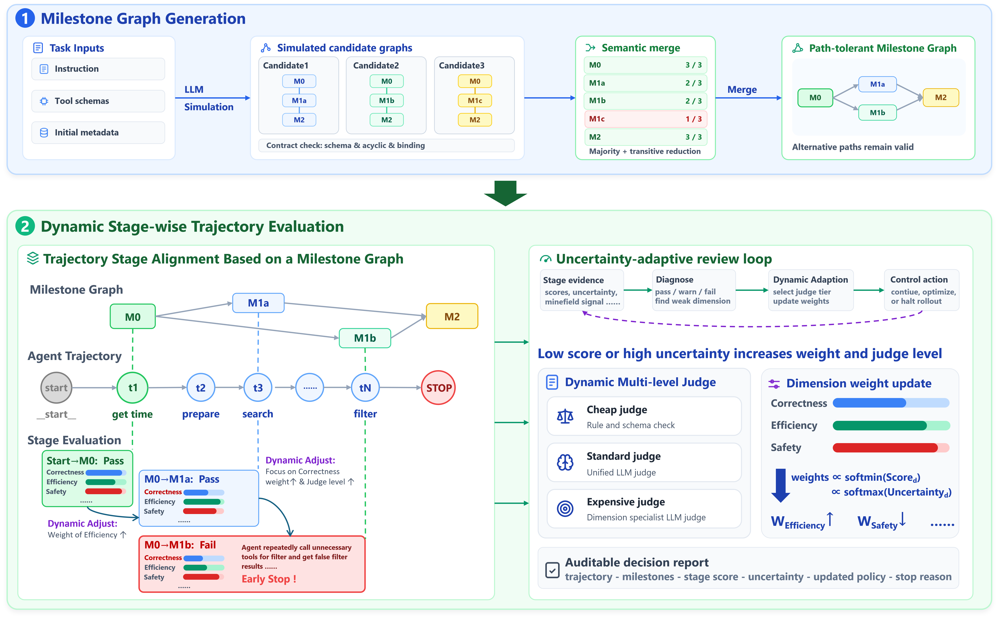

# DynSTEER

This is the code for paper: *DynSTEER: Dynamic Stage-wise Trajectory Evaluation and Execution-time Review for Agents*

## Introduction



DynSTEER is a dynamic, stage-wise trajectory evaluation and execution-time review framework for tool-using agents. Instead of scoring only a final answer, DynSTEER adapts a path-tolerant milestone DAG to each task, aligns trajectory evidence to dominator-anchored stage windows, and evaluates progress, tool quality, state consistency, safety, recovery, interaction quality, and efficiency. Dimension weights and judge routing adapt during evaluation, and policy rules can identify an early, defensible stopping point. The released implementation supports [ToolSandbox](https://github.com/apple-aiml-research/ToolSandbox) and [SWE-bench Pro](https://github.com/scaleapi/SWE-bench_Pro-os).

## Repository layout

- `dynsteer/`: adapters, milestone compilation, staged evaluation, judging, experiments, and runtime support.
- `display/`: static dashboard and builder for exported run artifacts.
- `scripts/`: benchmark preparation, preflight, bootstrap, and experiment launch helpers.
- `data/`: public benchmark manifests, credential-free run settings, and one-case sample experiment matrices.
- `main.py`: benchmark and unified experiment entry point.
- `milestone_reliability.py`: generated-versus-native milestone graph reliability study.
- `dynsteer/prompt/templates/`: bilingual English/Chinese prompt templates. Both language versions are intentional and are not runtime UI text.

## How to Run

### 1. Requirements

- Python 3.12
- [uv](https://docs.astral.sh/uv/)
- Git
- Docker Engine with build privileges for fresh SWE-bench Pro execution
- API access to an OpenAI-compatible chat model for agents, judges, and milestone generation

ToolSandbox can execute fully on the host. SWE-bench Pro supports adaptation, replay, and summaries on the host, but fresh source-direct execution and official patch evaluation require Docker.

### 2. Installation

Clone this repository and install its base environment:

```bash
uv sync
```

Install only the benchmark dependencies you need:

```bash
uv sync --group toolsandbox
uv sync --group swebench_pro
```

Or install every optional benchmark group:

```bash
uv sync --all-groups
```

### 3. Benchmark and data setup

The default manifests expect upstream repositories as siblings of this repository:

```text
parent-directory/
├── DynSTEER/
├── ToolSandbox/
└── SWE-bench_Pro-os/
```

##### 3.1 ToolSandbox

Clone the upstream repository:

```bash
git clone https://github.com/apple-aiml-research/ToolSandbox ../ToolSandbox
```

The public manifest is `data/toolsandbox/benchmark.json`. Its `source_root` defaults to `../ToolSandbox`. Install the benchmark group before adaptation or execution.

To inspect the complete scenario inventory:

```bash
uv run python scripts/get_cases.py --benchmark toolsandbox
```

#### 3.2 SWE-bench Pro

Clone the upstream repository:

```bash
git clone https://github.com/scaleapi/SWE-bench_Pro-os ../SWE-bench_Pro-os
```

Obtain the official dataset archive and place it at `../../swebench_pro_data.zip`, or pass its location with `--archive`. Prepare the local snapshot and evaluator inputs with:

```bash
uv run python scripts/prepare_swebench_pro.py \
  --source-root ../SWE-bench_Pro-os \
  --archive ../../swebench_pro_data.zip
```

Edit `data/swebench_pro/benchmark.json`:

- `source_root`: location of the upstream repository.
- `dataset_archive`: location of the dataset ZIP relative to `data/swebench_pro`.
- `dockerhub_username`: namespace used for task images; replace `your-dockerhub-namespace`.

After preparing the snapshot, export the available cases:

```bash
uv run python scripts/get_cases.py --benchmark swebench_pro
```

### 4. Credentials and configuration

Copy the environment template and populate only the providers you use:

```bash
cp .env.example .env
```

Important variables include:

- `DYNSTEER_AGENT_API_KEY` / `DYNSTEER_AGENT_BASE_URL`: agent client.
- `DYNSTEER_USER_API_KEY` / `DYNSTEER_USER_BASE_URL`: ToolSandbox simulated-user client.
- `DYNSTEER_JUDGE_API_KEY` / `DYNSTEER_JUDGE_BASE_URL`: milestone generator and judges.

Public JSON files use `api_key_env` and `base_url_env` references. Do not put literal credentials in JSON, source files, logs, or exported artifacts.

### 5. Run settings

- `data/<benchmark>/benchmark.json` identifies the upstream source, backend, language, and benchmark metadata.
- `data/<benchmark>/run_configs.json` contains benchmark runtime defaults and scenario selection.
- `data/experiments/*.example.json` contains compact one-case experiment samples. Expand `case_ids`, models, methods, and repeats before running a research experiment.

The samples use one repeat and one case so they remain inexpensive. Main and ablation files demonstrate the available method matrix. The milestone-reliability sample reduces candidate-graph generation to two graphs and one generation batch.

### 6. Whole-trajectory baseline

For SWE-bench Pro `default` runs, DynSTEER performs the official patch/test evaluation and then runs the outcome-informed whole-trajectory auditor. The fixed auditor uses `qwen3-max-2026-01-23` at temperature `0.2`, receives the full task/repository context, command/result trajectory, final patch, and terminal outcome, and returns the holistic audit score used as the default benchmark score. The normalized internal score is in `[0, 1]`; `raw.native_score` and `metrics.score_100` preserve the native and reporting-scale details.

### 7. Running experiments

Preflight, dependency setup, source checks, and execution are handled by the launch scripts.

#### 7.1 ToolSandbox on the host

```bash
./scripts/start_experiment_no_docker.sh \
  --exp data/experiments/toolsandbox_main.example.json
```

Use `toolsandbox_ablation.example.json` for the component-ablation method matrix.

#### 7.2 SWE-bench Pro with Docker execution

Start Docker Engine, then run:

```bash
./scripts/start_experiment.sh \
  --exp data/experiments/swebench_pro_main.example.json
```

Use `--workers N` to control parallel cases. Use `--only-adapt` to adapt cases without evaluation, `--force_adapt` to rebuild adapted cases, and `--force_eval` to rerun existing outputs.

The generic no-Docker launcher can adapt SWE-bench Pro and process replay/offline artifacts, but it does not provide fresh source-direct execution or official evaluation.

#### 7.3 Milestone reliability

```bash
./scripts/start_milestone_reliability.sh \
  --exp data/experiments/toolsandbox_milestone_reliability_main.example.json
```

Results are written under `results/milestone/<experiment_id>/`.

#### 7.4 Direct benchmark entry point

After the required environment and benchmark sources are prepared, the same unified entry point can be invoked directly:

```bash
uv run python main.py --exp data/experiments/toolsandbox_main.example.json
```

### 8. Outputs and visualization

Runs and native benchmark artifacts are written under `runs/`; DynSTEER reports and experiment summaries are written under `results/`; logs are written under `logs/`. These directories are intentionally not part of the public sample data.

Build dashboard data after a run:

```bash
uv run python -m display.build \
  --runs-dir runs \
  --results-dir results \
  --output display/data.js
```

Open `display/index.html` in a browser to inspect the generated report.

## Notes

- The sample SWE-bench Pro case is only an execution example; it is not a claim about the paper's complete sampled evaluation set.
- Bilingual files under `dynsteer/prompt/templates/` are intentional prompt assets.
- Rotate any API key that was ever present in a private configuration before reusing it.

## License

See [LICENSE](LICENSE).
