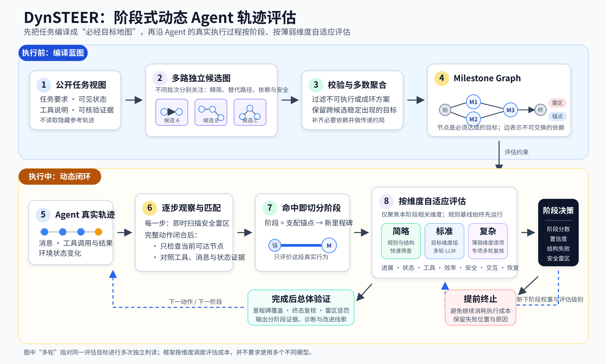

# DynSTEER 动态评估框架：让 Agent 的执行过程“分段可检查”

> 面向已经知道 Agent 会“理解任务—调用工具—观察结果—继续行动”，但不了解具体评估技术的读者。

## 一句话理解

DynSTEER 先根据任务要求和可用工具，整理出一张由若干**必经目标（milestone，里程碑）**组成的任务地图；Agent 真正执行任务时，DynSTEER 一边观察它的行动，一边判断它走到了哪个里程碑，并对刚刚完成的这一段过程进行有针对性的评估。表现稳定时采用低成本检查，发现薄弱或不确定之处时自动加强复核；如果已经出现严重错误或长时间没有有效进展，则可以提前停止执行。

**图 1　DynSTEER 阶段式动态 Agent 轨迹评估框架。** 上半部分在任务执行前编译评估蓝图；下半部分在任务执行中完成里程碑识别、阶段切分、分级评估和策略更新，形成闭环。

## 1. 为什么不只检查最终答案？

只看最终结果，只能回答“最后做成了吗”，却很难回答：

- Agent 是在哪一步开始偏离任务的？
- 工具选错了，还是参数、状态理解或用户沟通出了问题？
- 是否做了大量无效尝试，碰巧得到正确结果？
- 是否已经明显失败，却仍在继续消耗时间和 Token？

DynSTEER 因此把评估从“任务结束后的统一验收”，变成“任务执行中的分阶段检查”。它不要求 Agent 逐步复刻一条固定的参考轨迹，而是约束真正影响任务完成的关键目标及其依赖关系，从而容许多种合理的执行路径。

## 2. 执行前：怎样得到 Milestone Graph？

### 2.1 多路提出候选任务图

生成器只接收 Agent 在执行前可以获得的公开信息，例如任务要求、公开状态、工具说明和可核验的证据目录。它不会读取隐藏的参考轨迹或任务完成后的真实结果。

生成器会在多个独立批次中提出完整的候选任务图，并分别关注：

- **精简性**：去掉只是“可能有用”但并非必需的步骤；
- **依赖与安全**：检查数据依赖、可执行性，以及绝不能触发的危险动作。

因此，可以把这一过程通俗地理解为“多路规划”。更严格地说，当前代码是让生成器**多次独立提出完整候选图**，而不是实际启动多个 Agent 去运行和模拟完整轨迹。

### 2.2 校验、投票和编译

每张候选图先经过确定性检查：节点和字段是否合法、工具参数是否符合说明、动态值是否确实来自前序工具结果、状态变化是否可验证、图中是否存在循环等。非法候选会被过滤。

随后，DynSTEER 对合法候选进行多数聚合：跨候选稳定出现的目标和危险动作更可能被保留；依赖边则只在同时包含两个端点的候选中统计支持度。代码还会补上数据绑定、环境恢复和跨轮次所必需的依赖，并删除能够由其他路径推出的冗余边。

最终得到一张有向无环图（DAG）：

- **节点**表示任务必须达成的目标，例如调用必要工具、让环境达到某个状态、向用户提供必要信息；
- **边**表示不可随意交换的前后依赖；没有依赖关系的节点可以采用不同顺序完成；
- **Minefield（雷区）**表示一旦发生就构成严重失败的危险行为；
- 所有保留下来的 milestone 都是必须完成的，并不存在“可选 milestone”。

需要注意，候选图的多数聚合给出的是一种**经验性的必经步骤估计**，不是数学意义上的完备证明。

## 3. Milestone Graph 怎样把轨迹切成阶段？

DynSTEER 会为每个 milestone 计算一个“阶段锚点”。这个锚点不是简单地任选一个直接前驱，而是该 milestone 的**直接支配节点**：无论从任务起点选择哪条合法路线，要到达当前 milestone 都必须先经过的、距离它最近的共同节点。

当新的 milestone 被识别为已完成时，从其阶段锚点完成的位置，到当前 milestone 完成的位置，就构成一个评估阶段。

例如，某任务在完成 M1 后分成两项可以交换顺序的工作 M2、M3，二者共同完成后才能进入 M4。由于到达 M4 并不一定“最后经过”M2 或 M3 中的某一个，M4 的阶段锚点仍是两条分支共同经过的 M1。这样划分不会把某条偶然的执行顺序误当成唯一标准顺序。

## 4. 执行中：怎样识别 Agent 到达了某个 Milestone？

Agent 每产生一条消息、工具调用、工具结果或状态变化，DynSTEER 都会把它追加到真实轨迹中。

处理分为两种节奏：

1. **每个原始步骤都立即扫描 Minefield。** 如果已经触发致命危险行为，可以在下一次 Agent 行动前停止任务。
2. **一个 Agent 动作完整闭合后再匹配 Milestone。** 例如工具调用要等对应结果返回后再判断，避免在证据不完整时误判。

DynSTEER 主要把当前依赖已经满足的节点集合，也就是“就绪前沿（ready frontier）”，作为可以正式结算的候选。对这些节点，它使用结构化约束核对工具名称与参数、消息内容、工具结果、环境状态及其变化。只有约束达到通过条件，milestone 才会被正式结算，随后图的就绪前沿继续向前推进。与此同时，系统也会低成本检查“只满足了部分前驱”的阻塞节点；如果 Agent 已经越过必要前置步骤去做后续目标，就能及时定位为前驱缺口，而不会把它误算成正常完成。

对于“表达方式可以不同，但含义必须等价”的用户消息，规则匹配拿不准时还可以触发一次窄范围的 LLM 语义复判；它只判断这条消息是否传达了要求的含义，不评价整个阶段。

同一套逻辑既可以接在真实 Agent 的执行环境中进行**在线评估**，也可以对一条已经存在的完整轨迹进行**离线回放**。在线模式能够真正停止后续执行；回放模式记录的是“如果当时启用 DynSTEER，会在哪一步虚拟停止”。

## 5. 每个阶段评估什么？

DynSTEER 预先根据 milestone 的约束语义，选择本阶段真正相关的维度。**任务进展**和**执行效率**始终会被检查；其余维度按需加入：

| 维度 | 通俗含义 |
| --- | --- |
| 任务进展（progress） | 这一阶段的目标是否真正完成 |
| 状态一致性（state consistency） | 环境状态、工具结果和 Agent 的说法是否一致 |
| 工具质量（tool quality） | 工具选择、调用参数和结果使用是否合理 |
| 执行效率（efficiency） | 是否存在明显重复、拖延或无效步骤 |
| 安全性（safety） | 是否违反权限、政策或触发危险副作用 |
| 交互质量（interaction quality） | 对用户的说明是否清楚、诚实且足够 |
| 恢复能力（recovery） | 面对失败、缺失信息或冲突时是否能合理恢复 |

只评估相关维度有两个好处：减少无意义的 LLM 调用，也让诊断集中在当前阶段真正可能出问题的地方。

## 6. 评估力度怎样动态变化？

每个阶段都会先运行低成本的规则性检查，再按照当前策略对需要加强的维度追加更高成本的评估：

1. **简略评估（cheap）**：不调用 LLM，利用 milestone 约束得分、工具成败、空结果、参数警告、重复步骤等结构化信号进行快速筛查。
2. **标准评估（standard）**：把当前需要关注的一组维度交给 LLM 做多次独立判读，再汇总得分和一致程度。
3. **复杂评估（expensive）**：对薄弱维度逐项使用专项提示词进行多轮独立复核，获得更细的证据和诊断。

这里的“多轮”是对同一评估目标进行多次独立判读；当前实现可以复用同一个配置模型，并不要求必须使用多个不同 LLM。

任务开始时，各维度的初始权重由任务类型决定；阶段完成后，DynSTEER 会同时更新两件事：

- **关注权重**：分数越低、判断越不确定的维度，在下一阶段综合评分中的权重越高；
- **评估级别**：高分且低不确定的维度可以回到简略评估；出现警告或高不确定时逐级加强；低于失败阈值的维度直接进入复杂评估。

代码中的权重更新可以概括为：

$$
w'_{d}=\operatorname{normalize}\left(w_d\,\exp\left[\alpha(1-s_d)+\beta u_d\right]\right)
$$

其中，$s_d$ 是维度得分，$u_d$ 是判断不确定度。也就是说，“表现差”和“看不准”都会让该维度在后续获得更多关注；没有在本阶段评估的维度不会被当成零分。

## 7. 什么时候会提前终止？

在启用动态停止策略时，以下情况可以触发提前终止：

- 命中致命 Minefield；
- milestone 的硬性结构约束失败；
- 阶段综合分低于失败阈值；
- Agent 已经执行了后续目标，却缺少它必须先完成的前驱目标；
- 当前就绪 milestone 连续多次没有达到足够的有效进展。

提前终止不是简单地丢弃结果。DynSTEER 会记录停止位置、失败依据、当时可达但未完成的 milestone、各维度分数和证据，使优化流程可以直接回到最需要修复的阶段，而不必每次都等待长任务完整跑完。

## 8. 最终会得到什么？

对正常完成的任务，DynSTEER 还会进行一次总体验证：检查所有真实 milestone 是否覆盖、最终状态约束是否仍然满足、必要的最终消息是否已经出现，以及是否命中过 Minefield。

最终报告不仅给出总分，还包含：

- milestone 覆盖程度（完整、部分或没有覆盖）；
- 每个阶段的起止位置、得分、评估级别、置信度与不确定度；
- 具体证据、失败原因和改进线索；
- 动态权重与下一阶段评估策略的变化；
- Minefield 命中和提前终止原因。

因此，DynSTEER 同时扮演三种角色：**任务完成度的验收器、执行过程的跟踪器，以及控制评估成本和停止时机的动态控制器**。它的核心价值不是强迫 Agent 走一条固定路线，而是在允许合理路径多样性的同时，把“是否走到了关键目标、这一段走得怎么样、是否还值得继续执行”变成可实时回答的问题。

在少数无法得到正向 milestone 的任务中，框架不会直接把空图视为成功：只有安全禁区的任务按 Minefield 结果确定性结算；其他任务会退化为对完整轨迹和最终状态的标准 LLM 评估。
