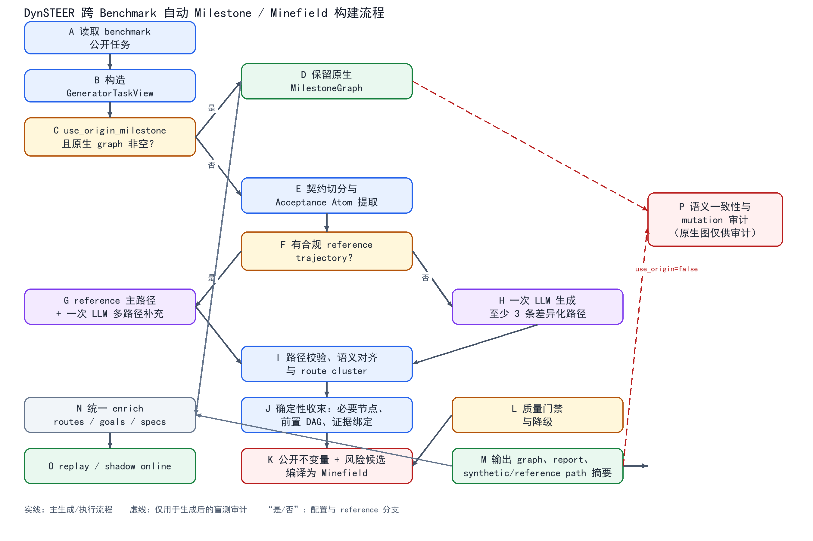

# DynSTEER 跨 Benchmark 自动 Milestone 与 Minefield 构建模块详细代码修改方案

> 制定日期：2026-08-05  
> 适用范围：ToolSandbox、AgentCompass 接入的 SWE-bench Pro/SkillsBench 以及后续 benchmark 适配器。  
> 本文是对 `2026-08-05-DynSTEER跨Benchmark自动Milestone与Minefield构建模块代码方案.md` 的重新梳理和落地版。所有代码设计遵循 `docs/constraints/code.md`。

## 第 1 大节：算法流程

### 1.1 目标、输入和两种运行模式

算法的目标不是猜测一条唯一的正确操作序列，而是把 Agent 能看到的任务契约编译为现有 DynSTEER `MilestoneGraph`：

- milestone 表示可观察、与任务契约直接相关的必要进展；
- milestone 之间的边只表示确定的语义前置关系；
- minefield 表示有公开来源且有确定性 detector 的违规不变量；
- 备选实现保留在生成报告中，不新增现有运行期不支持的 optional/OR 节点。

每个 benchmark 适配器先提供统一的 `GeneratorTaskView`，包含任务说明、Agent 可见工具/环境 schema、公开起始观察、输出契约、证据目录和不变量目录。本文中的“profile”仅指 adapter 生成这些目录时使用的投影规则，不新增独立的 profile registry/class。隐藏测试、gold patch、原生 matcher、target dataframe 和 verifier 字段永远不进入该 view。

配置写在 `benchmark.json`、`run_configs.json` 或 experiment 配置的 `milestone_generation` 对象中，关键参数如下：

```json
{
  "milestone_generation": {
    "use_origin_milestone": true,
    "simulated_path_count": 6,
    "reference_policy": "safe_primary",
    "generator": {"provider": "openai_compatible", "model": "...", "temperature": 0}
  }
}
```

`use_origin_milestone` 默认为 `true`，含义是：只要适配器提供的原生 graph 有 milestone 或 minefield 标注，就原样使用原图，完全跳过自动生成。设为 `false` 时，即使 ToolSandbox 有人工 matcher，也必须走自动生成；原图只能在编译完成后作为盲测参考，不能进入生成 prompt。无原生 graph 时无论该参数取值如何都自动生成。自动图首版固定只允许 replay/shadow online，`online_stop_eligible` 由 compiler 固定输出 `false`；真实在线停止另立方案，不在本配置中预留未使用的开关。

### 1.2 总体流程图



### 1.3 分阶段算法

#### 阶段 A：输入投影和模式判定

1. adapter 从 benchmark 原始记录构造 `TaskCase`，并生成 `GeneratorTaskView`。view 中的字段必须有稳定 `source_ref`，只保留公开可复现内容。
2. loader 保存 `origin_graph` 的内存引用和摘要 hash；之后先判断模式，再把 view 传给 compiler。compiler 的入参不包含 `origin_graph`。
3. `use_origin_milestone=true` 且 `origin_graph.nodes` 或 `origin_graph.minefields` 非空：返回原图，metadata 标记 `milestone_source=origin`，不调用 LLM。
4. 其他情况：进入阶段 B；`use_origin_milestone=false` 时，原图只在阶段 H 的审计函数中使用。

#### 阶段 B：从可见契约提取 Acceptance Atom

1. 先用确定性规则识别“必须产出、必须保持、必须调用/禁止调用、条件、数量、格式、用户沟通和安全策略”等显式条款。
2. 用一次结构化 LLM 请求补充语义 atom、候选前置和证据通道；LLM 只能引用 view 中的 `source_ref`、`tool_schema` 和 `evidence_catalog`。
3. 丢弃无来源、引用未知 selector/tool、只描述常见做法而不对应契约的 atom；合并同一 subject/predicate 的重复 atom。
4. 每个 atom 记录 `atom_id/kind/source_refs/precondition_ids/candidate_channels/criticality/confidence`，这是后续路径和图的唯一事实锚点。

#### 阶段 C：reference trajectory 准入（可选）

只有适配器明确声明 `reference_policy=safe_primary`，且轨迹成功、步骤只包含 Agent 可见动作和公开效果时，才把它投影成 reference path。无法证明安全、失败或含 hidden-only 信息的轨迹转为 audit-only；reference answer、gold patch、checklist 不能冒充 action trajectory。

reference path 的动作先按语义效果映射到 atom；不能回指 atom 或公开 schema 的动作标记为 `incidental`，不生成 milestone。参考路径是主锚点，不强制保留每次重试、探索和偶然顺序。

#### 阶段 D：一次请求生成多条模拟路径

一次请求固定输出 strategy slots，避免按路径循环调用 LLM：最短可行、状态优先、产物/接口优先、替代实现、保守条件分支以及 profile 自定义策略。每条路径描述 `intent -> precondition -> observable_effect`，而不是要求复现具体动作。

- 有 reference path：保留 reference 主路径，再生成 2～4 条补充路径；补充路径用于发现遗漏必要节点、等价实现和风险分支。
- 无 reference path：至少生成 3 条结构不同且能覆盖终态 atom 的有效路径，归纳出的 synthetic path 仅是工作参考，不称为 gold path。

路径校验包括 JSON schema、atom/tool/channel 白名单、前置存在性、终态覆盖、无循环和环境可行性；失败路径不进入收束，并记录失败原因。

#### 阶段 E：语义对齐、节点收束和 DAG

1. 按覆盖 atom、可观察效果和前置语义聚类 route node；不同工具只要产生同一契约效果就进入同一 cluster。
2. 参考主线节点优先保留；无参考时选择覆盖率高、置信度高且 leave-one-path-out 稳定的 synthetic 主线。
3. 只有同时满足“回指显式/推导出的契约必要性、至少一个可执行证据、跨有效路径语义支配或明确硬前置”才升级为 mandatory milestone。仅多数路径出现但非契约必需的步骤降为 supporting/branch。
4. 只保留已验证的前置边：去自环和未知节点边，删除仅由偶然轨迹顺序支持的边；相反顺序且无硬依赖的节点并行化；检测环并删除低置信度边，强环则生成失败；最后做传递约简。
5. 用现有 `Milestone`、`Constraint`、`MilestoneGraph` 表达结果。替代实现不新增 `EvidenceGroup` 或 optional 节点（当前 scorer 不支持 OR 语义），仅写入 `generation_report.route_clusters` 和 milestone metadata。

#### 阶段 F：证据绑定和 milestone 编译

compiler 只从 adapter 提供的 `evidence_catalog` 选择已注册的 `(target, selector, operator, evaluator_hint)`。优先使用结构化 state/artifact/tool/message evidence；只能在轨迹终点观察的内容标记 `finish_only`，不能单独作为在线 milestone。动态参数必须来自公开初始观察或已命中前置 milestone 的结构化 snapshot，禁止把 reference-only 值直接写进 `expected`。

ToolSandbox profile 绑定四类证据：工具调用语义、namespace 状态 delta、Agent→User 消息意图、信息不足时的 `UNCHANGED_SINCE` guardrail。side-effect descriptor 只在一个工具映射表中维护，按工具语义复用，不按 case_id 硬编码。

#### 阶段 G：Minefield 编译

候选来源仅限：公开禁止项、评估完整性规则、环境安全规则、产物一致性规则以及模拟路径发现的反事实风险。后者必须回指公开 policy/invariant，并由 profile 提供单一可执行 detector；没有来源、不可观测或高误报候选直接删除。

- `fatal`：仅显式 policy 违规、修改 verifier/测试、secret 泄露或确定性破坏性越权；
- `error`：finish 复查发现的产物缺失/构建失败；
- `warn`：重复调用、长时间无进展等软诊断，不自动 fatal。

每个 Minefield 只保留一个 detector 约束，复合 invariant 在 detector 内部返回结构化结果，以兼容现有 `evaluate_minefields_at_boundary()`。

#### 阶段 H：质量门禁、降级和审计

默认门槛：契约覆盖率 ≥0.95、可观测率 ≥0.90、结构化证据比例 ≥0.70、模拟路径有效率 ≥0.80、无 reference 时有效路径至少 3 条、DAG/selector 校验通过、hidden leakage=0、无孤立 mandatory 节点。失败时依次删除非法/重复路径、把不稳定节点降为 branch、把不可观测 atom 延后到 finish、删除高误报 minefield；仍失败则 `generation_status=needs_review`，loader 不得启用在线停止。

当 `use_origin_milestone=false` 且原图存在，编译完成后才执行 `audit_generated_graph(generated, origin_graph)`：按 atom/状态效果/前置边/invariant 语义对齐计算 precision、recall、F1，不按 ID 或文本相等比较；审计结果写入 report，不反向修改生成图，也不进入生成 prompt。这样可直接检验自动图与 ToolSandbox 人工标注的一致性。

### 1.4 易懂版伪代码

```text
function build_case(config, adapter, case_id):
    task_case = adapter.adapt_task_case(config, case_id)
    origin_graph = task_case.milestone_graph
    view = adapter.generator_task_view(config, task_case, case_id)

    if config.use_origin_milestone and has_any_label(origin_graph):
        mark(task_case, source="origin")
        return enrich_and_prepare(task_case)

    if view is None:
        raise GenerationError("未提供 GeneratorTaskView，无法自动生成")

    atoms = extract_atoms(view)                         # A/B
    reference = admit_reference(view.reference_trajectory)
    paths = simulate_once(view, atoms, reference, config.simulated_path_count)
    valid_paths = validate_paths(paths, view, atoms)
    if reference is None and count_distinct(valid_paths) < 3:
        return needs_review(task_case, "有效路径不足")

    clusters = align_by_semantic_effect(valid_paths, atoms)
    main_path = choose_reference_or_stable_synthetic(clusters, reference)
    mandatory = select_contract_necessary_dominators(clusters, atoms, main_path)
    edges = build_and_reduce_dag(mandatory, valid_paths)
    constraints = bind_profile_evidence(mandatory, view.evidence_catalog)
    minefields = compile_invariants(view.invariant_catalog, valid_paths)
    graph = to_existing_milestone_graph(mandatory, edges, constraints, minefields)
    report = quality_gate(graph, view, valid_paths, clusters)
    if not report.ready_for_replay:
        return needs_review(task_case, report.reasons)

    if not config.use_origin_milestone and has_any_label(origin_graph):
        report.audit = audit_generated_graph(graph, origin_graph)
    task_case.milestone_graph = graph
    task_case.metadata["milestone_generation"] = report.to_dict()
    return enrich_and_prepare(task_case)
```

## 第 2 大节：基于算法的具体代码修改方案

### 2.1 新增文件与唯一职责

1. `dynsteer/milestone/__init__.py`：仅显式导出 `GeneratorTaskView`、`MilestoneGenerationConfig`、`GenerationReport` 和 `compile_task_case`；不使用动态 `__getattr__` 或字符串映射。
2. `dynsteer/milestone/model.py`：集中定义生成期数据模型：`MilestoneGenerationConfig`、`GeneratorTaskView`、`PublicEvidence`、`PublicInvariant`、`AcceptanceAtom`、`PathHypothesis`、`PathNode`、`GenerationReport`。这些模型只描述生成期数据，不修改运行期 `dynsteer/model.py`。
3. `dynsteer/milestone/compiler.py`：唯一公开入口 `compile_task_case(view, config, llm)`；负责按阶段编排 atom 提取、reference 准入、一次请求多路径、语义聚类、DAG、证据绑定、Minefield 和质量门禁，并调用 `validate.py`。质量门槛集中为该文件的一个不可变常量映射，不再增加第二个 quality profile parser。不要再拆出只被调用一次的 planner/path/compiler 转发文件。
4. `dynsteer/milestone/validate.py`：唯一的校验实现位置，放可复用的纯函数：view 泄漏扫描、path schema、graph ID/DAG、selector 白名单和 origin/generated 语义审计。compiler 只编排调用，adapter、loader、scorer 不得复制校验逻辑。
5. `dynsteer/adapter/toolsandbox/utils/contract.py`：集中把 ToolSandbox Agent-facing 工具、公开环境字段、起始观察、side-effect descriptor、消息和 guardrail 规则投影成 `GeneratorTaskView`；不读取 `scenario.evaluation`、target dataframe 或 matcher。
6. `docs/apis/milestone.md`：记录配置、输入白名单、输出 report、`use_origin_milestone` 语义和 replay/shadow 限制。
7. `tests/milestone/` 与 `tests/adapter/toolsandbox/test_generated_milestone.py`：覆盖核心算法和 ToolSandbox 投影；核心生成函数行覆盖率不低于 80%。

其中两个入口模型的字段固定如下，避免后续 adapter 各自发明配置格式：

```python
@dataclass(frozen=True)
class MilestoneGenerationConfig:
    use_origin_milestone: bool = True
    simulated_path_count: int = 6
    reference_policy: str = "safe_primary"
    generator: JsonObject = field(default_factory=dict)

@dataclass(frozen=True)
class GeneratorTaskView:
    benchmark: str
    task_id: str
    case_id: str
    instruction: str
    public_assets: list[JsonObject]
    tool_schema: JsonObject
    environment_schema: JsonObject
    initial_observation: JsonObject | None
    output_contract: JsonObject
    evidence_catalog: list[PublicEvidence]
    invariant_catalog: list[PublicInvariant]
    reference_trajectory: JsonObject | None
    source_digest: str
```

`reference_trajectory` 在进入 compiler 前已经是安全投影；原始轨迹和 origin graph 不属于该模型。`generator` 只保存 provider/model/temperature/max_tokens 等非敏感配置，API key 由环境变量解析。质量门槛不做第二套配置，统一由 `compiler.py` 的常量和 `GenerationReport` 使用。

`compiler.py` 负责生成 graph/report，`loader.py` 负责一次调度和缓存，现有 `_postprocess_task_case()` 继续是唯一的 stage-goal/spec 生成入口；compiler 不再重复生成 stage goals，避免一次生成任务触发两套相同的目标模板流程。

### 2.2 现有文件的明确修改点

#### `dynsteer/harness/model.py`

- 在 `HarnessRunConfig` 增加 `milestone_generation: MilestoneGenerationConfig = field(default_factory=MilestoneGenerationConfig)`。
- `__post_init__` 校验 `simulated_path_count >= 3`，以及 `reference_policy` 取 `safe_primary/audit_only/disabled`；质量门槛由 compiler 内部唯一常量维护，在线停止资格固定由 compiler 设为 `false`。
- 不再通过多个布尔字段分别控制 origin/generated；唯一决策字段是 `use_origin_milestone`。

#### `dynsteer/harness/config.py`

- 新增 `milestone_generation_from_mapping(data)`，解析上述对象并提供默认 `use_origin_milestone=True`。
- 把 `milestone_generation` 加入 `_RUN_CONFIG_CONTROL_FIELDS`，从 manifest 和 run spec 合并一次，调用唯一的 `milestone_generation_from_mapping()` 解析后写入 `HarnessRunConfig`；不得把未校验的原始字典直接传给 compiler，也不得在 loader/evaluator 中再次从 metadata 解析同一配置。
- `load_benchmark_manifest_metadata()` 读取可选 manifest 级默认值；`run_configs.json` 同名字段覆盖 manifest 默认值。
- API key 仍只从环境变量读取，生成器和 Judge 的 provider/model 分开记录；不要把 key 写进 metadata 或 report。

#### `dynsteer/experiment/model.py` 与 `dynsteer/experiment/config.py`

- `ExperimentRunSpec` 增加 `milestone_generation: MilestoneGenerationConfig`，`build_harness_config()` 直接传递该对象；`to_metadata()` 不复制完整配置，只写入 `milestone_generation_digest` 供结果索引展示。
- `expand_experiment_matrix()` 支持 benchmark、method 或顶层 `milestone_generation` 覆盖；覆盖结果在这里合并后只调用一次 `milestone_generation_from_mapping()`。
- reliability 实验使用 `use_origin_milestone=false`；Default、DynSTEER replay 和 shadow online 的其它评估逻辑不改变。

#### `dynsteer/adapter/base.py`

- 新增可选接口：

  ```python
  def generator_task_view(
      self, config: HarnessRunConfig, task_case: TaskCase, case_id: str
  ) -> GeneratorTaskView | None: ...
  ```

- 默认返回 `None`，表示该 adapter 没有自动生成能力；loader 在 `use_origin_milestone=false` 时遇到 `None` 必须抛出带 benchmark/case_id 的错误，不得静默使用空图。
- 不新增 `generate_milestone()`、`generate_minefield()` 两套 benchmark hook；二者由同一个 compiler 输出。

#### `dynsteer/adapter/loader.py`

- 将 `_adapt_task_case()` 改为：`adapt_task_case -> 读取 origin_graph -> 按 config 决策 -> (必要时) generator_task_view + compile_task_case -> enrich_milestone_graph -> _postprocess_task_case`。
- 新增一个私有 `_apply_milestone_generation()` 作为唯一 loader 调度点；`load_task_case()` 和 `refresh_task_cases_for_experiment()` 都调用它，避免两条冗余流程。
- 读取 adapted case 时必须比较当前 `MilestoneGenerationConfig`、view/reference hash 和 compiler 版本：origin/generated 模式切换或 hash 变化时重建，不能仅因磁盘上已有 `milestone_graph` 就直接复用旧图。
- `use_origin_milestone=true`：保留原 graph，并写入 `metadata.milestone_generation={"source":"origin","generated":false,"online_stop_eligible":true}`，使现有在线策略保持原行为。
- `use_origin_milestone=false`：先保存 origin graph 的 hash/内存对象供 audit，再以 compiler 返回的 graph 替换 `TaskCase.milestone_graph`；禁止把 origin graph 序列化到 `GeneratorTaskView`。
- 生成结果的 `GenerationReport` 只写入 `TaskCase.metadata["milestone_generation"]` 一次；`MilestoneGraph.metadata` 只保留 `source`、版本和 digest，不嵌套完整 report。缓存 key 至少包含 view hash、reference projection hash、compiler 版本、generator model/temperature 和 config hash；缓存命中只反序列化 generated graph/report。
- 生成失败应抛出结构化异常或返回 `needs_review`，不得用空 graph 继续运行。

生成器 LLM 必须由 loader 根据 `config.milestone_generation.generator` 调用现有 `dynsteer.llm.factory.build_llm_from_config()` 构造；不能复用只面向 Judge 的 `build_llm_from_env()`，也不能在 compiler 内部临时读取环境变量。未配置 generator 时，若确实需要自动生成，应明确报错。

#### `dynsteer/adapter/toolsandbox/adapter.py`

- 保留 `milestone_graph_from_scenario()` 作为原生图读取函数，仅用于 `use_origin_milestone=true` 和 post-generation audit。
- 新增 `generator_task_view()`，调用 `utils/contract.py` 提取实际 Agent-facing schema、公开环境字段、起始 observation、任务契约和证据/不变量目录。
- `refresh_task_case_for_experiment()` 分支处理：origin 模式沿用当前 expected 刷新；generated 模式重新计算 view hash，变化时调用 loader 的同一生成调度点，不能按 constraint ID 从原生 matcher 拷贝 expected。
- metadata 明确记录 `milestone_source`、`generation_status`、`origin_graph_digest`；不记录 target dataframe 内容。

#### `dynsteer/adapter/toolsandbox/utils/scenario.py`

- 不把自动生成算法塞进该文件；`milestone_graph_from_scenario()` 只负责原生 matcher -> `MilestoneGraph` 的已有转换。
- 给 origin graph metadata 增加 `source="origin"`，供 loader 判断；删除任何可能把原生 matcher 结构伪装成 reference trajectory 的新逻辑。

#### `dynsteer/adapter/toolsandbox/utils/contract.py`

- `build_toolsandbox_generator_view(context, scenario, case_id)` 只读取公开 context、工具转换后的 schema 和用户首条任务消息。
- `build_evidence_catalog()` 为 state/tool/message/guardrail 四类证据生成现有 `Constraint` 所需的 target、selector、operator 和 evaluator hint。
- `build_invariant_catalog()` 仅登记公开 policy、安全和产物规则；模拟路径提出的风险只能作为候选回指这些规则。
- side-effect descriptor 使用一个模块级只读映射；禁止按 scenario/case_id 写预期值。

#### `dynsteer/adapter/toolsandbox/harness.py`、`dynsteer/adapter/toolsandbox/scorer.py`

- 两个文件不承载生成算法；harness 继续只负责 session 生命周期，scorer 继续负责现有 `Constraint` 评分。
- 只需用已有 scorer 支持的 `target/selector/operator/metadata` 形状编译 generated graph，并增加回归测试；若某证据无法由现有 scorer 观察，必须在 compiler 阶段降级为 finish/review，而不是在 scorer 中再造一套 matcher。

#### `dynsteer/model.py`、`dynsteer/evaluate/*`

- 本方案不新增 `EvidenceGroup`，也不修改 `Milestone`、`Minefield`、`GeneralScorer`、`evaluate_minefields_at_boundary()` 的接口；生成结果必须落到现有模型。
- `dynsteer/graph.py`、`dynsteer/adapter/route.py`、stage goal/spec、settlement/scoring 继续复用现有 enrich 和评分流程。
- `dynsteer/evaluate/evaluator.py` 仅在现有 `_apply_live_decision()` 增加一个统一安全门：当 `TaskCase.metadata["milestone_generation"].online_stop_eligible` 不是 `true` 时记录 `policy_stop_suppressed` 并继续运行；origin graph 不受影响，replay 仍沿用已有 virtual-stop 记录逻辑。
- 仅在 `evaluate/diagnostics.py` 的运行报告中增加 `milestone_source`、`generation_status`、`virtual_stop` 等 metadata 展示字段；不复制生成器逻辑。

#### `dynsteer/adapter/registry.py`

- 不新增不存在的 AgentCompass adapter 占位注册。AgentCompass 的 SWE-bench Pro/SkillsBench 适配器到位后，只需实现 `adapt_task_case()` 和 `generator_task_view()`；通用 compiler、validator、scorer 不改。

### 2.3 AgentCompass 等 benchmark 的接入契约

AgentCompass 侧适配器把 `PreparedTask` 的 instruction、公开 files/workspace manifest、tools、messages 和 output expectations 投影为 `GeneratorTaskView`；gold patch、tests、reward/verifier 仍放在 audit side。若 benchmark 没有 action reference trajectory，直接走 consensus-synthetic；若明确提供安全的成功轨迹，按阶段 C 投影。新增 benchmark 只提供自己的 evidence/invariant catalog，不复制 atom 提取、路径模拟、DAG 或 minefield 流程。

### 2.4 配置示例与输出

`data/toolsandbox/run_configs.json` 可增加：

```json
{
  "milestone_generation": {
    "use_origin_milestone": false,
    "simulated_path_count": 6,
    "reference_policy": "audit_only"
  }
}
```

生成 case 的 metadata/report 至少包含：`source`、`use_origin_milestone`、`path_synthesis_mode`、`valid_path_count`、`atom_coverage`、`backbone_stability`、`graph_valid`、`leakage_count`、`generation_status`、`online_stop_eligible` 以及（有原图且 false 模式）`origin_audit`。原始 reference payload、LLM hidden reasoning 和 secret 不落盘。

### 2.5 测试、验收和清理

- 单元测试：配置默认/覆盖、origin 分支不调用 LLM、false 分支即使有原图也调用 compiler、字段泄漏、atom/path 校验、路径收束、DAG 环检测、证据白名单、Minefield severity、缓存 key 和 replay 兼容。
- ToolSandbox 集成：随机抽取同时有原生 milestone/minefield 的 case，分别运行 `use_origin_milestone=true/false`；比较 atom/状态效果/边/invariant 的 precision、recall、F1 和成功轨迹命中一致性。origin graph 只作为 audit 输入。
- 无原生图 fixture：至少三条有效差异路径才能生成 synthetic path；常见但非契约必需步骤必须降级为 branch；替代工具不能导致额外 mandatory 节点。
- 验收门槛：契约覆盖率 ≥0.95、可观测率 ≥0.90、路径有效率 ≥0.80、hidden leakage=0、核心测试覆盖率 ≥80%；未达标只允许 replay diagnostics，`online_stop_eligible=false`。
- 按约束执行 `pytest` 和静态检查；测试结束后清理本次生成产生的 `__pycache__`、`.pytest_cache` 等中间目录，不删除 `docs/constraints` 或 `docs/plans` 中已有文档。
- 不新增死代码：新公开接口必须由 loader、adapter 或测试调用；不实现 SWE-bench/SkillsBench 的空壳 runner；不在 scenario、loader、compiler、scorer 多处实现同一算法。

本次冗余复核后的结构约束如下：

1. 配置只有一个 dataclass 和一个 mapping parser；experiment metadata 只保存 digest，不作为第二个配置来源。
2. 自动生成只有 `compiler.compile_task_case()` 一个入口；loader 只有 `_apply_milestone_generation()` 一个调度点，刷新和首次加载共用它。
3. 校验和 origin/generated 语义审计只有 `validate.py` 一份实现；ToolSandbox scorer 不新增 matcher。
4. stage goals/specs 继续由现有 `_postprocess_task_case()` 生成；compiler 不复制该流程。
5. 不添加 `EvidenceGroup`、optional milestone、profile registry、benchmark 占位 runner 或未启用的 online-stop 配置字段。

## 附录 A：当前没有把握实现的模块部分

1. **AgentCompass 外部运行时的准确字段映射**：当前仓库没有 AgentCompass 源码和实际 `PreparedTask` 运行对象，无法确认 workspace、工具结果和公开 trajectory 的最终字段名。方案只固定 `GeneratorTaskView` 契约，拿到外部仓库后补 profile 投影并用 fixture 验证。
2. **ToolSandbox Agent-facing schema 的完整提取**：当前 adapter 仅写入 `{"source":"toolsandbox"}`，需要在真实依赖版本中确认 `ExecutionContext.get_available_tools()` 或等价 API；若 API 不稳定，profile 必须使用现有 tool conversion 的公开结果，不读取 matcher/target dataframe。
3. **无 reference 时的真实必经性**：LLM 多路径可能结构同质，路径多数不等于语义必经。若 backbone stability、mutation precision 或人工盲审未达门槛，生成图只能用于 replay，不能据此宣称可在线早停。
4. **动态 expected 的公开来源**：如果某 benchmark 的 expected 只能由隐藏 verifier 计算，则该 atom 标记 `finish_only` 或 `needs_review`，不能在生成器中猜测具体值。
