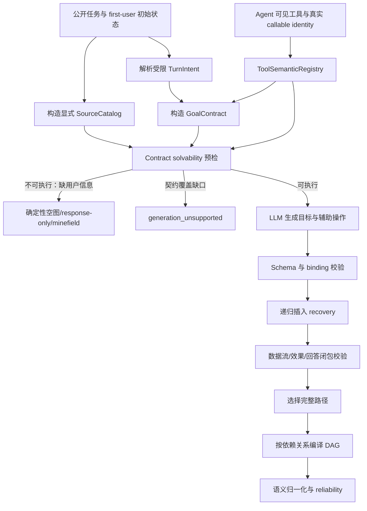
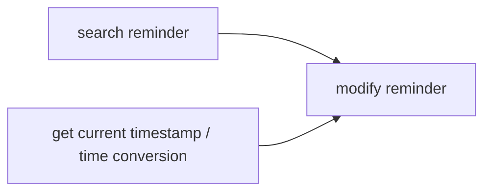

# DynSTEER milestone graph 生成回归代码修复方案

> **已废止（2026-08-11）**：复核发现本方案继续引入 SourceCatalog、ResultShape、intent、validation 等多层抽象，违反项目简洁性约束，存在重复上一轮过度设计的风险。不得按本方案实施。请改用同目录的 `2026-08-11-milestone-generation-minimal-repair-plan.md`。

## 1. 修复目标

本方案修复 `toolsandbox_milestone_reliability_partial_main` 暴露的 milestone graph 系统性回归。目标不是放宽校验让更多错误 JSON 通过，而是恢复以下能力：

1. 正确任务路径在输出协议中必须可表达；
2. GoalContract 必须覆盖目标效果、参数来源、必要辅助操作、递归恢复条件和必要输出；
3. compiler 只能删除可证明冗余的操作，不能把人工图中的必要计算、搜索或恢复步骤判成 distraction；
4. 生成 DAG 必须来自真实数据依赖和状态依赖，不能统一退化为单节点或简单线性链；
5. minefield 只能来自结构化禁止项或真实 unresolved slot，不能从普通“没有更多信息”文本误生成；
6. reliability 指标必须比较同构语义，不允许 primary exact 结构性恒为 0；
7. 每一阶段必须由真实 ToolSandbox case 的端到端测试验收，未达门槛不得进入下一阶段或重新运行正式实验。

本次修复不读取人工 milestone、evaluation、verifier、实际轨迹或最终状态参与生成。人工图只用于离线 reliability 测试和指标校准。

## 2. 修复策略选择

不在当前 validator 上继续零散增加例外。采用“保留公共接口入口、替换错误内部模型”的分阶段修复：



核心顺序固定为：**source 与 tool 语义可表达性 → GoalContract 与闭包 → compiler → minefield → reliability**。在 source/binding 修复完成前，不调整 LLM 模型和温度。

### 2.1 逐文件修改清单

| 文件 | 操作 | 主要修改 |
|---|---|---|
| `dynsteer/milestone/model.py` | 修改 | PublicSource、ResultShape、新 ArgumentBinding、GoalContract、GenerationReport |
| `dynsteer/adapter/toolsandbox/utils/sources.py` | 新增 | initial state、turn、rule 的唯一 source catalog 构造 |
| `dynsteer/adapter/toolsandbox/utils/effects.py` | 重写 | callable-identity registry、返回 shape、效果模板、完整环境规则 |
| `dynsteer/adapter/toolsandbox/utils/intent.py` | 新增 | 受限 ToolSandbox intent/slot/cardinality/response 解析 |
| `dynsteer/adapter/toolsandbox/utils/contract.py` | 重写核心流程 | 移除 case ID 和关键词 GoalContract，组合 source/tool/intent/solvability |
| `dynsteer/adapter/contract.py` | 修改 | 移除通用否定正则 minefield，保留显式结构化 invariant 接口 |
| `dynsteer/adapter/toolsandbox/utils/scenario.py` | 修改 | reference 侧复用统一 effect/capability canonicalization |
| `dynsteer/adapter/loader.py` | 修改 | 加载 source catalog、solvability 和新 graph metadata/digest |
| `dynsteer/milestone/validation.py` | 新增 | schema、binding、类型、dependency、closure 校验 |
| `dynsteer/milestone/compiler.py` | 重写核心流程 | deterministic non-executable、repair、recovery expansion、依赖 DAG、状态报告 |
| `dynsteer/milestone/semantics.py` | 重写 canonical 部分 | multiset、response、minefield、comparability、coverage |
| `dynsteer/milestone/__init__.py` | 修改 | 只显式导出新的公共模型与入口 |
| `dynsteer/prompt/templates/milestone/*.md` | 重写 | 完整 schema/source/result selector 和最小 repair 指令 |
| `milestone_reliability.py` | 修改 | 新漏斗、comparability、失败分母、两轮 violations |
| `dynsteer/harness/outputs.py` | 修改 | 持久化新 generation status 和 report 字段 |
| `data/experiments/*repair_v1.json` | 新增 | 新 experiment id，禁止覆盖失败实验 |
| `docs/apis/milestone.md` | 修改 | 同步新接口、协议、状态与示例 |
| `tests/adapter/*`、`tests/milestone/*` | 新增/重写 | 单元、真实 case、离线回放和 reliability 门禁 |

不保留旧 binding/GoalContract 的兼容分支；adapter、compiler、prompt 和 tests 在同一阶段统一迁移，避免两套协议并存。

## 3. 首阶段止损与失败基线

### 3.1 保留失败现场

保留以下工件，不覆盖现有实验：

- `results/milestone/toolsandbox_milestone_reliability_partial_main`；
- 25 份 `llm_outputs`；
- 当前未提交 milestone 相关 diff；
- 两份 2026-08-11 根因报告。

新实验使用新的 experiment id 和 results 目录，例如：

```text
toolsandbox_milestone_reliability_partial_main_repair_v1
```

不使用 `--force` 覆盖失败结果。

### 3.2 将当前失败固化为门禁

先增加测试，确保以下行为在修复前失败、修复后通过：

- initial state 中每个可绑定原子值都有合法 source ref；
- `You do not have more information` 产生 0 个 invariant；
- low-battery 对 location、cellular、Wi-Fi 三种 enable 都产生 battery recovery；
- reminder timestamp、holiday timestamp diff、phone number、reminder ID 都存在合法 operation-result selector；
- executable 多步 case 不允许生成单节点图；
- `complete_path_count=0` 不能报告为 LLM-generated completed。

## 4. 数据模型修复

### 4.1 `dynsteer/milestone/model.py`

新增并调整以下模型。

#### `PublicSource`

显式替代 `_source_values()` 对任意嵌套 JSON 的递归搜集：

```text
source_ref
kind: instruction_text | state_value | rule_value | public_asset
value
value_type
validation_mode: text_contains | exact
metadata
```

约束：

- `source_ref` 只标识位置，不把联系人 ID、电话号码等敏感值编码进 ref；
- `state_value/rule_value` 使用 `exact`；
- `instruction_text/public_asset` 使用 `text_contains`；
- 同一 source ref 不允许指向多个值；
- generator prompt 和 compiler 使用同一份 catalog，不再一份展示、一份隐式校验。

#### `ResultShape`

描述工具返回值：

```text
kind: none | scalar | object | list_object
fields
value_type
```

合法 selector 限定为：

- scalar：`$`；
- object：`$.field`；
- list_object：`$[非负整数].field`。

不接受任意 JSONPath、过滤表达式或脚本。

#### `ArgumentBinding`

删除旧 `case_literal/operation_result/unresolved` 混合协议，改为：

```text
literal:
  kind / value / source_ref

source_value:
  kind / source_ref

operation_result:
  kind / source_operation_id / selector
```

`unresolved` 不再作为 executable operation argument。未解析信息只存在于 GoalSlot 和 turn disposition 中，非 executable turn 必须没有 operations。

使用稳定 `operation_id`，不再用跨 turn 的全局 `operation_index` 指向来源，避免候选调整后索引漂移。

#### `ToolEffect`

改为组合以下字段：

```text
canonical_tool_id
visible_tool_name
capability
argument_schema
result_shape
effect_templates
precondition_rule_ids
```

`effect_templates` 支持参数决定的状态效果，例如：

```text
set_cellular_service_status(on=true)
=> SETTING.cellular = true
```

不能继续把所有 set 工具压成不带目标值的 `cellular.set`。

#### `TurnGoalContract`

增加：

- `intent_kind`；
- `required_effects`；
- `required_answer_fields`；
- `cardinality`；
- `response_policy: required | optional | none`；
- `contract_status: executable | needs_clarification | response_only | coverage_gap`。

`response_policy` 与 disposition 分离。needs-clarification 不自动生成 required response milestone；只有公开任务契约明确要求时才进入 graph。

#### `GenerationReport`

将状态拆为：

```text
llm_generated
deterministic_non_executable
generation_unsupported
generation_rejected
generation_failed
```

同时保存两轮的 returned/schema-valid/binding-valid/closure-valid 数量和 violation codes。不得再出现 `complete_path_count=0` 但统计为 LLM-generated completed。

## 5. 构造统一 SourceCatalog

### 5.1 新增 `dynsteer/adapter/toolsandbox/utils/sources.py`

实现一个主要入口：

```python
def build_toolsandbox_source_catalog(
    turns: list[tuple[str, str]],
    initial_state: JsonObject,
    environment_rules: tuple[EnvironmentRule, ...],
    public_assets: list[JsonObject],
) -> tuple[PublicSource, ...]:
    ...
```

该文件只负责 source 规范化，不承担 GoalContract 或 tool effect 推理。

### 5.2 初始状态 source 规则

按 namespace 和稳定行顺序展开原子字段：

```text
state:CONTACT:row:0:person_id
state:CONTACT:row:0:phone_number
state:REMINDER:row:2:reminder_id
state:SETTING:row:0:low_battery_mode
```

稳定顺序：

1. CONTACT 按 `person_id`；
2. MESSAGING 按 `message_id`；
3. REMINDER 按 `reminder_id`；
4. SETTING 单行；
5. 其他 namespace 使用 canonical JSON 排序。

SANDBOX 历史消息不作为 state literal 重复展开；消息内容由 public assets/turn source 管理。

### 5.3 turn source 规则

每个预定义 turn 必须有独立 source：

```text
turn:turn_0:instruction
turn:turn_1:instruction
```

禁止多个未来 turn 共用一个 simulator 整段文本 source。解析 user-simulator 后，把每条真实 turn 文本单独登记。

### 5.4 rule source 规则

恢复参数使用确定性 source：

```text
rule:service_enable_requires_battery_off:recovery:on
rule:message_send_requires_cellular_on:recovery:on
```

compiler 插入 recovery 时直接绑定这些 source，不要求 LLM把 `true/false` 错标成 instruction literal。

### 5.5 删除旧逻辑

从 `dynsteer/milestone/compiler.py` 删除：

- `_source_values()`；
- `_collect_source_values()`；
- `_instruction_for_ref()`。

compiler 只能读取 `GeneratorTaskView.source_catalog`。

## 6. ToolSandbox 工具语义注册表

### 6.1 重写 `dynsteer/adapter/toolsandbox/utils/effects.py`

删除通过 tool name substring 推导 subject/action 的 `_subject()`、`_action()` 和通用 `id/person_id` result binding。

使用 `ToolSemanticSpec` registry。registry 以 ToolSandbox callable identity 为 canonical key，以 Agent 实际可见名称为 `visible_tool_name`。这样 argument/tool-name scrambling 不改变 capability。

### 6.2 当前 25 case 必须覆盖的返回结构

至少登记：

| 工具 | 返回结构 | 合法 selector |
|---|---|---|
| `get_current_timestamp` | scalar float | `$` |
| `datetime_info_to_timestamp` | scalar float | `$` |
| `timestamp_to_datetime_info` | object | `$.year/month/day/hour/minute/second` |
| `timestamp_diff` | object | `$.days`、`$.seconds` |
| `search_holiday` | scalar optional float | `$` |
| `search_contacts` | list object | `$[n].person_id/name/phone_number/relationship/is_self` |
| `search_messages` | list object | `$[n].message_id/.../creation_timestamp/content` |
| `search_reminder` | list object | `$[n].reminder_id/.../creation_timestamp/reminder_timestamp` |
| `add_contact` | scalar str | `$` |
| `add_reminder` | scalar str | `$` |
| `send_message_with_phone_number` | scalar str | `$` |

工具签名在 adapter 初始化时与 registry 核对。参数或返回注解变化时返回 `coverage_gap`，不得回退到字符串猜测。

### 6.3 状态效果模板

明确映射：

- `add_contact` → `CONTACT.create`；
- `modify_contact` → `CONTACT.update`；
- `remove_contact` → `CONTACT.delete`；
- `add_reminder` → `REMINDER.create`；
- `modify_reminder` → `REMINDER.update`；
- `send_message_with_phone_number` → `MESSAGING.send`；
- setting set 工具 → 对应字段的目标布尔值；
- search/get/conversion → observation/result capability。

reference adapter 和 generated compiler 必须复用同一个 registry，避免 `contact.create` 与 `contact.update` 两套推导。

## 7. 环境依赖与递归 recovery

### 7.1 新增明确规则模型

在 `effects.py` 或独立 `environment.py` 中定义 `EnvironmentRule`：

```text
rule_id
applies_to_tool/effect
argument_predicate
state_predicate
recovery_effect
recovery_arguments
```

### 7.2 ToolSandbox 必须覆盖的真实规则

1. location enable 且 low-battery=true → battery false；
2. cellular enable 且 low-battery=true → battery false；
3. Wi-Fi enable 且 low-battery=true → battery false；
4. message send 且 cellular=false → cellular true；
5. holiday/network query 且 Wi-Fi=false → Wi-Fi true；
6. recovery operation 本身继续递归检查前置条件。

例如 holiday query 在 low-battery=true、Wi-Fi=false 时展开为：

```text
battery false → Wi-Fi true → holiday search → timestamp diff
```

### 7.3 compiler 拥有 recovery

新增：

```python
def expand_required_recoveries(
    operations: tuple[OperationCandidate, ...],
    initial_state: JsonObject,
    rules: tuple[EnvironmentRule, ...],
    tool_catalog: tuple[ToolEffect, ...],
    source_catalog: tuple[PublicSource, ...],
) -> RecoveryExpansion:
    ...
```

使用 DFS 和 cycle detection，模拟确定性 setting state。复杂度为 `O(operation + rule edge)`。

LLM 不再负责发明 recovery 参数。若 LLM 已给出与 compiler 推导完全相同的 recovery，规范化为 compiler-owned operation 并记录审计原因；不完全相同则报冲突，不能静默接受。

## 8. 受限、可审计的 GoalContract 构造

### 8.1 新增 `dynsteer/adapter/toolsandbox/utils/intent.py`

不再用 case ID 或通用 substring 集合作为任务真值。实现受限 ToolSandbox intent resolver，覆盖当前明确工具域：

- contact create/update/delete/search；
- message search/send；
- reminder create/update；
- setting enable/disable；
- holiday days-till query。

每个 resolver 返回：

- intent kind；
- terminal effect/answer；
- required slots；
- cardinality；
- temporal/recency modifier；
- literal source span；
- response policy。

规则以完整短语和参数类型组合匹配，不以任意 subject token 命中。无法唯一解析时返回 `coverage_gap`，不得默认 executable。

### 8.2 禁止 case-name discrimination

删除：

```text
force_unresolved="insufficient_information" in task_case.case_id
```

是否信息不足只根据 required slot 的来源决定。例如：

- 缺 holiday name → `holiday_identity` unresolved；
- 缺联系人身份或无法唯一选择 → `contact_identity` unresolved；
- 请求 update 但缺新值 → 对应 update-value slot unresolved；
- 删除工具不可用 → response-only，而不是 needs-clarification。

### 8.3 依赖闭包

GoalContract 只描述终端目标和答案要求；辅助工具由 tool producer registry 和 LLM path共同决定。新增 `ContractSolvabilityReport`：

- terminal effect 是否有可用工具；
- 每个 required argument 是否存在 instruction/state/operation producer；
- answer field 是否存在 result selector；
- recovery 是否可递归完成；
- future turns 是否全部覆盖。

预检结果：

- 用户信息确实缺失 → deterministic non-executable；
- tool/selector/intent registry 未覆盖 → generation unsupported；
- 完整可解 → 调用 LLM。

不得把 registry 覆盖缺口伪装成 needs-clarification。

## 9. LLM 响应协议和 prompt

### 9.1 新 schema

每个 operation 必须有稳定 ID；query turn 显式声明 answer binding：

```json
{
  "paths": [
    {
      "turns": [
        {
          "turn_id": "turn_0",
          "disposition": "executable",
          "unresolved_slots": [],
          "operations": [
            {
              "operation_id": "op_0_0",
              "evidence_id": "tool_call_search_holiday",
              "arguments": {
                "holiday_name": {
                  "kind": "literal",
                  "value": "Christmas Day",
                  "source_ref": "turn:turn_0:instruction"
                }
              }
            },
            {
              "operation_id": "op_0_1",
              "evidence_id": "tool_call_get_current_timestamp",
              "arguments": {}
            },
            {
              "operation_id": "op_0_2",
              "evidence_id": "tool_call_timestamp_diff",
              "arguments": {
                "timestamp_0": {
                  "kind": "operation_result",
                  "source_operation_id": "op_0_1",
                  "selector": "$"
                },
                "timestamp_1": {
                  "kind": "operation_result",
                  "source_operation_id": "op_0_0",
                  "selector": "$"
                }
              }
            }
          ],
          "answer_bindings": [
            {
              "kind": "operation_result",
              "source_operation_id": "op_0_2",
              "selector": "$.days"
            }
          ]
        }
      ]
    }
  ]
}
```

删除 `disposition_reason`，避免模型把长篇思考写进协议。

### 9.2 generation prompt

修改中英文 generation 模板，注入：

- 完整 JSON Schema；
- legal source catalog；
- 每个工具的 required/optional arguments；
- result shape 与合法 selector；
- GoalContract 的 terminal goal、answer requirement；
- 明确说明 recovery 由 compiler 插入；
- 明确说明 initial state 已是 planning boundary，不加入无数据依赖的 status getter；
- 3 个完整示例：instruction literal、state value、operation result。

优先使用 provider strict JSON Schema；provider 不支持时才使用 `json_object` 加本地严格校验。

### 9.3 refinement prompt

repair 必须再次提供 schema、source catalog、result selector 和逐字段 violation。禁止仅给 `arguments:{}`。

repair 规则按 code 给最小动作：

- unknown source → 从 legal source 中选择；
- unsupported selector → 从该工具 selector 列表选择；
- missing producer → 增加能提供参数/answer 的辅助操作；
- unrelated operation → 只有确定不在 goal/answer/binding/recovery 逆向闭包中才删除。

## 10. compiler 和 validation 重构

### 10.1 文件职责

保留 `dynsteer/milestone/compiler.py` 负责：

- 总流程；
- repair/round selection；
- recovery expansion 调用；
- DAG 编译；
- report。

新增 `dynsteer/milestone/validation.py` 负责：

- JSON response 解析；
- source/result binding 校验；
- operation dependency graph；
- goal/effect/answer closure；
- unrelated operation 判定。

这两个文件不建立同义薄包装。validation 返回完整 `PathValidation`，compiler 不重复计算。

### 10.2 binding 校验

校验顺序：

1. operation ID 在 path 内唯一；
2. required argument 完整；
3. literal/source value 引用合法且类型匹配；
4. operation-result 来源存在且位于依赖 DAG 上游；
5. selector 与 source tool ResultShape 匹配；
6. selector 输出类型与目标 argument 类型兼容；
7. DAG 无环。

### 10.3 closure 校验

从以下终点反向遍历 dependency graph：

- terminal effect operations；
- answer bindings；
- compiler 插入的 recovery dependency。

反向可达的 search/get/conversion 都是必要辅助操作，不得判 unrelated。只有不在任何闭包中的 operation 才是 distraction。

closure-valid 必须同时满足：

- 全部 terminal goals 覆盖；
- 全部 answer fields 有来源；
- required bindings 可解析；
- recovery closure 完整；
- response policy 满足；
- 所有 turns 完整。

### 10.4 路径选择

排序优先级修改为：

1. closure-valid；
2. terminal effect coverage；
3. answer coverage；
4. binding validity；
5. recovery completeness；
6. 非闭包 operation 数；
7. 仅在以上完全相同时按 operation 数和 canonical JSON 稳定 tie-break。

删除当前“GoalContract 尚未证明完备时直接最短”的选择逻辑。

### 10.5 deterministic non-executable

在调用 LLM 前处理，而不是 LLM 两轮失败后偷偷 fallback：

- needs-clarification：空 milestone nodes + unresolved-slot minefield；
- response-only：仅在公开 response policy required 时生成 response；
- coverage-gap：返回 generation_unsupported，不生成伪 graph。

状态必须写入 report，不能与 llm-generated 混合。

## 11. 按依赖关系编译 DAG

当前 compiler 按 operation 列表顺序线性连边，会错误地把并行依赖串联。改为：

1. operation-result binding：producer → consumer；
2. recovery：recovery → dependent operation；
3. answer response：answer producer → response；
4. state-change response：terminal state operation → required response；
5. 跨 turn：前一 turn required response/terminal sinks → 后一 turn roots；
6. 无真实依赖的同 turn operations不连边；
7. 最后执行 DAG 校验和 transitive reduction。

例如 latest reminder 应形成：



而不是强制 `search → time → modify`。

多次更新同一 search 结果时形成一对多边，不把两个 update 互相串联。

## 12. minefield 修复

### 12.1 禁用当前自然语言否定正则

从 `dynsteer/adapter/contract.py` 删除或停用：

- `_INVARIANT_PATTERN`；
- `_tool_mentioned()`；
- 按 subject token 把整行转 fatal 的逻辑。

第一阶段只接受 adapter 明确构造的结构化 `PublicInvariant`。没有可靠结构化规则时宁可报告 coverage gap，也不能生成虚假 fatal minefield。

### 12.2 unresolved-slot minefield

GoalSlot 显式记录其保护的 terminal capability/answer capability。若 slot unresolved：

- 禁止依赖该 slot 的写操作；
- 禁止产生需要该 slot 的确定性答案；
- severity/trigger 使用统一 registry capability；
- canonical 语义不包含生成侧专有的 `pre_execution` 字段。

例如缺 holiday identity 时，保护最终 days-till answer/timestamp-diff；缺 contact identity 时保护 contact update/delete。

### 12.3 冲突检查

新增静态断言：同一 turn 的 required terminal capability 不得同时出现在 public invariant minefield 中。出现冲突直接 `generation_unsupported`。

## 13. reliability 与 canonical semantics 修复

### 13.1 `dynsteer/milestone/semantics.py`

重新定义同构 canonical schema：

- operation/effect capability 全部通过 ToolSemanticRegistry；
- state snapshot addition/update 映射到与生成工具相同的 create/update；
- response 仅接受 `kind=emit_message` 且 recipient=USER；
- node comparable label 不包含只有 generated 才有的 turn_id；
- minefield 只比较 capability、severity 和 normalized trigger；
- operation/response 使用 multiset，不用 set 丢失重复 update；
- topology 保留重复节点的 occurrence identity，不能把两次 contact.update 合并。

### 13.2 comparability

每个维度返回：

```text
status: comparable | not_comparable
reason
reference_count
generated_count
precision/recall/f1/exact
```

reference 未标 disposition 时，disposition 只作 generated diagnostic，不进入 exact。reference 无可推导 binding 时，binding 维度标 not-comparable，不按空集合处罚。

primary metric 改为 `comparable_semantic_exact`：

- 所有 reference-required 且 comparable 的语义维度 exact；
- fatal minefield 无 miss；
- contract/source/dataflow coverage 无 gap；
- generation status 为 llm-generated 或正确 deterministic non-executable。

### 13.3 input coverage

`compare_input_coverage()` 增加：

- initial-state source 是否可寻址；
- reference-required argument 是否有 source/producer；
- result selector 是否支持；
- recovery closure 是否可解；
- answer/response 是否可表达；
- future turn 是否完整。

不能再以“initial_state 非空”替代“initial-state value 可绑定”。

### 13.4 `milestone_reliability.py`

summary 固定输出漏斗：

```text
case_count
contract_solvable
deterministic_non_executable
llm_called
schema_valid
binding_valid
closure_valid
llm_generated
generation_unsupported
generation_rejected
metric_completed
```

失败 case 计入端到端成功率分母。单独报告 graph-return ratio、LLM-path success ratio、fallback ratio，不再用 completed 混合表示。

case JSON 保存两轮 violation summaries 和 raw response 文件路径/SHA-256，不复制敏感完整 prompt。

## 14. ToolSandbox adapter 修改

### 14.1 `dynsteer/adapter/toolsandbox/utils/contract.py`

改为单一编排入口：

1. 解析 first-user boundary 和预定义 turns；
2. 构造 initial state；
3. 获取可见 tool identity/schema；
4. 构造 tool semantic registry projection；
5. 构造 source catalog；
6. 调用受限 intent resolver；
7. 构造 GoalContract 和 solvability report；
8. 构造结构化 invariant。

删除 `_goal_contract()` 当前关键词实现和 `force_unresolved`。

### 14.2 `agent_facing_tool_schema()`

同时保留：

- Agent visible name/schema；
- adapter 内部 canonical callable identity。

canonical identity 只进入 generator tool contract，不把不可见工具或 evaluation 字段暴露给 Agent。

### 14.3 `dynsteer/adapter/toolsandbox/utils/scenario.py`

reference canonicalization 调用统一 ToolSemanticRegistry。只在 reliability 路径使用人工 graph，不能把 reference-derived值回写 GeneratorTaskView。

## 15. 测试方案

### 15.1 测试进入版本管理

当前 `.gitignore` 忽略 `tests/*`。受项目约束，本方案不修改 `.gitignore`。新增/修改测试后，在交付中明确列出测试文件；最终提交由用户显式 `git add -f` 纳入版本控制，避免测试继续只存在本地。

### 15.2 单元测试

新增或重写：

- `tests/adapter/test_toolsandbox_sources.py`；
- `tests/adapter/test_toolsandbox_effects.py`；
- `tests/adapter/test_toolsandbox_intent.py`；
- `tests/milestone/test_binding_validation.py`；
- `tests/milestone/test_goal_closure.py`；
- `tests/milestone/test_recovery_expansion.py`；
- `tests/milestone/test_compiler_dag.py`；
- `tests/milestone/test_semantics.py`；
- `tests/milestone/test_reliability.py`。

核心断言：

1. state/rule/turn source ref 稳定且值类型正确；
2. scalar/object/list selector 允许合法路径、拒绝越界字段和任意 JSONPath；
3. result type 与目标 argument type 不兼容时拒绝；
4. low-battery recovery 对三个服务均生效且递归展开；
5. closure 反向可达的 search/get/conversion 不判 unrelated；
6. 真正 distraction 被拒绝；
7. 多 producer 到单 consumer 生成分叉 DAG；
8. 两次 update 不被 multiset canonicalizer 合并；
9. reference 无 disposition 时 exact 不被结构性置 false；
10. `do not have more information` 不生成 invariant。

### 15.3 25-case 端到端门禁

使用真实 adapter、真实 ToolSandbox source、确定性 stub LLM 响应，逐 case 断言：

- 4 个 location 变体：battery false → location true → required response（若 contract 要求）；
- cellular low-battery：battery false → cellular true；
- holiday Wi-Fi：递归 recovery + holiday/current-time/diff answer chain；
- 4 个 reminder create：datetime conversion → reminder create；
- latest reminder：search/current-time/time conversion → modify；
- send-message：contact lookup + cellular recovery + send；
- relationship all/twice：search 与多次 update、多 turn 完整；
- insufficient-information：无危险 operation，正确 minefield；
- remove-tool unavailable：response-only；
- 普通 case 无 spurious fatal minefield；
- 所有 reference 多节点 executable case 不得输出单节点图。

这些测试比较公开任务语义的预期结构。只有 reliability 测试可以读取人工 graph。

### 15.4 recorded-output 回放

保留当前 llm_outputs 作为失败语料，测试新 parser 给出明确 migration rejection，不要求兼容旧 schema。另建立 repair-v1 schema 的固定响应 fixtures，确保无需网络即可复现 compiler。

### 15.5 覆盖率与命令

核心新模块 PyTest 行覆盖率不低于 80%。使用项目 `.venv` 或设置 workspace-local uv cache：

```powershell
$env:UV_CACHE_DIR = Join-Path (Get-Location) '.uv-cache'
uv run python -m compileall dynsteer milestone_reliability.py
uv run pytest tests/adapter tests/milestone tests/evaluate/test_milestone_frontier_freeze.py -q
uv run pytest --cov=dynsteer.milestone --cov=dynsteer.adapter.toolsandbox --cov-report=term-missing
```

测试结束删除本次生成的 `__pycache__`、`.pytest_cache`，不删除 tests 源文件。

## 16. 分阶段实施顺序和停止条件

### 阶段 A：source/result 可表达性

修改 model、sources、effects 和对应测试。

通过门槛：

- 25 case initial-state 所需字段全部有 source ref；
- 当前必要工具 result selector 覆盖率 100%；
- ToolSandbox callable signature 与 registry 一致。

未通过时停止，不修改 compiler。

### 阶段 B：intent/GoalContract/solvability

实现 bounded intent resolver、移除 case ID 判断、构造闭包预检。

通过门槛：

- 25 case 无 `coverage_gap`；
- 所有人工多步 case对应的公开语义依赖均可表达；
- insufficient 与 missing-tool case disposition 正确；
- response policy 不产生结构性强制节点。

### 阶段 C：validation/compiler/DAG

实现新 schema、binding、closure、recovery、路径选择和依赖 DAG。

通过门槛：

- stub LLM 下 graph return 25/25；
- executable multi-step case 单节点数为 0；
- 递归 recovery exact 通过；
- deterministic non-executable 独立统计；
- 无 spurious minefield。

### 阶段 D：semantic/reliability 校准

统一 capability、multiset、response、minefield、comparability 和 coverage。

通过门槛：

- reference/generated 相同语义 fixture exact=true；
- disposition 缺失不导致假 false；
- add-contact create、response route、fatal minefield fixture 全部同构；
- input coverage 能发现故意删除的 state source 和 timestamp selector。

### 阶段 E：真实 LLM 小批验证

按以下顺序运行，不直接跑 25 case：

1. reminder create 1 case；
2. location recovery 1 case；
3. holiday query 1 case；
4. relationship multi-result/multi-turn 1 case；
5. insufficient-information 1 case。

5 个 smoke case 全部 closure-valid 后才运行 25 case。

### 阶段 F：25-case 验收

最低门槛：

- graph outcome 25/25，其中 deterministic non-executable 单列；
- executable case LLM-path success ≥ 90%；
- binding parse rejection=0；
- fatal minefield miss=0；
- spurious fatal minefield=0；
- 三类 low-battery recovery recall=100%；
- required support-operation recall≥95%；
- reference 多节点 executable case 的 edge recall≥80%；
- fallback 冒充 LLM-generated=0；
- comparable semantic exact≥70%。

任一安全门槛（fatal miss、spurious fatal、recovery）失败即停止，不扩大实验。

## 17. 日志、异常、安全与性能

### 17.1 日志

增加结构化中文日志：

- source catalog：数量和 kind 分布，不记录具体敏感值；
- tool registry：覆盖/缺失 canonical tool id；
- solvability：缺失 source/selector/recovery；
- 每轮校验：schema/binding/closure violation codes；
- recovery expansion：rule id 和插入 operation 数；
- graph 编译：operation/response/minefield/node/edge 数；
- reliability：comparability、coverage 和漏斗状态。

### 17.2 异常

- registry/source/intent coverage gap → `GenerationUnsupportedError`；
- LLM 两轮无 closure-valid path → `MilestoneGenerationError`；
- source 重复、selector 类型不兼容、recovery cycle → 结构化配置错误；
- 不吞异常，不把 coverage gap 转为 response-only。

### 17.3 安全

- GeneratorTaskView 继续禁止 evaluation/matcher/verifier/reference graph；
- source refs 不编码敏感值；
- 日志不输出联系人、消息正文、电话号码和完整 initial state；
- reliability reference 只存在于比较函数局部，不传 compiler；
- 不修改 `.gitignore`，不删除 `docs/constraints` 或 `docs/plans` 文档。

### 17.4 性能

- tool/source/rule 使用 dict 索引；
- dependency/recovery/closure 均为 `O(V+E)`；
- 不在 operation 循环内重复扫描全部 source/tool；
- 每 case 最多一次 generation + 一次 correctness repair；
- 25-case smoke 通过前不增加额外 LLM judge 调用。

## 18. 文档修改

更新 `docs/apis/milestone.md`：

- PublicSource/SourceCatalog；
- 新 ArgumentBinding schema；
- ResultShape 和 selector grammar；
- GoalContract/solvability；
- recovery ownership；
- closure validation；
- dependency DAG；
- generation status funnel；
- comparable semantic metrics。

文档提供 reminder、holiday、multi-result contact、insufficient-information 四个完整示例。代码接口与文档必须在同一阶段更新。

## 19. 冗余与最终检查

完成后使用 `rg` 确认以下旧逻辑不存在生产调用：

- `force_unresolved`；
- case ID 的 `insufficient_information` 判断；
- `_INVARIANT_PATTERN` 和 `_tool_mentioned`；
- `_source_values/_collect_source_values`；
- 通用 `id/person_id` result bindings；
- 只按 operation 数选择路径；
- `complete_path_count=0` 的 LLM-generated completed；
- response canonicalization 中的 `matching_route is not None`。

检查新增 public class/function 均有生产调用方；没有调用的接口删除。compiler 与 validation 不重复 source、selector、closure 逻辑。

本方案不主动执行 git commit 或 push，所有提交由用户决定。

## 附录A. 项目中没有把握实现的模块部分

### A.1 任意自然语言到完备 GoalContract

当前公开输入没有统一结构化 goal 字段。对未来任意语言、任意新工具，仅靠规则或单次 LLM 无法保证 GoalContract 100% 完备。

本方案只承诺当前 ToolSandbox 明确任务族；无法匹配的任务返回 `coverage_gap`，不猜测 executable。扩展新任务族时必须先增加 fixture、tool registry 和端到端测试。

### A.2 多结果集合的动态选择与运行期评分

`$[n].field` 可以覆盖当前已知列表结果，但对“满足条件的全部结果”“argmax/argmin 后的对象”“运行时顺序不稳定”仍不完全通用。

第一阶段利用 ToolSandbox 稳定搜索条件和列表字段覆盖当前 25 case；若发现顺序不稳定，需要新增受限 collection binding（如 `filter/argmax/foreach`）并同步 scorer，不能开放任意表达式。

### A.3 人工 response milestone 的不一致性

ToolSandbox 人工图对最终 Agent→User response 的标注并不统一：部分状态修改包含 response，部分 reminder 修改不包含。仅凭公开任务文本无法保证复现 evaluator 的任意标注选择。

修复时优先建立一致的 DynSTEER response policy，并在 reliability 中把无法从公开 contract 推导的 response 维度标为 not-comparable。不得读取人工 graph 决定 runtime response node。

### A.4 ToolSandbox 上游版本与工具扰动

当前 registry 可以用 callable identity 抵抗 visible name/description scrambling，但上游改变函数签名、返回类型或隐藏 callable identity 时，无法自动保证语义不变。

adapter 初始化必须核验锁定版本；不一致时报告 coverage gap。不得用 visible tool name substring 静默猜测 capability。

### A.5 reference-derived dynamic binding 评分

生成阶段可以保存 operation-result provenance，但 evaluator 对所有 selector、list item 和多结果 update 的运行期验证仍需逐工具核查。

在 scorer 完成支持前，binding 只作为生成与 reliability 语义，不得宣称全部可执行期精确评分已经解决。超出已验证 selector 的路径必须显式标记 scorer coverage gap。
