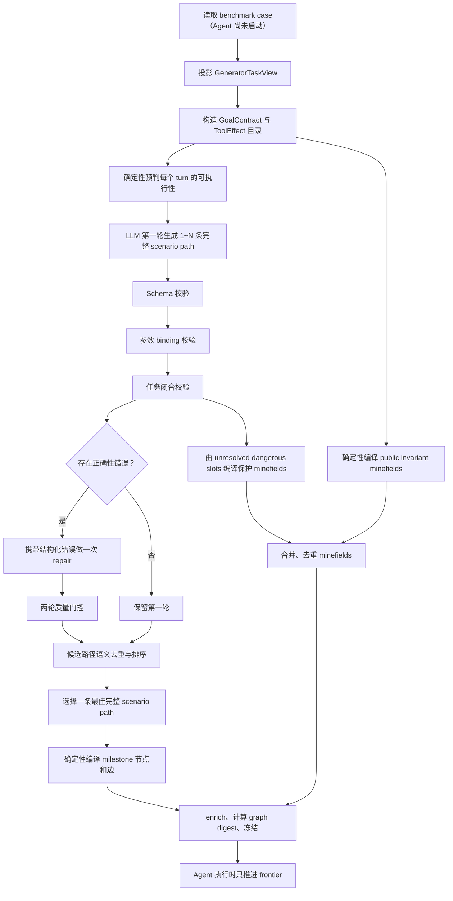

# DynSTEER Milestone 语义可靠性综合优化最终方案

本文是 milestone graph 与 minefield 生成链路的最终实施方案。方案只讨论执行前生成、编译、评测和运行期冻结，不修改 Agent 的任务输入，也不允许利用 Agent 实际执行轨迹反向补图。

## 第一部分：算法逻辑

### 1.1 目标与不可突破的边界

修改后的系统必须满足以下定义：

1. **生成时点**：一个 case 的完整 milestone graph 和 minefields 必须在 Agent 启动前一次性生成完毕。
2. **多轮任务**：若 case 在执行前已经定义后续用户轮次，生成器必须一次性覆盖全部预定义轮次；Agent 执行期间不得新增、删除或扩展 milestone。
3. **初始状态**：`Scenario.starting_context` 是 first-user boundary 的执行前 world state。凡是初始状态与目标状态冲突、且环境规则证明必须先恢复的步骤，均属于必经 milestone。
4. **信息隔离**：生成器可以读取 evaluator 在执行前持有的 case contract，但这些字段不能传给被测 Agent。生成器不得读取人工 milestone/minefield、verifier/evaluation target、Agent 实际轨迹、工具返回或最终状态。
5. **图的含义**：milestone 表示完成预定义任务所必需且可从执行证据判定的动作、状态效果或用户可见响应；minefield 表示执行前即可确定的禁止行为。
6. **空图语义**：空 milestone graph 不等于生成失败。`no_action`、`needs_clarification` 或只有 minefield 的 case 可以合法地没有 milestone 节点；成功与否还必须结合 disposition、minefield 和评测流程判断。
7. **参考图用途**：ToolSandbox 人工图只用于 reliability 评测，不进入生成器。评测时使用完整人工图，不截断未来轮次，也不删除由初始状态决定的恢复节点。

生成器允许读取和禁止读取的字段如下：

| 数据 | 生成器 | 被测 Agent | 说明 |
|---|---:|---:|---|
| first-user boundary 的初始状态 | 可读 | 按 benchmark 原有规则决定 | 用于识别恢复步骤和已有实体 |
| Agent runtime instruction/messages/tools | 可读 | 可读 | 两者都可使用的任务公开面 |
| 预定义 SYSTEM→USER user-simulator 计划 | 可读 | 启动时不可读 | evaluator-only 的执行前 interaction contract |
| allow/deny 后的工具 schema、环境依赖规则 | 可读 | 可读或由环境体现 | 用于 capability 和前置条件推理 |
| 人工 milestone/minefield | 禁止 | 禁止 | 仅 reliability reference |
| verifier、evaluation targets | 禁止 | 禁止 | 防止答案泄露 |
| 实际轨迹、工具结果、最终状态 | 禁止 | 执行后自然产生 | 禁止用执行结果补图 |

### 1.2 总体流程



核心原则是：**LLM 只负责把已知任务契约组织成候选操作序列；输入投影、参数来源校验、任务闭合、路径选择、图编译和 minefield 编译全部由代码确定性完成。**

### 1.3 执行前输入投影

统一生成视图 `GeneratorTaskView` 包含：

- `instruction`：首个用户任务文本；
- `public_assets`：带 `visibility` 和 source ref 的执行前证据；同时容纳 Agent-visible 内容和 evaluator-only user-simulator turn source，但 loader 不把后者传给 Agent；
- `initial_state`：first-user boundary 的结构化初始状态快照；
- `environment_rules`：低电量、蜂窝网络、Wi-Fi、权限和工具 allow/deny 等执行规则；
- `tool_schema`：最终可用工具 schema；
- `tool_effects`：最终可用工具对应的 capability、参数、前置条件、效果和结果绑定目录；
- `output_contract`：必须返回给用户的输出形式；
- `goal_contract`：代码从首轮请求和预定义 user-simulator 计划整理出的逐轮目标、slot、effect、响应要求和 source refs；它是唯一的规范化多轮 contract，不再并存一份内容重复的 `interaction_contract`；
- `evidence_catalog`、`invariant_catalog`：允许 compiler 生成约束和 minefield 的白名单证据。

ToolSandbox 的投影规则如下：

1. 以 `context.first_user_sandbox_message_index` 为 first-user boundary。
2. 将 boundary 时已经存在的 CONTACT、MESSAGING、REMINDER、SETTING 等 namespace 转为 `initial_state`；只保留任务规划需要的字段，不复制运行期缓存或内部对象。
3. 保留 recipient=AGENT 的 SYSTEM/USER 消息作为 Agent-visible assets。
4. 额外读取 boundary 时已经存在、recipient=USER 的 SYSTEM 消息，作为 evaluator-only user-simulator 计划；按原 sandbox message index 排序后直接规范化为 `goal_contract.turns`，原始文本只以带 source ref 的 `public_assets` 保存一份。
5. 将第一个真实 USER→AGENT 请求和后续预定义 user-simulator 请求合并为完整 turn 序列。后续 turn 即使尚未向 Agent 展示，也必须在图中预生成。
6. 根据 setting 初始值和 ToolSandbox 规则生成 `environment_rules`。例如“低电量模式禁止直接开启 location”“发送消息要求 cellular on”“联网查询要求 Wi-Fi on”。
7. 工具列表必须使用 allow/deny、扰动和可见性处理后的最终 schema，不能把不可用工具放入 contract。

`GeneratorTaskView.digest()` 覆盖上述全部生成输入。禁止把 origin graph、evaluation object 或 scenario verifier 序列化进该视图。

### 1.4 GoalContract：把自然语言目标转为可校验契约

`GoalContract` 是 compiler 的任务真值边界，不是人工答案。它只从合法执行前输入生成，包含：

```text
GoalContract
└── turns[]
    ├── turn_id / order
    ├── instruction_source_ref
    ├── slots[]
    │   ├── slot_id / semantic_type
    │   ├── required
    │   ├── value（若 case 已提供）
    │   ├── source_refs
    │   └── protects_capabilities（slot 未解析时禁止哪些写操作）
    ├── required_effects[]
    │   ├── capability
    │   ├── effect_kind
    │   ├── target_namespace
    │   └── required_state
    └── response_required
```

关键概念：

- **GoalSlot**：动作所需的语义参数，例如联系人身份、电话号码、消息内容、提醒时间。
- **GoalEffect**：用户真正要求的结果，例如 `contact.update`、`message.send`、`setting.enable.location`，而不是某个工具名。
- **ToolEffect**：工具能实现的 capability、必要参数、读写 namespace 和前置状态。
- **ArgumentBinding**：参数值的来源。只允许 case literal、前序 operation result 或 unresolved 三类。

参数绑定结构统一为：

```json
{
  "kind": "case_literal",
  "value": "Alice",
  "source_refs": ["turn:turn_0:instruction"]
}
```

或：

```json
{
  "kind": "operation_result",
  "operation_index": 0,
  "selector": "$.person_id"
}
```

`unresolved` 只用于说明任务为何不可执行，不能作为可执行工具调用的 required argument。

### 1.5 ToolEffect 与必要恢复步骤

每个可用工具必须映射到一个确定性的 `ToolEffect`：

```text
tool_name
capability
required_arguments
optional_arguments
reads / writes
precondition_rule_ids
effects
result_bindings
dangerous_when_unresolved
```

恢复步骤的判定不交给 LLM自由发挥，而由 compiler 根据 initial state、environment rules 和选中操作的 `precondition_rule_ids` 统一推导。具体条件只保存在 environment rules，ToolEffect 不复制条件表达式：

1. 若目标操作的前置状态已经满足，不插入恢复步骤。
2. 若前置状态不满足，且工具目录存在唯一或可排序的恢复 capability，则把恢复操作加入该 turn 的 required effects。
3. 恢复操作必须排在依赖它的目标操作之前，并成为 milestone。
4. 若没有可用恢复 capability，则该 turn 不能标为 executable，应转为 `needs_clarification` 或 `response_only`，具体取决于是否需要用户补充信息。

必须覆盖的已知规则：

- `low_battery_mode=true` 且开启 location 受限：先关闭低电量模式，再开启 location；两个操作都是 milestone。
- `cellular=false` 且需要发送消息：先开启 cellular，再发送消息。
- `wifi=false` 且假日查询依赖联网：先开启 Wi-Fi，再执行查询。

这三类恢复节点不得因“Agent 初始不可见”“不是最终目标”或“人工图未来轮次”而被删除。

### 1.6 逐轮 disposition 预判

每个 `TurnGoalContract` 先由代码给出允许的 disposition 集合：

- `executable`：required slots 均有合法来源，且至少存在一条 capability-complete 工具链；
- `needs_clarification`：必要 slot 缺失，执行写操作可能作用于错误对象；
- `response_only`：不存在实现目标的工具 capability，Agent 只能解释限制或拒绝；
- `no_action`：用户没有要求产生动作或响应 milestone。

LLM 可以在允许集合中给出 disposition 和原因，但不能把代码判定为不可执行的 turn 改成 executable。典型边界：

- `remove_contact_by_phone_no_remove_contact_insufficient_information`：工具集中没有 remove capability，生成 response milestone，不把 search 冒充 remove。
- 联系人身份无法唯一解析但存在 modify 工具：标记 `needs_clarification`，生成澄清响应，并生成禁止 `contact.update` 的 fatal minefield。
- 人工标注 milestone 为空不代表生成失败；若 disposition、响应要求和 minefield 都正确，空节点图是成功结果。

### 1.7 LLM 第一轮响应协议

第一轮允许返回 1～`max_candidate_path_count` 条路径，不再要求恰好 6 条，不设置“至少三分之二合法”的门槛，也不强制虚构不同 strategy。

每条 path 必须覆盖 `GoalContract` 的全部 turns：

```json
{
  "paths": [
    {
      "turns": [
        {
          "turn_id": "turn_0",
          "disposition": "executable",
          "disposition_reason": "The request and all required arguments are available.",
          "unresolved_slots": [],
          "operations": [
            {
              "evidence_id": "tool_call_search_contacts",
              "arguments": {
                "name": {
                  "kind": "case_literal",
                  "value": "Alice",
                  "source_refs": ["turn:turn_0:instruction"]
                }
              }
            },
            {
              "evidence_id": "tool_call_modify_contact",
              "arguments": {
                "person_id": {
                  "kind": "operation_result",
                  "operation_index": 0,
                  "selector": "$.person_id"
                },
                "relationship": {
                  "kind": "case_literal",
                  "value": "friend",
                  "source_refs": ["turn:turn_0:instruction"]
                }
              }
            }
          ]
        },
        {
          "turn_id": "turn_1",
          "disposition": "executable",
          "disposition_reason": "The second request was predefined by the case.",
          "unresolved_slots": [],
          "operations": [
            {
              "evidence_id": "tool_call_modify_contact",
              "arguments": {
                "person_id": {
                  "kind": "operation_result",
                  "operation_index": 0,
                  "selector": "$.person_id"
                },
                "relationship": {
                  "kind": "case_literal",
                  "value": "enemy",
                  "source_refs": ["turn:turn_1:instruction"]
                }
              }
            }
          ]
        }
      ]
    }
  ]
}
```

删除旧响应字段：`path_index`、`strategy`、operation 的 `name`/`purpose`、`expected_literal_index` 以及顶层 `minefield_invariant_ids`。名称、描述、expected、约束和 minefield 均由 compiler 根据 evidence、binding 和 contract 生成。

### 1.8 三层路径校验

每条 path 独立执行三层校验，并输出机器可读 violation；单条失败不影响其他路径。

#### 第一层：schema-valid

- 顶层只能有 `paths`；
- path 只能有 `turns`；
- turn id 必须与 GoalContract 一一对应且顺序一致；
- disposition、unresolved slots、operations 字段类型正确；
- evidence id 必须存在且 role 为 milestone；
- path 数量位于 1～`max_candidate_path_count`。

#### 第二层：binding-valid

- required argument 必须全部存在；
- `case_literal.source_refs` 必须指向生成视图中真实存在的 source，且 value 与该 source 一致；
- `operation_result.operation_index` 必须指向同一 turn 或已完成前序 turn 的操作，不能前向引用；
- selector 必须由 ToolEffect 的 result binding 白名单允许；
- unresolved binding 不能进入 executable operation；
- 不允许把公开文本中未出现的 ID、日期、电话号码或实体值当作 literal。

#### 第三层：task-complete

- 每个 turn 的 disposition 必须与 deterministic precheck 兼容；
- executable turn 必须覆盖全部 `required_effects`；
- 目标操作的 precondition 不满足时必须包含恢复 effect；
- search/read 不能冒充 delete/update/send 等写 effect；
- operation 顺序必须满足 binding 和 state dependency；
- 禁止加入与任何 required effect、binding 或 precondition 无关的 distraction 工具；
- response-required turn 必须由 compiler 可确定性追加 response milestone；
- 所有预定义 turns 均被覆盖，不能只生成首轮。

违反第三层的典型 fatal code 包括：`missing_required_effect`、`missing_recovery_effect`、`effect_mismatch`、`unsafe_unresolved_slot`、`missing_turn` 和 `unrelated_operation`。

### 1.9 条件 repair 与两轮质量门控

第二轮不再由“多样性不足”触发。只有第一轮出现以下正确性问题时才调用一次 repair：

- 顶层或 turn schema 不合法；
- 所有路径均 binding-invalid；
- 没有 task-complete path；
- turn disposition 与 deterministic precheck 冲突；
- 缺失恢复 effect、required effect 或预定义 turn；
- 出现 unresolved dangerous slot、前向 binding 或无关工具。

repair prompt 只提供：原始 GoalContract 摘要、首轮原始响应、结构化 violation 列表和正确 schema。只记录 returned/unique/duplicate path 数供诊断，不计算不参与决策的成对距离，也不因多样性触发修订。

首轮和第二轮分别计算 `RoundQuality`，按以下稳定顺序比较：

1. 所有 turn disposition compatible；
2. task-complete path 数量更多；
3. fatal violation 更少；
4. required effect coverage 更高；
5. unresolved binding 更少；
6. unrelated operation 更少；
7. 最佳完整路径更短；
8. 完全同分时选择第一轮。

第二轮只在质量严格更高时覆盖第一轮，从而避免当前 `selected = refined or draft` 导致的修订退化。

### 1.10 路径去重与选择

通过以下 canonical sequence 对 task-complete paths 去重：

```text
(
  turn_id,
  disposition,
  [(capability, canonical_argument_bindings), ...]
)
```

6 条完全重复的路径只算 1 条 unique path。单一完整合理路径是合法结果，不因缺少“共识票数”而拒绝。

不再把互斥路径合并成共识 DAG。选择规则为：

1. 只考虑 schema-valid、binding-valid、task-complete 的 unique path；
2. required effect coverage 必须为 100%；
3. fatal violation 必须为 0；
4. 按 unresolved 数、无关操作数、总操作数、canonical JSON 依次升序；
5. 选择排序第一的单条 scenario path。

其他 unique paths 仅用于计算每个 operation 的独立支持度并写入 metadata，不参与节点准入，不对互斥路线交叉连边。

### 1.11 Milestone graph 编译

选中 path 后，compiler 按 turn 和 operation 顺序确定性生成节点：

1. 一个 operation 对应一个 operation milestone。
2. constraint 至少检查工具名；所有可由 case literal 确定的参数同时进入约束。
3. 动态参数不写成伪 expected literal，而是写入 `constraint.stage_goal_semantics.argument_bindings`，供语义评分器识别“来自前序结果”。
4. `stage_goal_semantics` 同时写入 `kind=tool_call`、`tool_name`、`capability`、`effects` 和 argument match policy。
5. 节点 metadata 写入 `turn_id`、operation index、source refs、support count、selected path digest 和 `necessity_basis`。
6. 同一 turn 内按 operation 相邻顺序连边；相邻 turn 之间，将前一 turn 的最后节点连到后一 turn 的第一个节点。
7. 若 turn 需要向用户回复，compiler 在该 turn 末尾追加 response milestone，并从最后 operation 连到 response；无 operation 时 response 自身是该 turn 节点。
8. 对 `needs_clarification`/`response_only` turn，只生成必要响应节点，不生成危险工具节点。
9. 最后做 DAG 校验和 transitive reduction；不得跨不同候选路径合并节点或边。

生成图 metadata 至少包含：

```json
{
  "source": "generated",
  "schema_version": "milestone_graph.generated.v3",
  "view_digest": "...",
  "goal_contract_digest": "...",
  "selected_round": 1,
  "selected_path_digest": "...",
  "dispositions": {"turn_0": "executable"},
  "unique_complete_path_count": 1,
  "graph_digest": "..."
}
```

### 1.12 Minefield 编译

LLM 不再返回 minefield id。minefields 由 compiler 从两个来源确定性生成。

#### 来源一：结构化公开 invariant

适配器将 case/system/user 中的禁止项转成 `PublicInvariant`，每个 invariant 必须包含可执行 trigger：

- 禁止调用某 capability：生成 TOOL_CALL constraint；
- 禁止修改某 namespace/字段：生成 STATE_SNAPSHOT constraint；
- 禁止向错误 recipient 发消息：生成 STEP route/content constraint。

只有具备结构化 trigger 的 invariant 才能编译；不能继续用“Agent 输出包含禁止语句文本”代替实际违规行为。

#### 来源二：未解析危险 slot

若 turn 非 executable，且 required slot 的 `protects_capabilities` 非空，则为每个受保护 capability 生成 fatal minefield。例如联系人身份无法解析：

```text
slot: contact_identity = unresolved
protects_capabilities: [contact.update]
=> 禁止调用任何 capability=contact.update 的工具
```

minefield 生成步骤：

1. 将 invariant triggers 和 unresolved-slot protections 展开为 `(capability/target, selector, operator, expected, severity)`；
2. 按 canonical trigger 去重；
3. 用 trigger digest 生成稳定 minefield id；
4. fatal 使用固定 penalty 1.0，error 0.5，warning 0.25；
5. metadata 写入来源、turn/slot/invariant id、source refs 和保护 capability。

因此空 milestone 节点图若漏掉应有 fatal minefield，`semantic exact` 必须为 false。

### 1.13 图冻结与运行期行为

`compile_task_case()` 只允许由 `dynsteer.adapter.loader._adapt_task_case()` 在 session 创建前调用。完整流程为：

```text
adapt case
→ build generator view
→ compile graph/minefields
→ enrich graph/routes
→ materialize stage goals/specs
→ compute stable graph digest
→ save adapted case
→ start Agent session
```

稳定 digest 只覆盖 nodes、edges、minefields 和除 `graph_digest` 外的 graph metadata，不覆盖运行期 topology 对象。session 初始化时把 digest 写入 frontier；每个已闭合 Agent step 评估前进行一致性断言。

运行期唯一允许变化的是：

- `remaining_predecessor_count`；
- `ready_ids`；
- matched/blocked/frontier 诊断状态。

运行期禁止：

- 调用 generator；
- 修改 `task_case.milestone_graph.nodes/edges/minefields`；
- 因新工具结果或新用户可见轮次补图；
- 用实际轨迹修订参数 expected。

### 1.14 Reliability v3 的判定逻辑

`milestone_reliability.py` 使用完整 origin graph 的统一语义表示与 generated graph 比较。`completed=true` 仅表示 graph object 成功返回且评测流程完成，不表示节点非空，也不表示语义正确。

每个 case 独立输出：

- `graph_returned`、`graph_empty`；
- turn disposition accuracy；
- operation/tool capability precision、recall、F1；
- argument literal/binding accuracy；
- state effect precision、recall、F1；
- response milestone accuracy；
- minefield precision、recall、F1 和 fatal miss count；
- semantic topology accuracy；
- `complete_semantic_exact`；
- `input_coverage`。

`complete_semantic_exact=true` 必须同时满足：

1. 全部 turn disposition 一致；
2. milestone operation/effect/response 一致；
3. required literal 或 binding 一致；
4. minefield 一致且 fatal miss=0；
5. 必要 precedence 一致；
6. 没有 reference input coverage 缺口。

raw strict GED、structural GED、topology GED 和 FGW 继续保留在 diagnostics，但不作为主结论。若 origin 某语义无法由 GeneratorTaskView 的合法输入解释，记录为 `input_coverage.uncovered` 并使 adapter/experiment contract 验收失败；不得通过删除 origin 节点或截断未来轮次来提高分数。

### 1.15 端到端伪代码

```python
def compile_task_case(view, config, llm):
    goal_contract = view.goal_contract
    precheck = _precheck_goal_contract(
        goal_contract,
        view.tool_effects,
        view.environment_rules,
        view.initial_state,
    )
    payload = build_generation_payload(view, goal_contract, precheck)

    draft = generate_and_validate(llm, payload, round_index=1)
    selected_round = draft
    if draft.has_correctness_errors:
        repaired = generate_and_validate(
            llm,
            build_repair_payload(payload, draft.violations),
            round_index=2,
        )
        selected_round = better_round(draft, repaired)

    unique_paths = deduplicate_complete_paths(selected_round.complete_paths)
    selected_path = select_best_complete_path(unique_paths)

    if selected_path is None and precheck.requires_response_path:
        selected_path = deterministic_response_path(precheck)
    if selected_path is None:
        raise MilestoneGenerationError("没有可编译的完整路径", selected_round.report)

    nodes, edges = compile_selected_path(selected_path, goal_contract)
    minefields = compile_minefields(
        view.invariant_catalog,
        precheck.unresolved_slots,
        view.tool_effects,
    )
    graph = MilestoneGraph(nodes=nodes, edges=edges, minefields=minefields)
    return graph, build_generation_report(...)

# 仅由 loader 在 Agent session 启动前执行：
graph, report = compile_task_case(view, config, llm)
task_case.milestone_graph = enrich_milestone_graph(graph)
task_case = postprocess_task_case(task_case)
digest = stable_graph_digest(task_case.milestone_graph)
task_case.milestone_graph.metadata["graph_digest"] = digest
```

## 第二部分：具体修改内容

### 2.1 修改后的目录结构

```text
dynsteer/
├── utils.py                      # 复用稳定 JSON 序列化与 digest
├── graph.py                      # 复用 DAG 校验与 transitive reduction
├── milestone/
│   ├── __init__.py
│   ├── model.py                  # 生成配置、contract、report 数据类
│   ├── semantics.py              # 统一语义、digest、reference coverage
│   └── compiler.py               # 路径生成/校验/选择/编图/minefield
├── adapter/
│   ├── contract.py               # benchmark 共用 evidence/invariant 工具
│   ├── base.py                   # generator view 与 reference semantics 接口
│   ├── loader.py                 # 唯一执行前编译入口与冻结
│   ├── toolsandbox/
│   │   ├── adapter.py
│   │   └── utils/
│   │       ├── contract.py       # ToolSandbox 执行前输入投影
│   │       ├── effects.py        # 新增：ToolEffect/环境依赖目录
│   │       └── scenario.py       # origin graph 与 interaction plan 语义化
│   └── agentcompass/
│       └── contract.py
├── evaluate/
│   ├── evaluator.py              # 运行期 digest 断言
│   └── matching/
│       └── frontier.py           # 只推进静态图 frontier
└── prompt/templates/milestone/
    ├── generation.en.md
    ├── generation.zh.md
    ├── refinement.en.md
    └── refinement.zh.md

milestone_reliability.py          # v3 语义指标
data/experiments/
└── toolsandbox_milestone_reliability_partial_main.json
tests/
├── milestone/
│   ├── test_compiler.py
│   ├── test_semantics.py
│   └── test_reliability.py
├── adapter/
│   ├── test_contract.py
│   └── test_toolsandbox_contract.py
├── evaluate/
│   └── test_milestone_frontier_freeze.py
└── test_milestone_response_recording.py
```

#### 2.1.1 唯一职责和唯一调用链

为避免落地后出现“同一算法多份实现”，各职责固定如下：

| 职责 | 唯一实现位置 | 其他模块允许做什么 |
|---|---|---|
| JSON canonicalization、JSON digest | `dynsteer/utils.py` | 调用，不得自建 `_canonical_json()`/`_digest()` |
| DAG 校验、transitive reduction | `dynsteer/graph.py` | compiler 调用，不得保留本地 `_is_dag()`/`_reachable()` |
| ToolSandbox 工具 capability/环境规则 | `adapter/toolsandbox/utils/effects.py` | contract 只调用 resolver，不复制规则表 |
| 多轮消息解析 | `adapter/toolsandbox/utils/scenario.py` | contract 只消费解析结果，不再实现 `_interaction_contract()` |
| GoalContract 构造 | `adapter/toolsandbox/utils/contract.py` | compiler 只校验和执行 precheck，不重新解析自然语言 |
| 恢复步骤推导、effect coverage、binding 校验 | `milestone/compiler.py` | adapter 只提供事实目录，不做第二套推理 |
| milestone/minefield canonical semantics | `milestone/semantics.py` | reliability 直接消费，不复制字段提取 |
| 图生成入口 | `adapter/loader.py::_adapt_task_case()` | runtime 禁止调用 compiler |
| runtime 图状态 | `evaluate/matching/frontier.py` | 只维护 ready/count，不复制或重建图 |

数据也必须单一来源：

- 预定义多轮计划规范化后只存在于 `GoalContract.turns`；原始证据只在 `public_assets` 中保留 source ref，不再增加重复的 `interaction_contract` 字段。
- 环境条件只在 `environment_rules` 保存一次；`ToolEffect.precondition_rule_ids` 只引用 rule id，不复制条件表达式。
- tool 参数 schema 只在 `tool_schema` 保存；`ToolEffect` 只保存 compiler 必需的参数名、capability、effect 和 binding selector，不复制完整 JSON Schema/描述文本。
- graph digest 只持久化在 `MilestoneGraph.metadata`，运行期 frontier 保存启动时快照；不再复制到 `GenerationReport` 或 `TaskCase.metadata`。
- 语义指标只从 `canonical_graph_semantics()` 的一次结果计算，GED descriptor 仅作为 diagnostics，二者不得各自再做一套“主语义”提取。

#### 2.1.2 不允许出现的实现形态

- 不为单个调用方新增只转调另一函数的 wrapper；
- 不同时保留 old/new schema parser、兼容 alias 或双写字段；
- 不在中英文 prompt 之外复制两份 Python 校验规则；prompt 只说明协议，正确性以 compiler 为准；
- 不为每个 reliability 维度写结构相同的薄包装函数，集合类指标统一走一个 `_set_metric()`；
- 不缓存可由 O(1) 字段读取或单次小集合遍历得到的中间对象；仅缓存 path canonical key 这类会重复排序/序列化的值。

### 2.2 `dynsteer/milestone/model.py`

#### 修改 `MilestoneGenerationConfig`

删除：

- `simulated_path_count`；
- `simulated_path_count >= 5`；
- 由固定路径数推导三分之二合法路径数的约束。

改为：

```python
@dataclass(frozen=True)
class MilestoneGenerationConfig:
    use_origin_milestone: bool = True
    max_candidate_path_count: int = 6
    enable_repair: bool = True
    generator: JsonObject = field(default_factory=dict)
```

`__post_init__()` 校验 `max_candidate_path_count` 是 1～8 的整数、`enable_repair` 是 bool。上限用于控制 token 和校验成本，不要求 LLM 返回满额路径。

#### 新增 contract 数据类

在 `PublicEvidence` 前新增并显式导出：

- `ArgumentBinding`：`kind`、`value`、`source_refs`、`operation_index`、`selector`；在 `__post_init__` 中按 kind 检查互斥字段。
- `GoalSlot`：`slot_id`、`semantic_type`、`required`、`value`、`source_refs`、`protects_capabilities`。
- `GoalEffect`：`capability`、`effect_kind`、`target_namespace`、`required_state`、`source_refs`。
- `TurnGoalContract`：`turn_id`、`order`、`instruction_source_ref`、`slots`、`required_effects`、`response_required`；不重复保存已经位于 `public_assets` 的 instruction 文本。
- `GoalContract`：`turns`、`metadata`，`digest()` 直接调用 `stable_json_digest()`。
- `ToolEffect`：工具到 capability、必要参数名、`precondition_rule_ids`、effect、result selector 的映射；不保存完整 tool schema。

不新增 `MilestoneInputCoverage` 数据类：coverage 只被 reliability/report 序列化消费，直接使用结构固定的 `JsonObject`，避免一个只有 `to_dict()` 用途的包装类型。所有入参有类型声明，核心类补中文 docstring；不增加只调用其他函数的 wrapper。

#### 扩展 `PublicInvariant`

当前字段无法表达真实违规行为。增加：

```python
trigger_evidence_ids: tuple[str, ...]
metadata: JsonObject
```

删除单一 `evidence_id` 假设。一个 invariant 可以映射到多个工具、状态或消息 trigger；受保护 capability 从 trigger evidence/ToolEffect 推导，不在 invariant 再存一份重复列表。

#### 扩展 `GeneratorTaskView`

增加：

```python
initial_state: JsonObject
environment_rules: JsonObject
tool_effects: tuple[ToolEffect, ...]
goal_contract: GoalContract
```

`digest()` 自动覆盖新字段。字段不可选；没有对应内容时传空对象、空元组或空 turns，禁止用 `None` 混淆“未投影”和“确实为空”。

#### 重构 `GenerationReport`

删除共识算法专用字段：

- `requested_path_count`；
- `minimum_valid_path_count`；
- `candidate_atom_count`；
- `aligned_atom_count`；
- `consensus_node_count`。

增加：

```text
schema_version = milestone_generation.report.v3
generation_status
turn_dispositions
max_candidate_path_count
returned_path_count
schema_valid_path_count
binding_valid_path_count
complete_path_count
unique_complete_path_count
selected_round
selected_path_digest
graph_returned
graph_empty
minefield_count
repair_triggered
round_summaries
path_summaries
reasons
```

`generation_status=generated` 允许 `graph_empty=true`。`graph_digest` 不进入 report，因为 digest 在 compiler 返回后才由 loader 对 enrich 后的最终图计算，唯一持久化位置是 `MilestoneGraph.metadata["graph_digest"]`。`input_coverage` 也不进入 generation report：它依赖仅 reliability 可读的 reference graph，只存在于 reliability case/summary，避免 compiler 接触 reference 或重复存储指标。

### 2.3 `dynsteer/utils.py` 与新增 `dynsteer/milestone/semantics.py`

#### 修改 `dynsteer/utils.py`

新增两个通用函数，替换本次链路中所有重复 JSON hash helper：

```python
def canonical_json(value: object) -> str: ...
def stable_json_digest(value: object) -> str: ...
```

`canonical_json()` 内部先 `json_safe()`，再统一使用 `ensure_ascii=False`、`sort_keys=True` 和紧凑 separators；`stable_json_digest()` 只负责对前者做 SHA-256。随后删除：

- `dynsteer/milestone/compiler.py::_canonical_json()`；
- `milestone_reliability.py::_canonical_json()` 和 `_digest()`；
- `GeneratorTaskView.digest()`、`GoalContract.digest()` 内重复的 `json.dumps/hashlib` 代码；
- `adapter/loader.py` 生成 `artifact_id` 时重复的 canonical dump。

文本原始响应的 SHA-256 不属于 JSON canonicalization，可继续直接对 UTF-8 bytes 哈希。

#### 新增 `dynsteer/milestone/semantics.py`

该文件集中实现跨 compiler、adapter 和 reliability 共用的语义逻辑，禁止在 `milestone_reliability.py` 再复制一套 canonicalization。

只暴露三个确有跨模块调用方的函数：

```python
def canonical_graph_semantics(graph: MilestoneGraph) -> JsonObject: ...
def stable_graph_digest(graph: MilestoneGraph) -> str: ...
def compare_input_coverage(
    reference: MilestoneGraph,
    view: GeneratorTaskView,
) -> JsonObject: ...
```

argument、milestone 和 minefield 的 canonicalizer 只作为上述函数内部的 `_canonical_*` helper，不从 `milestone/__init__.py` 导出，避免形成无外部调用方的公共 API。

实现要求：

- canonical milestone 提取 turn、capability、tool、literal arguments、dynamic bindings、effects 和 response route；
- canonical minefield 提取 trigger capability/target、severity 和保护语义；
- topology 只比较语义节点间的可达关系，不依赖 `m0`、hash id 等表面标识；
- `stable_graph_digest()` 对完整 nodes/edges/minefields/metadata 做精确序列化，只排除 `graph.metadata.graph_digest` 和运行期 `graph.topology`，再调用 `stable_json_digest()`；它不能直接 hash `canonical_graph_semantics()`，因为语义 canonicalizer 会忽略 id/name 等字段，无法检测全部运行期图修改；
- input coverage 逐个 reference semantic item 查找合法 source refs、GoalEffect、ToolEffect 或 invariant trigger 的来源，输出明确的 uncovered reason；
- 该模块不 import benchmark 实现，避免 milestone 包反向依赖 ToolSandbox。
- 现有 `dynsteer/evaluate/semantic.py` 负责运行期消息语义复判，`dynsteer/evaluate/diagnostics.py` 负责展示摘要；二者职责不同，不迁入、不复制其函数，也不得把展示摘要当 canonical semantics。

`canonical_graph_semantics()` 与 `stable_graph_digest()` 虽然都会遍历图，但前者服务跨图语义比较、允许忽略表面 id，后者服务同一图的字节级冻结、必须覆盖表面字段；两者判定目标不同，不能为了表面复用而合并成错误算法。它们只共享 `canonical_json()/stable_json_digest()`。

### 2.4 `dynsteer/milestone/compiler.py`

这是本次主要重构文件。保留 `compile_task_case()` 作为唯一公开入口，内部函数按“主流程在前、校验和 helper 在后”排列。

#### 同步修改 `dynsteer/graph.py`

把通用图算法放在现有图模块，而不是继续留在 compiler：

```python
def transitive_reduction(
    node_ids: set[str],
    edges: list[tuple[str, str]],
) -> list[tuple[str, str]]: ...
```

实现复用现有 `build_adjacency()` 和 `topological_order()`；后者已经负责 DAG 校验。可达性 helper 保持为 `graph.py` 私有函数。compiler 只调用 `transitive_reduction()`，因此删除 compiler 内 `_transitive_reduction()`、`_reachable()` 和 `_is_dag()` 三个重复函数。

#### 删除旧数据结构和常量

删除：

- `CONSENSUS_RATIO`、`PATH_STRATEGIES`、`_PathSignature`；
- `_PathAtom`、带 `path_index/strategy` 的 `_PathCandidate`；
- `_AlignedPath`、`_ConsensusCluster`；
- `_strategies()`、`_align_path()`、`_consensus_clusters()`、`_milestones_from_clusters()`、`_consensus_edges()`；
- `_path_set_diversity()`、`_round_feedback()` 和旧 `_mark_duplicate_summaries()`；新流程只记录 returned/unique/complete 数，不再计算不会参与选择的成对路径距离；
- `_contains_forbidden_atom_reference()`、`_allowed_expected_literals()` 和 `_public_literals()`；新 schema 没有 atom 引用或 expected literal index；
- `_valid_path_summary()`、`_rejected_path_summary()` 的旧 `path_index/strategy/atom_count` 版本，改由 validation result 直接序列化；
- `expected_literal_index` 解析；
- “executable 至少 ceil(2/3*N) 条合法路径”拒绝逻辑；
- LLM 提供 `minefield_invariant_ids` 的逻辑。

#### 新增内部结构

```python
@dataclass(frozen=True)
class _OperationCandidate:
    evidence_id: str
    arguments: dict[str, ArgumentBinding]

@dataclass(frozen=True)
class _TurnCandidate:
    turn_id: str
    disposition: TurnDisposition
    disposition_reason: str
    unresolved_slots: tuple[str, ...]
    operations: tuple[_OperationCandidate, ...]

@dataclass(frozen=True)
class _PathCandidate:
    turns: tuple[_TurnCandidate, ...]

@dataclass(frozen=True)
class _PathValidation:
    schema_valid: bool
    binding_valid: bool
    task_complete: bool
    violations: tuple[JsonObject, ...]
    effect_coverage: float
    unresolved_binding_count: int
    unrelated_operation_count: int

@dataclass(frozen=True)
class _RoundCandidate:
    paths: tuple[_PathCandidate, ...]
    validations: tuple[_PathValidation, ...]
    raw_response: str
    quality: JsonObject
```

`TurnDisposition` 使用 `Literal["executable", "needs_clarification", "no_action", "response_only"]`。

#### 重写 `compile_task_case()`

函数按以下固定步骤实现：

1. 校验 view/config/llm；
2. `_precheck_goal_contract()` 从 `view.goal_contract`、`view.tool_effects`、`view.environment_rules` 和 initial state 统一计算 disposition、恢复步骤和 effect coverage 前提；adapter 不再另做恢复推导；
3. 构造不含 origin/verifier 的 payload；
4. 调用第一轮 `_generate_round()`；
5. 对每条 path 直接依次调用 schema、binding、task-completeness 三个 validator，并把结果聚合进 `_RoundCandidate`；不新增只负责循环转调的 `_validate_round()`；
6. `_repair_reasons()` 非空且 `enable_repair=true` 时才调用第二轮；
7. `_select_round()` 按 1.9 的顺序选轮次；
8. `_distinct_complete_paths()` 去重；
9. `_select_best_path()` 选单一路径；
10. `_compile_selected_path()` 编译节点和边；
11. `_compile_minefields()` 从 invariant 和 unresolved slot 编译；
12. 构造 graph 和 v3 report；digest 在 enrich 后由 loader 写入。

若没有 LLM complete path，但全部 turn 均为 deterministic non-executable，允许 `_deterministic_non_executable_path()` 生成仅响应/空节点路径。若存在 executable turn 却无完整路径，抛出带 v3 report 的 `MilestoneGenerationError`。

#### 重写 payload 与 prompt 参数

`_generator_payload()` 返回：

```text
task
initial_state
environment_rules
goal_contract
tools（来自 view.tool_effects，含 capability/effects/参数）
evidence
allowed_dispositions
```

`_public_task_payload()` 必须保留 GoalContract 引用的 evaluator-only turn source assets，但只序列化白名单字段。添加 `_assert_no_forbidden_generation_inputs()`，递归拒绝键名 `milestone_matcher`、`minefield_matcher`、`evaluation`、`verifier`、`reference_graph`、`trajectory` 和 `final_state`。

#### 重写解析与校验函数

新增：

```python
def _parse_response(raw: str, config: MilestoneGenerationConfig) -> tuple[_PathCandidate, ...]: ...
def _validate_schema(path: _PathCandidate, goal: GoalContract) -> tuple[JsonObject, ...]: ...
def _validate_bindings(path: _PathCandidate, view: GeneratorTaskView) -> tuple[JsonObject, ...]: ...
def _validate_task_completeness(path: _PathCandidate, precheck: JsonObject) -> tuple[JsonObject, ...]: ...
def _repair_reasons(round_candidate: _RoundCandidate) -> tuple[JsonObject, ...]: ...
def _round_quality(round_candidate: _RoundCandidate) -> JsonObject: ...
def _select_round(draft: _RoundCandidate, repaired: _RoundCandidate | None) -> _RoundCandidate: ...
def _distinct_complete_paths(round_candidate: _RoundCandidate) -> list[_PathCandidate]: ...
def _select_best_path(paths: list[_PathCandidate]) -> _PathCandidate: ...
```

所有 violation 使用 `{code, severity, path_index, turn_id, operation_index, detail}`，不把异常静默吞掉。LLM 网络/JSON 顶层失败记录 round error；单 path 错误只淘汰该 path。

#### 重写图编译函数

新增：

```python
def _compile_selected_path(
    path: _PathCandidate,
    view: GeneratorTaskView,
    support: Mapping[str, int],
) -> tuple[list[Milestone], list[tuple[str, str]]]: ...

def _compile_operation_milestone(...): ...
def _compile_response_milestone(...): ...
def _compile_minefields(...): ...
```

milestone id 使用 `(turn_id, operation_index, canonical operation)` digest；response id 使用 `(turn_id, response)` digest。constraint 的 `stage_goal_semantics` 必须写入 `argument_bindings`，不能只在 metadata 保存。

`_compile_minefields()` 不接收 LLM 返回值，只接收 `view.invariant_catalog`、precheck 和 ToolEffect catalog。

#### 保留并调整的函数

- `_record_raw_response()` 保留，继续按 case 聚合保存两轮原始输出；repair 未触发时只保存 round 1。
- `_source_values()` 和 `_evidence_catalog()` 保留，但要覆盖 initial_state、environment_rules、goal_contract 和 public assets，并验证 source ref 唯一。
- `_generation_report()` 改为生成 v3 字段。
- canonical key、milestone id 和 path digest 全部调用 `canonical_json()`/`stable_json_digest()`，compiler 不保留本地 JSON/hash helper。
- 完成删除后同步清理只服务旧共识阈值的 `ceil` 及其他无引用 import；`Counter`、`NoReturn` 等只有在新实现仍有真实调用时才保留。最终 import 必须能由文件内生产代码或类型检查引用证明。

### 2.5 `dynsteer/milestone/__init__.py`

使用显式顶层导入，禁止懒加载。导出：

- `compile_task_case`；
- 新增 contract/report 数据类；
- `canonical_graph_semantics`、`stable_graph_digest`、`compare_input_coverage`。

删除已经不存在的旧类型导出，不保留兼容 alias。

### 2.6 `dynsteer/adapter/contract.py`

#### 用 `agent_response_evidence()` 替换 `base_public_evidence()`

删除返回混合列表的 `base_public_evidence()`，新增单一职责工厂：

```python
def agent_response_evidence() -> PublicEvidence: ...
```

它只返回确实会被 compiler 生成 constraint 的 `agent_response_present`。同时删除旧列表中的：

- `agent_message_instruction`：instruction 已通过 source ref 进入 GoalContract，不是待匹配 milestone evidence；
- `tool_result_present`：动态结果来源由 ToolEffect.result selector 和 ArgumentBinding 表达，不单独生成“出现任意工具结果”的 milestone。

工具调用 evidence 由 `normalize_tool_contract()` 根据 ToolEffect 生成，参数语义放到 ToolEffect，不再让 LLM用 `expected_literal_index` 选 expected。

#### 调整 `normalize_tool_contract()`

该函数是工具 schema→ToolEffect→tool evidence 的唯一遍历入口，签名改为：

```python
def normalize_tool_contract(
    tool_schema: JsonObject,
    effect_resolver: Callable[[str, JsonObject], ToolEffect],
) -> tuple[JsonObject, tuple[ToolEffect, ...], list[PublicEvidence]]: ...
```

函数只遍历一次工具列表：规范化 schema，调用 adapter 提供的 resolver 构造 ToolEffect，再从 ToolEffect 确定性生成 PublicEvidence。每个工具必须有稳定 `evidence_id`、真实 tool name 和 capability；同名工具或同 evidence id 直接报错。

在本文件提供 `default_tool_effect_resolver()` 给 AgentCompass 等无 benchmark-specific effect 目录的 adapter 使用。ToolSandbox 必须传入自身 resolver。不得再新增独立的 `tool_evidence_from_effects()` 或第二次扫描 tool schema 的 `build_*_tool_effects()`。

#### 重写 `build_public_invariants()`

当前实现只用正则搜索 `must not/do not/never`，再生成“消息内容包含该句”的 minefield evidence，语义错误。修改为：

```python
def build_public_invariants(
    contents: list[JsonObject],
    tools: tuple[ToolEffect, ...],
) -> tuple[list[JsonObject], list[PublicEvidence], list[PublicInvariant]]:
```

每个 content 必须带 `source_ref`。函数只把能映射到 capability、state field 或 message route 的规则加入 invariant catalog；无法结构化的规则进入 `unparsed_invariants` 诊断，不生成虚假 minefield。

共享 slug、source-ref 和 invariant trigger 构造只在本文件实现一次。

### 2.7 新增 `dynsteer/adapter/toolsandbox/utils/effects.py`

该文件是 ToolSandbox 工具与环境规则的唯一目录，新增主要接口：

```python
def resolve_toolsandbox_tool_effect(
    tool_name: str,
    function_schema: JsonObject,
) -> ToolEffect: ...
def build_toolsandbox_environment_rules(initial_state: JsonObject) -> JsonObject: ...
```

`resolve_toolsandbox_tool_effect()` 只解析一个已经过 allow/deny 的工具，由 `normalize_tool_contract()` 在单次遍历中调用。`effects.py` 不实现 effect coverage、disposition 或恢复步骤推导；这些任务只由 compiler 的 `_precheck_goal_contract()` 完成。

effect catalog 以 capability 为稳定语义，至少覆盖当前 25 case 用到的：

```text
contact.search / contact.add / contact.update / contact.remove
message.search / message.send
reminder.search / reminder.add / reminder.update
setting.enable / setting.disable
holiday.lookup
response.emit
```

每个 entry 明确 required argument 名、result selectors、`precondition_rule_ids`、state effects 和 `dangerous_when_unresolved`。具体条件表达式只存在于 `environment_rules`，ToolEffect 通过 rule id 引用，避免两处维护同一依赖。工具扰动只改变 schema 名称/描述/参数名时，优先从 ToolSandbox callable identity 或 adapter metadata 恢复 capability；不能靠模型猜测字符串。

环境规则至少实现：

- location 与 low-battery 的依赖；
- message.send 与 cellular 的依赖；
- holiday.lookup 与 Wi-Fi 的依赖。

若 ToolSandbox 后续新增工具但无法映射 capability，adapter 应在 input coverage 中报告 unknown tool effect；不得默认把它当成任意写 capability。

### 2.8 `dynsteer/adapter/toolsandbox/utils/contract.py`

#### 保留并扩展 `agent_facing_tool_schema()`

继续从 `context.get_available_tools(scrambling_allowed=True)` 获取最终工具。额外把 callable identity、原始参数到扰动参数的映射写入 evaluator-only metadata，供 `effects.py` 建 catalog；输出给 LLM 时只暴露必要 capability/effect，不暴露 Python 对象。

#### 重写 `build_toolsandbox_generator_view()`

当前函数只保留 recipient=AGENT 的 SYSTEM/USER 消息，导致初始状态和多轮计划缺失。改为：

1. 调用 `initial_state_from_context()`；
2. 调用 `interaction_plan_from_steps()`，分别构造 agent-visible assets 和 evaluator-only turns；
3. 将 `resolve_toolsandbox_tool_effect()` 传给 `normalize_tool_contract()`，一次得到 normalized schema、ToolEffects 和 tool evidence；
4. 调用 `build_toolsandbox_environment_rules()`；
5. 调用本文件唯一的 `_build_goal_contract()`，把解析结果规范化为 GoalContract；
6. 构造 structured invariants，并显式加入 `agent_response_evidence()`；
7. 返回完整 `GeneratorTaskView`。

新增内部函数：

```python
def _agent_visible_assets(steps: list[JsonObject]) -> list[JsonObject]: ...
def _build_goal_contract(...) -> GoalContract: ...
```

本文件不得再实现 `_interaction_contract()` 或第二套消息遍历；turn 排序和稳定编号统一由 `scenario.py::interaction_plan_from_steps()` 完成。`relationship_twice_multiple_user_turn` 应生成两个 turn，而不是等第二轮真正出现后扩图。

新增投影审计 metadata：

```text
first_user_sandbox_message_index
initial_state_namespaces
agent_visible_message_refs
interaction_turn_refs
tool_effect_count
unparsed_invariants
```

### 2.9 `dynsteer/adapter/toolsandbox/utils/scenario.py`

保留 origin graph 转换职责，并增加生成器 contract 所需的纯读取函数：

```python
def initial_state_from_context(
    context: object,
    module_loader: Callable[[str], object],
) -> JsonObject: ...

def interaction_plan_from_steps(
    steps: list[dict[str, JsonValue]],
    first_user_sandbox_message_index: int,
) -> JsonObject: ...
```

`initial_state_from_context()` 复用 `sandbox_rows_from_context()` 的 boundary snapshot，不读取执行后的 context。输出 namespace→rows/settings 的 JSON-safe 结构。

`interaction_plan_from_steps()` 识别：

- 首轮 USER→AGENT；
- 执行前 SYSTEM→USER 中描述的后续预定义用户请求；
- turn 的原始 sandbox index 和 source ref。

现有 `task_description_from_steps()` 改为复用 `interaction_plan_from_steps()` 的首个 turn，不再独立遍历 steps 决定 first user 文本。这样 first-user boundary 和多轮解析只有一套实现。

#### 调整 `milestone_graph_from_scenario()`

继续完整转换所有 origin milestone、edge 和 minefield。禁止增加“仅保留 first-user 前节点”或“删除恢复节点”的过滤参数。

`constraint_from_snapshot_constraint()` 继续产出 `stage_goal_semantics`，但补充统一 `capability`、`effects` 和 `argument_bindings`，使 reference 与 generated graph 能进入同一个 canonicalizer。`tool_trace_dependant_similarity` 保留 `reference_derived` binding，不伪造 literal。

### 2.10 `dynsteer/adapter/toolsandbox/adapter.py`

#### 修改 `adapt_task_case()`

当前代码写死 `initial_state=None`。改为：

```python
initial_state = initial_state_from_context(context, module_loader)
```

并写入 `TaskCase.initial_state`。`is_default` 时是否带 origin graph 的现有行为保持，但生成模式不得把 origin graph传入 generator view。

metadata 增加 first-user boundary 和 interaction turn count，方便审计。

#### 修改 `generator_task_view()`

继续重新读取同一个 pre-execution scenario，但调用重构后的 `build_toolsandbox_generator_view()`；返回前断言 `view.case_id == case_id` 且 forbidden input scan 通过。

#### 修改 `refresh_task_case_for_experiment()`

删除：

```python
task_case.initial_state = None
```

generated graph 不从 origin graph复制 expected、semantics 或 metadata。只有使用 origin graph 的基准运行才允许刷新人工 constraint 的动态 target。该分支必须由 `graph.metadata.source == "origin"` 明确保护。

### 2.11 `dynsteer/adapter/agentcompass/contract.py`

适配新 `GeneratorTaskView` 必填字段：

- `initial_state` 使用 `task_case.initial_state or {}`；
- `environment_rules` 从 environment schema 中投影；
- `tool_effects` 使用 `normalize_tool_contract(..., default_tool_effect_resolver)` 的第二个返回值；
- `goal_contract` 直接包含首轮 instruction/output contract，不再同时保存 interaction contract。

evidence 列表改为显式加入 `agent_response_evidence()`，不再调用已删除的 `base_public_evidence()`。AgentCompass 无 ToolSandbox state dependency 时不伪造恢复规则。继续禁止测试、patch、verifier 和期望输出答案进入 generator view。

### 2.12 `dynsteer/adapter/base.py`

保留抽象方法 `generator_task_view()`，新增一个用于 reliability 的抽象/默认接口：

```python
def reference_milestone_graph(
    self,
    config: HarnessRunConfig,
    case_id: str,
) -> MilestoneGraph | None:
    return None
```

ToolSandbox override 返回 `milestone_graph_from_scenario(scenario)`；其他 benchmark 没有 reference 时返回 `None`。这样 `milestone_reliability.py` 不再绕过 adapter 直接读取 scenario internals。

不新增单纯转调 `generator_task_view()` 的中转函数。

### 2.13 `dynsteer/harness/config.py`、`dynsteer/experiment/model.py` 与 `dynsteer/experiment/runner.py`

#### `dynsteer/harness/config.py`

`milestone_generation_from_mapping()`：

- 允许字段改为 `use_origin_milestone`、`max_candidate_path_count`、`enable_repair`、`generator`；
- 删除 `simulated_path_count`；
- 构造新 `MilestoneGenerationConfig`；
- 未知旧字段直接报错，不做兼容转换。

#### `dynsteer/experiment/model.py`

`ExperimentRunSpec` 类型不变，继续持有 `MilestoneGenerationConfig`；`to_metadata()` 如需要输出 generation config，使用最新字段名。

#### `dynsteer/experiment/runner.py`

`_static_adaptation_key()` 将 `generation.simulated_path_count` 改为：

```python
generation.max_candidate_path_count,
generation.enable_repair,
```

防止不同 repair 配置错误共享 adapted case cache。

### 2.14 `dynsteer/adapter/loader.py`

#### 修改 `_adapt_task_case()`

维持其为唯一自动生成入口，调整为：

```text
adapter.adapt_task_case
→ adapter.generator_task_view
→ compile_task_case
→ enrich_milestone_graph
→ enrich_milestone_routes
→ materialize goals/specs
→ stable_graph_digest
→ 写入 metadata/report
```

具体修改：

- `has_origin_graph` 不能只看 nodes/minefields；存在合法空 origin graph 时也应由 `graph is not None` 和 source metadata 判定。
- generator 返回后立即设置 `source=generated`，再 enrich。
- `_postprocess_task_case()` 完成后计算 digest，只写入 `task_case.milestone_graph.metadata["graph_digest"]`；generation report 不重复保存。
- adapted case metadata 写入 `generation_phase="pre_execution"`。
- 不新增任何从 runtime 调用 compile 的入口。
- 现有 `artifact_id` 改用 `stable_json_digest(canonical)`，删除本文件局部的 `json.dumps(...sort_keys=True)+hashlib.sha256` 组合。

#### 修改 `save_task_case()`

当前代码强制 `data["initial_state"] = None`，会丢失生成审计所需初始状态。删除该覆盖，保存 JSON-safe `TaskCase.initial_state`。若担心体积，只能在 ToolSandbox 投影时裁剪字段，不能在保存阶段抹掉语义。

#### 修改 `refresh_task_cases_for_experiment()`

generated graph 只刷新 stage goals/specs，不读取 origin constraints。refresh 前后分别计算 digest；若不同立即抛错。

#### 修改 parse/save

`parse_constraint()` 无需新增 TaskCase 字段，但要原样保留 `stage_goal_semantics.argument_bindings/effects/capability`。`parse_milestone_graph()` 校验已有 `graph_digest` 时先重算并比对。

### 2.15 `dynsteer/model.py` 与 runtime frontier

#### `dynsteer/model.py`

给 `MilestoneFrontierState` 增加：

```python
graph_digest: str
```

不把 milestone graph 做成运行期可变副本。`TaskCase.initial_state` 类型保持 `JsonObject | None`，但新 adapter 实际传结构化对象。

#### `dynsteer/evaluate/matching/frontier.py`

`initialize_milestone_frontier()`：

- 要求 `graph.metadata.graph_digest` 非空；
- 重算 digest 并与 metadata 比对；
- 将 digest 写入 frontier。

`advance_milestone_frontier()` 只修改 `remaining_predecessor_count` 和 `ready_ids`。不得接收或返回新 graph。

新增：

```python
def assert_milestone_graph_frozen(
    graph: MilestoneGraph,
    frontier: MilestoneFrontierState,
) -> None: ...
```

#### `dynsteer/evaluate/evaluator.py`

在 `_initial_runtime_state()` 初始化 frontier 时完成首个 digest 校验；在 `_evaluate_closed_agent_step()` 调用 `evaluate_agent_step()` 前调用 `assert_milestone_graph_frozen()`。最终结算前再检查一次。

如果 digest 改变，抛出结构化错误并记录 `case_id`、expected digest、actual digest；不得静默重新初始化 frontier。

### 2.16 四个 milestone prompt 模板

修改：

- `dynsteer/prompt/templates/milestone/generation.en.md`
- `dynsteer/prompt/templates/milestone/generation.zh.md`
- `dynsteer/prompt/templates/milestone/refinement.en.md`
- `dynsteer/prompt/templates/milestone/refinement.zh.md`

#### generation 模板

必须明确：

- 输出 1～N 条完整 scenario path；
- 每条 path 覆盖所有预定义 turns；
- initial state 冲突时加入必要恢复操作；
- 只能引用 evidence id 和合法参数 source/binding；
- 禁止输出 minefield、expected、节点名、边或策略标签；
- 不为多样性虚构 distraction 工具；
- 非 executable turn 的 operations 必须为空，并列出 unresolved slots；
- 只输出 JSON 对象，不加 markdown fence。

模板变量改为：`task`、`initial_state`、`environment_rules`、`goal_contract`、`tools`、`evidence`、`allowed_dispositions`、`max_candidate_path_count`。多轮内容只从 `goal_contract` 注入一次。

#### refinement 模板

删除 `diversity_report` 和 `path_strategies`。改为接收：

- `original_response`；
- `validation_violations`；
- `goal_contract`；
- `response_schema`；
- `max_candidate_path_count`。

要求只修复列出的正确性问题。中英文模板字段和约束保持完全一致，测试渲染后变量不得残留。

### 2.17 `milestone_reliability.py`

#### schema 升级

将：

- `milestone_reliability.case.v2` 改为 `milestone_reliability.case.v3`；
- `milestone_reliability.summary.v2` 改为 `milestone_reliability.summary.v3`。

#### 修改 `_run_case()`

区分以下状态：

```text
completed
graph_returned
graph_empty
generation_status
reference_graph_empty
```

`completed` 只由“compile 返回 graph 且全部 metric 计算结束”决定。不得使用 `bool(graph.nodes)` 判成功。

通过 `adapter.reference_milestone_graph()` 获取完整 origin graph，通过 `adapter.generator_task_view()` 获取 input coverage view。reference 不传入 compiler。

#### 替换主比较逻辑

新增：

```python
def _semantic_metric_bundle(reference, generated, view) -> JsonObject: ...
def _set_metric(reference_items: set[str], generated_items: set[str]) -> JsonObject: ...
def _topology_metric(reference_edges: set[tuple[str, str]], generated_edges: set[tuple[str, str]]) -> JsonObject: ...
```

`_semantic_metric_bundle()` 只调用一次 `canonical_graph_semantics()` 处理 reference、generated，然后对 disposition、operation、argument binding、effect、response、minefield 等集合统一调用 `_set_metric()`；`complete_semantic_exact` 在 bundle 内根据各结果直接合取，不再为每个维度建立结构相同的薄包装函数。

删除当前文件的 `_canonical_json()`、`_digest()`，配置 digest 使用 `stable_json_digest()`。现有 `_graph_metric_bundle()`、`_compute_ged()`、`_fallback_ged()` 和 optional FGW 保留，但只消费 diagnostics descriptor 并写入 `diagnostics`；不得再参与主语义 exact。`_round_distances()`、`_round_distance_improvements()` 及其 summary 字段删除，因为新流程不以成对路径距离评价 repair。

#### 修改 case JSON

case v3 至少写入：

```text
status
generation_report
graph_state
semantic_metrics
input_coverage
diagnostics
llm_usage
raw_response_records
```

空图 case 仍输出完整 minefield 和 disposition 指标。

#### 修改 summary

汇总：

- returned/empty/completed case 数；
- complete semantic exact 数和比例；
- 各语义维度 macro/micro F1；
- fatal minefield miss count；
- input coverage uncovered case/count；
- 首轮完成数、repair 触发数、repair 改善/持平/退化数；
- 实际 LLM call 数，不再假设每 case 两次。

### 2.18 实验配置

修改 `data/experiments/toolsandbox_milestone_reliability_partial_main.json`：

```json
{
  "milestone_generation": {
    "use_origin_milestone": false,
    "max_candidate_path_count": 6,
    "enable_repair": true,
    "generator": {
      "provider": "qwen",
      "model": "qwen-plus-latest",
      "temperature": 0,
      "timeout_seconds": 120,
      "max_tokens": 4096,
      "max_retries": 3
    }
  }
}
```

保留当前 25 个 case。`milestone_reliability` metadata 增加 `schema_version: 3` 和 `primary_metric: complete_semantic_exact`。GED 配置继续用于 diagnostics。

旧 adapted cases 与 v2 reliability 输出不能复用。通过 schema/version 和 adaptation key 使其自然 cache miss，不编写兼容迁移器。

### 2.19 API 文档

更新 `docs/apis/milestone.md`，内容必须包括：

- `GeneratorTaskView` 的合法输入与禁止输入；
- `GoalContract`、`ToolEffect`、`ArgumentBinding` 字段；
- 新 LLM JSON schema；
- 三层校验和 repair 触发条件；
- graph/minefield 编译规则；
- 空图成功语义；
- pre-execution freeze 和 digest；
- `GenerationReport v3` 字段；
- `reference_milestone_graph()` adapter 接口；
- 至少一个多轮示例、一个恢复步骤示例和一个 unresolved-slot minefield 示例。

代码中的核心公开函数补中文 docstring，说明入参、输出和异常；API 文档与最终函数签名同步。

### 2.20 测试修改

#### `tests/milestone/test_compiler.py`

新增/重写用例：

1. 首轮完整正确时只调用一次 LLM。
2. 首轮有 correctness error 时调用一次 repair。
3. 首轮优、第二轮差时选择首轮。
4. 第二轮严格改善时选择第二轮。
5. 6 条重复 path 去重为 1 条，support 不重复计票。
6. 单一完整 path 可成功编图。
7. 互斥路径不合并为共识 DAG。
8. required argument case literal/source ref 校验。
9. operation result 前向引用被拒绝。
10. search 不能覆盖 update/delete/send effect。
11. distraction operation 被拒绝。
12. response milestone 按 turn 确定性追加。
13. 空 milestone 节点但合法 minefield-only graph 返回 generated。

#### `tests/adapter/test_toolsandbox_contract.py`

新增用例：

1. `starting_context` 投影为 non-null initial state。
2. `first_user_sandbox_message_index` 决定 boundary。
3. recipient=AGENT 消息与 evaluator-only SYSTEM→USER plan 分离。
4. relationship-twice 在执行前得到两个 turns。
5. allow/deny 后不可用工具不进入 ToolEffect catalog。
6. 扰动工具仍映射正确 capability。
7. generator view 不含 evaluation/matcher/verifier/origin graph。

#### `tests/milestone/test_semantics.py`

新增用例：

1. 不同 milestone id、相同 capability/effect 得到相同 canonical semantics。
2. literal argument 与 dynamic binding 可区分。
3. graph digest 不受 topology 对象影响。
4. graph 内容变化导致 digest 变化。
5. input coverage 能定位 missing initial state、missing future turn 和 unknown effect。
6. `canonical_json()`/`stable_json_digest()` 被 model、compiler、loader、reliability 共用，相关模块不存在局部同义 helper。

#### `tests/milestone/test_reliability.py`

重写/扩展：

1. `completed=true` 不依赖节点非空。
2. origin/generated 都为空且 minefield 一致时 exact=true。
3. 空节点但 fatal minefield 缺失时 exact=false。
4. 完整 origin 多轮图参与比较。
5. raw GED 只在 diagnostics。
6. coverage uncovered 使 complete exact=false。
7. case/summary schema 均为 v3。

#### `tests/evaluate/test_milestone_frontier_freeze.py`

新增用例：

1. session 初始化后 generator 调用数为 0。
2. frontier 推进只改变 ready/count。
3. trajectory 推进期间 graph digest 不变。
4. 人为修改 node/edge/minefield 后断言失败。

#### ToolSandbox 25-case 回归

必须显式断言：

- `turn_on_location_low_battery_mode*` 包含关闭低电量和开启 location；
- `send_message_with_contact_content_cellular_off` 包含开启 cellular 和发送消息；
- `find_days_till_holiday_wifi_off_alt` 包含开启 Wi-Fi 和查询；
- `update_contact_relationship_with_relationship_twice_multiple_user_turn` 在启动前包含完整两轮图；
- `remove_contact_by_phone_no_remove_contact_insufficient_information` 为 response-only；
- identity unresolved case 为 needs-clarification 且有 fatal update minefield。

新模块和核心修改逻辑的 PyTest 行覆盖率不低于 80%。测试调用正式接口，不为测试新增生产 wrapper。

#### 冗余专项验收

代码评审必须逐项完成以下检查：

1. `rg` 确认旧共识实现、`simulated_path_count`、`interaction_contract`、本地 `_canonical_json/_digest`、adapter recovery 推导均已从生产代码删除。
2. 每个新增 public function/class 至少有一个生产调用方；只有测试调用、没有生产调用的接口必须删除或改成现有流程的私有 helper。
3. 每个新增 private helper 必须承担独立校验/转换职责；若函数体只是同参数转调另一函数，直接内联删除。
4. ToolSandbox tool schema 在一次 generator-view 构造中只遍历一次生成 ToolEffect/evidence；测试用 resolver 调用计数断言每个工具恰好解析一次。
5. first-user/multi-turn steps 只由 `interaction_plan_from_steps()` 解析；测试对 `task_description_from_steps()` 和 GoalContract 的首轮 source ref 做一致性断言。
6. recovery effect 只由 compiler precheck 产生；adapter fixture 只提供 rules/effects，不出现“expected recovery operations”。
7. reliability 对每个 graph 只 canonicalize 一次；可用 monkeypatch 调用计数断言一个 case 恰好 reference/generated 各一次。
8. 删除无调用 import、常量、旧 dataclass 和兼容字段；运行 `python -m compileall` 后再执行完整 PyTest。

本次不为冗余检测引入新的第三方 lint/dead-code 依赖；利用 `rg`、现有 PyTest、coverage 和人工调用关系审查即可，避免为了清理冗余反而增加工具链负担。

### 2.21 日志、异常、性能与安全

#### 日志

在以下节点输出结构化中文日志，同时进入项目既有终端、日期文件和缓冲区 handler：

- generator view 完成：case、turn 数、initial namespace 数、tool effect 数；
- 每轮完成：returned/schema-valid/binding-valid/complete path 数；
- repair 决策：是否触发和 violation codes；
- 路径选择：selected round/path digest/operation 数；
- 图完成：node/edge/minefield 数和 graph digest；
- reliability：semantic exact、fatal miss、input uncovered 数。

原始 prompt、完整 initial state、联系人/消息正文不写常规日志；LLM 原始响应继续写 case 专用 `llm_outputs` 文件，并记录 SHA-256。

#### 异常

- 配置、contract、source ref、effect catalog 错误直接抛结构化异常；
- 单 path 错误进入 violation，不终止其他 path；
- LLM 全轮失败或 executable task 无完整 path 时抛 `MilestoneGenerationError`；
- graph digest 改变视为运行期完整性错误，不自动恢复。

#### 性能

- source refs、evidence、tool effects、required effects 使用 dict/set 索引；
- path validation 为 `O(P × (T + O))`；
- unique path canonical JSON 只计算一次并缓存于内部 candidate；
- 最多两次 LLM 调用，首轮完整 case 只调用一次；
- graph digest 对小型 milestone graph 每个闭合 step 计算一次，可接受；若后续大图实测成为瓶颈，再在不降低冻结检查强度的前提下优化。

#### 安全

- generator payload 采用字段白名单构造，禁止把 scenario object 整体 `json_safe()`；
- forbidden-key scan 是泄露防线，不代替白名单；
- 不记录密钥、provider token 或完整敏感消息；
- 不修改 `.gitignore`；
- 不删除 `docs/constraints` 或 `docs/plans` 中的任何文档。

### 2.22 实施顺序与验收门槛

按以下顺序落地，前一阶段测试通过后再进入下一阶段：

1. `utils.py` 的 canonical/digest、`graph.py` 的 reduction、`model.py`、`semantics.py` 和配置字段；
2. ToolSandbox `effects.py`、initial state、interaction contract、GoalContract；
3. compiler schema/三层校验/repair/单路径编译/minefield；
4. loader digest 和 runtime freeze；
5. AgentCompass contract 适配；
6. reliability v3；
7. prompt、API 文档、死代码/重复实现清理和 25-case 实验。

代码验收命令：

```powershell
uv run python -m compileall dynsteer milestone_reliability.py
uv run pytest tests/milestone tests/adapter/test_contract.py tests/adapter/test_toolsandbox_contract.py tests/evaluate/test_milestone_frontier_freeze.py -q
uv run pytest --cov=dynsteer.milestone --cov=dynsteer.adapter.toolsandbox --cov-report=term-missing
uv run python milestone_reliability.py --exp data/experiments/toolsandbox_milestone_reliability_partial_main.json --force
```

最终 25-case 验收门槛：

- graph object return：25/25；
- `input_coverage.uncovered_count=0`；
- fatal minefield miss：0；
- 已列出的三类恢复 case 全部包含恢复 milestone；
- relationship-twice 完整预生成两轮；
- 同一任务 distraction/scramble 变体的 disposition 和 required capabilities 一致；
- LLM call 总数不超过 `25 + 实际触发 repair 的 case 数`；
- 运行期 generator call 数为 0；
- 所有 case 执行前后 graph digest 一致；
- `complete_semantic_exact` 作为主指标输出，raw GED 不再被解释为成功率。
- 冗余专项验收中的旧符号残留数、无生产调用的新增公共接口数、同义 canonical/digest helper 数均为 0。

## 附录A. 项目中没有把握实现的模块部分

### A.1 ToolSandbox GoalContract 的完全通用自然语言解析

当前 25 个 case 的工具域、slot 和 environment dependency 可以通过结构化 scenario、tool callable identity 和有限规则可靠覆盖；但对未来任意自然语言、任意新工具自动得到完备 GoalContract，无法仅靠当前信息保证 100% 正确。

实施时先做“结构化字段优先 + 已知 capability 目录 + 明确 unknown coverage”的可验收版本。未知意图必须报告 `input_coverage.uncovered`，不得默认为 executable，也不得凭关键词生成高风险写操作。

### A.2 SYSTEM→USER user-simulator 计划的跨版本通用解析

已确认 relationship-twice 的后续请求在执行前 SYSTEM→USER 消息中存在，但 ToolSandbox 不同版本可能改变 message content 或计划编码方式。若上游没有稳定结构化 turn 字段，仅靠文本解析可能出现漏轮次或把控制说明误当用户请求。

实施前需针对当前锁定的 ToolSandbox 版本制作 fixture，并优先读取结构化 sender/recipient/index/visible_to 字段。若未来格式变化，应明确适配失败并补 fixture，不应回退到“运行后看到新轮次再扩图”。

### A.3 动态参数 binding 的严格运行期评分

生成阶段可以可靠表达“第二个操作的 person_id 来自第一个操作结果”，但当前 scorer 对 `argument_match_policy=reference_derived` 和 selector 的支持需要结合真实 ToolSandbox trace 核查。不同工具返回结构可能导致 selector 无法统一。

第一阶段必须完整保存 binding provenance，并对当前 25 case 的 selector 建白名单测试；超出白名单的 binding 标记为 coverage gap。不得为了通过评分把动态 ID 固化成人工图 literal，也不得读取实际工具结果补写 milestone。
