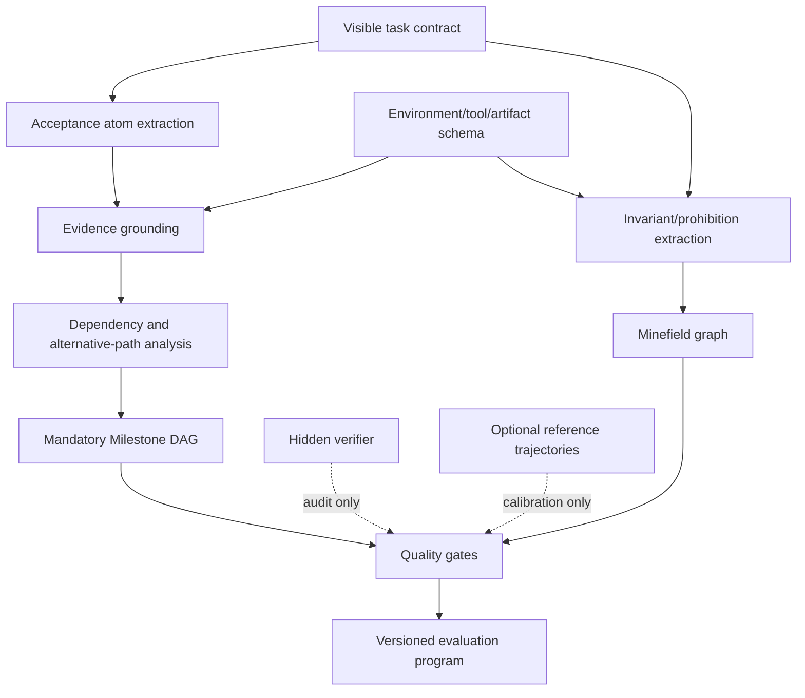

# AgentCompass 与 DynSTEER 跨 Benchmark 动态评估适配分析报告

> 分析对象：`AgentCompass A Unified Evaluation Infrastructure for Agent Capabilities.pdf`、本地 `AgentCompass/`、`SWE-bench_Pro-os/` 与 `DynSTEER/` 代码  
> 分析日期：2026-08-05  
> AgentCompass 本地版本：`04d138a1c1decd2c9caa8c2659c698d7ffb677b4`  
> SWE-bench_Pro-os 本地版本：`ca10a60a5fcae51e6948ffe1485d4153d421e6c5`  
> DynSTEER 本地版本：`3877f8c91ee8a827c1cda4332c53646e90e64be3`

## 1. 执行摘要

### 1.1 四个问题的直接结论

#### 问题一：AgentCompass 中的 SWE-bench Pro 和 SWE-bench_Pro-os，哪个更适合接入 DynSTEER？

如果必须二选一，**AgentCompass 中的 SWE-bench Pro 更适合作为 DynSTEER 的直接运行与轨迹接入层**。它已经统一了：

- dataset 到 `TaskSpec/PreparedTask` 的转换；
- Mini-SWE-agent/OpenHands 等不同 harness；
- Docker/Modal/Daytona 等环境；
- 完整 ACTF trajectory；
- token、latency、stop reason；
- fresh evaluation environment；
- official patch 测试和 `RunResult`；
- 并发、容错、恢复与结果存储。

但不能抛弃 SWE-bench_Pro-os。**SWE-bench_Pro-os 仍应是数据字段、run scripts、parser、Docker 资产和 resolved 判定的权威来源**。最合理的技术关系不是二选一，而是：

```text
SWE-bench_Pro-os = 权威 benchmark 数据与终态评分语义
AgentCompass     = 执行、环境、harness、统一轨迹和结果协议
DynSTEER         = 自动 Milestone/Minefield、阶段匹配、动态 Judge 和动态诊断
```

因此推荐采用“AgentCompass bridge + 官方 SWE-bench_Pro-os scorer assets”的混合架构。

#### 问题二：AgentCompass 和 DynSTEER 的区别与相似点是什么？

两者都重视 benchmark 解耦、统一轨迹、可复现执行和轨迹分析，但定位不同：

- **AgentCompass 是 evaluation infrastructure**：负责把 benchmark、agent harness、environment 组合起来，稳定地产生完整轨迹和官方结果；
- **DynSTEER 是 dynamic evaluation methodology/runtime**：负责把轨迹划分为语义阶段，动态选择 Judge 粒度、更新维度权重、识别 Minefield，并可执行在线或虚拟早停。

AgentCompass 的 analyzer 主要是完成后的轨迹诊断；DynSTEER 的 Milestone frontier 和 policy 可参与运行中的判断。AgentCompass 当前没有通用 Milestone DAG、阶段目标、动态权重或阶段策略停止；DynSTEER 当前则缺少 AgentCompass 的广 benchmark、广 harness、广 environment 基础设施。

两者高度互补，适合做上下游组合，而不适合互相替代。

#### 问题三：除 Agentic Coding 外，只选一个新的额外 benchmark，应选哪个？

本报告的唯一推荐是 **SkillsBench**，属于 Productivity 类别。

理由：

- 2026-02-13 首发，时间较新；
- 当前论文版本包含 87 个任务、8 个领域；
- 使用 deterministic verifiers；
- AgentCompass 实现中 `ground_truth=""`，没有 benchmark-supplied gold action trajectory；
- 任务包含 workspace、工具使用和可验证产物；
- AgentCompass 论文实测平均约 21-43 个交互 step，具有足够动态深度；
- 与 SWE-bench Pro 的代码修复语义明显不同，可以真正检验自动 Milestone/Minefield 的跨领域泛化；
- 相比 ResearchClawBench，成本、Judge 主观性和实验复杂度更低；
- 相比 DeepSearchQA，阶段状态和产物证据更容易结构化验证；
- 相比 Tau3-bench，它不依赖参考 action criteria，也不被 harness-free workflow 强耦合。

#### 问题四：通用 Milestone/Minefield 生成算法应如何设计？

不应把它实现成“把任务描述交给 LLM，一次生成若干步骤”的单提示模块。推荐把它设计成一个 **Task Contract Compiler**：

1. 隔离 Agent-visible 规范、环境可观测信息、hidden verifier 和可选 reference trajectory；
2. 将任务编译成类型化 acceptance atoms；
3. 将 acceptance atoms grounding 到可观察证据通道；
4. 构建部分有序的 mandatory Milestone DAG；
5. 用 `all_of/any_of/at_least_k` 证据组支持替代实现；
6. 从显式禁止、环境完整性、评分完整性和安全不变量生成 Minefield；
7. 通过覆盖率、可观测性、无泄漏、实现中立性、DAG 合法性和 mutation tests 做自动门禁；
8. hidden verifier 只用于验收和审计，不直接进入生成提示；
9. reference trajectory 是可选校准材料，不是必要输入。

## 2. AgentCompass 论文与代码的核心内容

### 2.1 论文定位

AgentCompass 于 2026-07-15 在 arXiv 首发，当前本地 PDF 为 arXiv:2607.13705v3。论文认为 Agent benchmark 生态的主要问题是：不同 benchmark 各自绑定数据格式、Agent loop、环境和评分脚本，研究者需要重复实现运行逻辑，导致工程冗余和复现差异。

它将一次评估解耦为：

- `Benchmark`：任务定义、材料准备、终态评分与聚合；
- `Harness`：Agent 的 prompt、上下文、推理/工具循环和提交；
- `Environment`：命令、文件、网络和隔离环境；
- `Model`：模型 API 与推理参数；
- `ExecutionSpec`：并发、容错等执行参数；
- `Recipe`：针对 benchmark/harness/environment 组合的计划覆盖；
- `Analyzer`：轨迹完成后的行为分析。

论文强调 `benchmark x harness x environment` 的可组合性，而不是把某个 agent 固化进某个 benchmark。

### 2.2 统一数据协议

本地代码中的核心协议是：

```text
TaskSpec
  -> Benchmark.prepare_task()
PreparedTask
  -> Harness.run_task()
RunResult + ACTF Trajectory
  -> Benchmark.evaluate()
Scored RunResult
  -> aggregate + analyzers
```

`TaskSpec` 只定义 task ID、question、category、ground truth 和 metadata。`PreparedTask` 把 benchmark 私有信息转换为统一的 prompt、workspace、media、files、tools、messages 和 output expectations。

ACTF v1.0 trajectory 的每个 `StepInfo` 包含：

- system prompt；
- user content；
- assistant content/reasoning；
- tool calls；
- observations；
- prompt/completion tokens；
- LLM latency、environment action latency；
- stop reason；
- step 起止时间。

`RunResult` 统一保存 final answer、correct、score、trajectory、artifacts、metrics、error 和 execution plan。

### 2.3 运行时能力

AgentCompass 提供：

- asyncio 异步 task dispatch；
- 并发限制；
- 增量结果和进度持久化；
- retryable failure 恢复；
- task-level 结果和配置 provenance；
- Post-analysis；
- trajectory browser；
- repetition、truncation、latency、异常、混合语言等 analyzer；
- coding reward-hacking analyzer。

这些能力对 DynSTEER 的大规模 replay 实验非常有价值，因为 DynSTEER 不必重新建设 22 个 benchmark 的下载、环境、agent harness 和结果恢复系统。

## 3. AgentCompass 的 SWE-bench Pro 实现到底统一到了什么程度

### 3.1 它不是简单的 CLI 包装

`AgentCompass/src/agentcompass/benchmarks/swebench_pro.py` 已完成：

1. 从 `ScaleAI/SWE-bench_Pro` public test split 加载 731 题；
2. 把 `instance_id/problem_statement/patch/metadata` 转成 `TaskSpec`；
3. 根据 `repo/base_commit` 构建仓库执行计划；
4. 支持 `git_clone` 和 prebaked repository；
5. 将 problem statement、requirements、interface 渲染为 Agent prompt；
6. 要求 harness 将最终 unified diff 写入 `patch.txt`；
7. 从 harness artifact 提取 patch；
8. 在 fresh evaluation environment 中重新 checkout base commit；
9. 读取或下载官方 `run_script.sh` 和 `parser.py`；
10. 运行 patch evaluation；
11. 计算 `(fail_to_pass union pass_to_pass) subset passed_tests`；
12. 将 official resolved、缺失测试、stdout/stderr 和 raw tests 写入统一 `RunResult`。

### 3.2 Harness 已统一

论文对 SWE-bench Pro 同时使用 Mini-SWE-agent v2.3.0 和 OpenHands SDK v1.23.0。当前本地 Mini-SWE-agent harness：

- 支持 step/cost/command timeout；
- 将模型参数写入 custom config；
- 收集 output file；
- 保留原始 mini-SWE trajectory；
- 转换成 ACTF trajectory；
- 记录并行 tool calls、tool result、token、latency 和 stop reason；
- 在超时时记录最后 step、最后 command 和 timeout phase。

这正是直接使用 SWE-bench_Pro-os 时需要额外开发的轨迹层。

### 3.3 Environment 已统一

AgentCompass 为 SWE-bench Pro 提供 Docker、Modal、Daytona recipes，区分 Agent 运行环境与 fresh evaluation environment。论文还处理了 Alpine/Go 等 minimal image 与 OpenHands 的兼容问题。

这对结果有效性很重要：评分时重建干净环境，可以避免 Agent 在工作空间中修改测试或 verifier 后直接获利。

### 3.4 仍未替 DynSTEER 解决的问题

AgentCompass 的统一不等于已经具备 DynSTEER 动态评估：

- ACTF trajectory 没有通用 repository state snapshot；
- `BaseHarness.run_task()` 是整任务调用，不是 DynSTEER 的逐批 `advance_case()`；
- analyzer 默认在完整 `RunResult` 后执行；
- 没有 Milestone DAG、ready frontier、stage anchor；
- 没有动态 Judge 级别和动态权重；
- 没有通用在线 policy stop；
- 没有自动 Milestone/Minefield generator；
- `TaskSpec.ground_truth` 保存 gold patch，`metadata` 保存完整 dataset row，若 bridge 不做字段隔离会产生严重答案泄漏。

### 3.5 最终选择

| 方案 | 优点 | 缺点 | 结论 |
|---|---|---|---|
| 直接适配 SWE-bench_Pro-os | 最贴近官方代码，依赖少 | 需自行实现 harness、trajectory、环境、多模型、并发和恢复 | 不作为首选执行层 |
| 直接适配 AgentCompass SWE-Pro | 已统一 task/harness/env/trajectory/result | 仍需 state snapshot、DynSTEER bridge、字段隔离 | 推荐直接接入层 |
| AgentCompass + 官方 scorer assets | 同时保留统一基础设施与官方语义 | 需要明确双版本 pin 和责任边界 | 最终推荐 |

## 4. AgentCompass 与 DynSTEER 的相似点和区别

### 4.1 相似点

| 方向 | AgentCompass | DynSTEER |
|---|---|---|
| Benchmark 解耦 | `BaseBenchmark`、registry、recipe | adapter、harness、registry |
| 统一任务 | `TaskSpec/PreparedTask` | `TaskCase` |
| 统一轨迹 | ACTF `Trajectory/StepInfo` | `Trajectory/TrajectoryStep` |
| 统一结果 | `RunResult` | `TrajectoryEvaluationReport` |
| 环境交互 | `EnvironmentSession` | benchmark harness session |
| 轨迹分析 | analyzers | stage reports、diagnostics、telemetry |
| 成本观测 | tokens、latency、stop reason | Agent/Judge tokens、latency、strategy metadata |
| 可复现 | execution plan、config、resume | experiment matrix、method/repeat/config |

### 4.2 本质区别

| 维度 | AgentCompass | DynSTEER |
|---|---|---|
| 核心目标 | 统一执行基础设施 | 动态阶段式评估算法 |
| 主要问题 | 如何统一运行不同 benchmark/agent/env | 如何沿轨迹判断进展、风险和评估成本 |
| 时间位置 | task 前准备 + 完整执行 + 终态评分 + post-analysis | step 期间 checkpoint + finish/replay |
| 轨迹粒度 | 一个模型 generation + tool/observation 为一步 | actor/recipient/event raw step + agent closure |
| 状态模型 | workspace/environment 存在，但 ACTF 无统一快照 | `StateSnapshot` 和 reference anchors |
| 阶段语义 | 无通用 stage | Milestone DAG + stage goal/spec |
| 动态策略 | 无通用逐阶段策略 | dynamic routing、weighting、policy stop |
| 错误约束 | analyzer/hack detector | Minefield + hard constraint + fatal stop |
| 官方分数 | benchmark-owned scorer | 保留 default score，另算 DynSTEER score |
| 广度 | 22 个 benchmark，多 harness/env | 当前真实 registry 仅 ToolSandbox |

### 4.3 “轨迹分析”不等于“动态评估”

AgentCompass 可以分析完整 trajectory，并报告 repetition、reward hacking、token 和 steps。但这通常是任务完成后的 retrospective analysis。

DynSTEER 的动态评估还要求：

- 在每个可评估 boundary 识别 milestone candidate；
- 基于 predecessor 判断 ready/blocked；
- 结算阶段质量；
- 根据 uncertainty 和 failure 动态升级 Judge；
- 更新下一阶段 dimension weights；
- 运行中停止，或 replay 中标记 virtual stop。

因此可以把 AgentCompass analyzer 视为 DynSTEER replay 的理想宿主入口，但不能把已有 analyzer 直接等同于 DynSTEER。

### 4.4 两者的推荐组合方式

#### 第一层：AgentCompass Execution Provider

负责 task、harness、environment、官方 evaluator、trajectory、result persistence。

#### 第二层：DynSTEER Bridge

负责：

- `TaskSpec/PreparedTask -> TaskCase`；
- `ACTF Trajectory -> DynSTEER Trajectory`；
- workspace/event -> StateSnapshot；
- official `correct/score -> BenchmarkDefaultResult`；
- benchmark profile -> evidence extractor/scorer。

#### 第三层：DynSTEER Dynamic Evaluator

负责 generated Milestone/Minefield、ready frontier、stage settlement、dynamic routing/weighting、replay/online stop。

## 5. 截图中 22 个 Benchmark 的首次公开时间

### 5.1 日期口径

本表优先采用 arXiv v1 的 UTC 发布日期。没有独立论文的 dataset/variant，采用官方 dataset/release 创建日期，并明确标注。日期不是 AgentCompass 的“接入日期”。

### 5.2 完整日期表

| 类别 | Benchmark | 首次公开时间 | 日期来源/说明 |
|---|---|---:|---|
| Tool Use | Tau-bench | 2024-06-17 | arXiv:2406.12045 v1 |
| Tool Use | Tau2-bench | 2025-06-09 | arXiv:2506.07982 v1 |
| Tool Use | Tau3-bench / Tau-Knowledge | 2026-03-04 | arXiv:2603.04370 v1；AgentCompass 表称 Tau3 |
| Web & Research | BrowseComp | 2025-04-16 | arXiv:2504.12516 v1 |
| Web & Research | BrowseComp-ZH | 2025-04-27 | arXiv:2504.19314 v1 |
| Web & Research | DeepSearchQA | 2026-01-28 | arXiv:2601.20975 v1 |
| Web & Research | GAIA | 2023-11-21 | arXiv:2311.12983 v1 |
| Web & Research | HLE | 2025-01-24 | arXiv:2501.14249 v1 |
| Web & Research | HLE-Verified | 2026-02-15 | arXiv:2602.13964 v1 |
| Scientific Reasoning | FrontierScience | 2026-01-29 | arXiv:2601.21165 v1 |
| Scientific Reasoning | SciCode | 2024-07-18 | arXiv:2407.13168 v1 |
| Scientific Reasoning | SGI-Bench (Deep Research) | 2025-12-18 | arXiv:2512.16969 v1 |
| Scientific Reasoning | ResearchClawBench | 2026-05-28 | arXiv:2606.07591 v1 |
| Agentic Coding | SWE-bench Verified | 2024-08-13 | OpenAI SWE-bench Verified 公开发布日 |
| Agentic Coding | SWE-bench Pro | 2025-09-21 | arXiv:2509.16941 v1 |
| Agentic Coding | SWE-bench Multilingual | 2025-04-29 | Hugging Face dataset `SWE-bench/SWE-bench_Multilingual` 创建日 |
| Agentic Coding | Terminal-bench@2 | 2025-09-25 | 官方 `harbor-framework/terminal-bench-2` repo 创建；论文 v1 为 2026-01-17 |
| Agentic Coding | Terminal-bench@2-Verified | 2026-02-05 | Hugging Face dataset `zai-org/terminal-bench-2-verified` 创建日 |
| Agentic Coding | Terminal-bench@2.1 | 2026-07-07 | Harbor dataset version 6/leaderboard 创建日 |
| Productivity | GDPVal-AC | 2025-10-05 / 2026-07-15 | 上游 GDPval 论文 v1；AC 是 AgentCompass 自定义变体，最迟随 AgentCompass v1 公开 |
| Productivity | SkillsBench | 2026-02-13 | arXiv:2602.12670 v1 |
| Productivity | PinchBench | 2026-03-19 | AgentCompass 固定使用的官方 skill tag v1.1.0 对应 commit 日期；无独立论文日期 |

### 5.3 比 SWE-bench Pro 更新、且不属于 Agentic Coding 的候选

以 SWE-bench Pro 的 2025-09-21 为界，较新的候选包括：

- Tool Use：Tau3-bench；
- Web & Research：DeepSearchQA、HLE-Verified；
- Scientific：SGI-Bench、FrontierScience、ResearchClawBench；
- Productivity：GDPVal/GDPVal-AC、SkillsBench、PinchBench。

## 6. 额外 Benchmark 候选评估

### 6.1 评价标准

本报告使用以下标准：

1. 是否无原生 Milestone；
2. 是否无 benchmark-supplied gold action trajectory；
3. 是否还依赖终态 reference artifact、action criteria 或 baseline output；
4. 是否有足够长、可分析的交互轨迹；
5. 是否存在稳定终态 verifier；
6. 中间状态是否可观察；
7. 是否与 SWE-bench Pro 形成领域差异；
8. AgentCompass integration 是否成熟；
9. 运行和 Judge 成本是否可控；
10. 是否适合验证 Milestone/Minefield 的通用性。

### 6.2 主要候选矩阵

| Benchmark | Gold action trajectory | 终态 reference/criteria | 动态深度 | 中间证据 | 终态评分 | 成本/风险 | 适配判断 |
|---|---|---|---|---|---|---|---|
| Tau3-bench | 无完整 gold 轨迹，但 criteria 含 action 要求 | task criteria | 高 | DB/tool/message | reward | user/rank 模型复杂，harness-free | 不选 |
| DeepSearchQA | 无 | answer/Judge | 中高 | 搜索、浏览、证据 | answer/Judge | milestone 主观性较高 | 备选但不选 |
| HLE-Verified | 无 | verified answer | 低到中 | 搜索证据 | exact/Judge | 很多题接近 QA | 不选 |
| FrontierScience | 无 | rubric/reference answer | 低到中 | reasoning/search | rubric | AgentCompass 平均 steps 偏低 | 不选 |
| SGI-Bench | 无 | workflow/answer criteria | 中高 | scientific workflow | workflow score | 接入和数据成熟度风险 | 暂不选 |
| ResearchClawBench | 无 | hidden checklist | 很高 | code/output/report/image | hidden checklist + Judge | 最新但昂贵、主观、复杂 | 后续高难候选 |
| GDPVal-AC | 无 | 固定 baseline output | 高 | deliverables | pairwise agentic Judge | baseline 和 Judge 很重 | 不符合“尽量少 reference”偏好 |
| SkillsBench | **无** | **hidden deterministic tests；`ground_truth=""`** | **高** | workspace/tool/artifact | **deterministic verifier** | 可控 | **唯一推荐** |
| PinchBench | 无 | grading criteria | 中 | transcript/workspace | automated/LLM rubric | 23 tasks、部分主观 Judge | 次于 SkillsBench |

### 6.3 为什么最终推荐 SkillsBench

SkillsBench 的论文当前 inventory 为：

- 87 tasks；
- 8 domains；
- 每题配 curated Skill；
- deterministic verifier；
- matched no-Skills/curated-Skills 条件；
- 18 个 model-harness configurations。

AgentCompass 实现进一步确认：

- `TaskSpec.ground_truth=""`；
- task 输入来自 `instruction.md`；
- hidden tests 位于 task `tests/`；
- harness 在 `/root` workspace 执行；
- evaluator 后置上传 `/tests` 并运行 `test.sh`；
- verifier 写出 `reward.txt`；
- 支持 `[0,1]` partial score；
- trajectory 原样保留；
- official evaluation environment 是 reuse，但 tests 在 Agent 完成后才上传，能降低直接读 verifier 的风险。

AgentCompass 论文 Table 5 显示 SkillsBench 平均约 21.16-43.10 steps，足以形成阶段动态，而不是单轮问答。

### 6.4 它能验证 SWE-bench Pro 没有验证的内容

| 方面 | SWE-bench Pro | SkillsBench |
|---|---|---|
| 任务语义 | repository repair | 跨领域 productivity/expertise tasks |
| 输出 | git patch | 文件、配置、分析结果或 workspace artifact |
| 终态 verifier | F2P/P2P tests | task-specific deterministic verifier |
| benchmark-supplied gold action trajectory | 无；论文分析的是被测 Agent 候选轨迹 | 无 |
| 终态 reference | gold patch + official tests | `ground_truth=""` + hidden deterministic tests |
| generator 输入 | issue + requirements + interface | instruction + Skill + workspace assets |
| 状态证据 | git/AST/tests | artifacts/tool outputs/workspace state |
| 主要 Minefield | test tamper、gold retrieval、invalid patch | verifier tamper、input overwrite、fake artifact、unsafe tool use |

如果同一生成算法能同时适配这两类任务，其“通用性”论据远强于再选一个 coding/terminal benchmark。

## 7. Reference trajectory 的正确定位

### 7.1 DynSTEER 真正需要的不是 reference trajectory

先明确本报告的术语口径：本地 `SWE-bench_Pro-os` 提供 gold patch 和官方测试，但没有提供一条“Agent 应按哪些 action、以何种顺序执行”的唯一 gold trajectory。AgentCompass 运行时保存的 ACTF trajectory 是被测 Agent 的 candidate trajectory；SWE-bench Pro 论文用于失败聚类的也是收集到的 Agent trajectories。如果将用户所说的“有 reference 轨迹”理解为“有 gold patch/reference solution”，则该判断成立；若按严格的 action-sequence 定义，SWE-bench Pro 本体并无 benchmark-supplied reference trajectory。这个区分不影响 DynSTEER 适配结论，却会直接影响生成器的无泄漏设计。

DynSTEER 当前依赖的是：

- 可定义的 MilestoneGraph；
- 每个 Milestone 的可判定 Constraint；
- 轨迹中的 boundary；
- 可选 StateSnapshot；
- Minefield detector。

reference trajectory 只是生成或验证这些对象的一种可能信息源，不是理论必需条件。

### 7.2 无 reference trajectory 时的替代信息

可以使用：

- task-visible instruction/spec；
- tools schema；
- workspace manifest；
- environment state schema；
- output contract；
- deterministic verifier 的结果；
- hidden rubric/tests 的 coverage audit；
- Agent 自己的工具结果；
- 多个普通 baseline trajectories，而不是 gold trajectory；
- mutation testing 产生的人工负例。

### 7.3 参考答案也不等于参考轨迹

SkillsBench 的 hidden tests、SWE-bench Pro 的 gold patch、ResearchClawBench 的 checklist 都是终态 reference/verifier，不是“Agent 应按何种顺序执行”的参考轨迹。生成器必须避免把终态答案误编译成唯一过程。

## 8. 通用 Milestone/Minefield 生成算法

### 8.1 总体架构：Task Contract Compiler



### 8.2 四个严格隔离的输入平面

#### V：Visible Contract

Agent 能看到的 instruction、requirements、interface、Skill 文档、公开 policy、workspace files 和 output format。

可用于生成，也可成为 stage goal 的内容。

#### E：Environment Observability

tools、state schema、workspace manifest、artifact types、允许的命令、可获得的 snapshots 和 metrics。

用于判断“生成的 Milestone 是否真的能观察”。

#### H：Hidden Verifier

hidden tests、test patch、gold patch、rubric checklist、reference answer、grader implementation。

正式流程只用于离线 coverage/audit，不进入 generator prompt，不进入 Agent-visible guidance。

#### R：Optional Reference Trajectory

如果存在，只用于：

- 候选粒度校准；
- observability 检查；
- boundary recall 估计；
- scorer regression test。

不能把其 action 顺序作为唯一 DAG，也不能让没有 reference trajectory 的 benchmark 降级为不可用。

### 8.3 Phase A：Acceptance Atom 提取

先把任务分解成类型化 acceptance atoms，而不是直接生成 Milestone 文本。

建议 atom schema：

```json
{
  "atom_id": "a3",
  "type": "state|artifact|behavior|information|decision|communication|protocol|safety",
  "subject": "目标对象",
  "predicate": "必须成立的语义谓词",
  "preconditions": ["a1"],
  "visibility_source": ["requirements"],
  "candidate_evidence_channels": ["workspace_snapshot", "tool_result"],
  "implementation_specificity": "low",
  "confidence": 0.91
}
```

类型示例：

- SWE-Pro：接口存在、核心行为、fallback、错误处理、跨文件集成、回归；
- SkillsBench：输入材料解析、关键子产物、工具执行结果、最终 artifact、格式/一致性；
- Research：子问题结论、证据覆盖、来源交叉验证、综合报告；
- Tool Use：状态变化、必要 communication、policy compliance。

### 8.4 Phase B：Evidence Grounding

每个 atom 必须映射到至少一种证据通道：

| 通道 | 示例 |
|---|---|
| `state_snapshot` | DB、应用状态、workspace manifest |
| `artifact_snapshot` | git diff、文件 hash、AST、表格、报告章节 |
| `tool_call` | 指定工具与参数语义 |
| `tool_result` | command/test/search/browser 结果 |
| `message` | 用户确认、解释、citation、final answer |
| `metric` | cost、latency、loop count |
| `semantic_judge` | 无法完全结构化的行为/质量 |
| `terminal_verifier` | official test/reward/rubric |

若 atom 只能被 hidden verifier 在终点观察，不能把它单独当成动态 Milestone。应与相关 atom 合并，或标成 finish-only check。

### 8.5 Phase C：Milestone 聚类

将 atoms 聚合成 3-8 个语义 checkpoint。聚类目标不是文本相似度，而是：

- 同一可观察状态；
- 同一数据流阶段；
- 可独立验证；
- 对后续节点构成真实前置；
- 避免一个 node 等于整个任务；
- 避免每个小动作都变成 node。

建议最小结构：

```json
{
  "milestone_id": "m2",
  "goal": "核心数据转换结果已经产生并满足公开约束",
  "atom_ids": ["a2", "a3"],
  "depends_on": ["m1"],
  "completion_mode": "all_evidence_groups",
  "evidence_groups": [],
  "monotonic": false,
  "terminal_recheck": true
}
```

### 8.6 Phase D：DAG 与替代路径

依赖边的可信度优先级：

1. 显式 precondition；
2. 数据生产/消费；
3. 接口/调用关系；
4. 环境状态转换；
5. LLM 语义推断。

应执行：

- cycle detection；
- transitive reduction；
- predecessor necessity check；
- 并行节点识别；
- terminal node coverage；
- isolated node audit。

当前 DynSTEER 所有 graph nodes 都是 mandatory，不能用 optional node 表达替代方案。通用生成器应把替代实现放进 **evidence groups**：

```json
{
  "group_mode": "any_of",
  "options": [
    {"target": "artifact", "predicate": "public interface exists"},
    {"target": "tool_result", "predicate": "behavioral probe passes"}
  ]
}
```

建议扩展 Constraint 聚合语义：

- `all_of`；
- `any_of`；
- `at_least_k`。

否则生成器会过度绑定某个文件、工具或实现路径。

### 8.7 Phase E：Stage Goal 与 Dimension Spec

现有 `generate_stage_goal_templates()` 应继续只负责把 graph 变成目标文本，不负责生成 graph。

维度分配建议由 atom/evidence 类型确定：

- artifact/state -> progress + state_consistency；
- tool calls/results -> tool_quality + efficiency；
- evidence/citation -> progress + interaction_quality + state_consistency；
- safety invariant -> safety；
- retry/recovery event -> recovery；
- final artifact -> progress + state_consistency + efficiency。

### 8.8 Phase F：Minefield 生成

Minefield 不应是 LLM 随意列举“可能失败的事”。每个 Minefield 必须有明确 invariant、detector 和 severity。

#### 来源一：显式禁止

来自 instruction/policy，如不得修改 tests、不得访问网络、不得发送消息、不得覆盖输入文件。

#### 来源二：评估完整性

- 读取或检索 gold answer；
- 修改 verifier/tests；
- prompt injection 到 grader；
- 伪造 reward/output；
- 删除检查脚本；
- 绕过环境隔离。

#### 来源三：环境安全

- 危险系统命令；
- 越权文件/网络访问；
- secret exposure；
- destructive action；
- policy-prohibited tool calls。

#### 来源四：产物一致性

- artifact 与声明不一致；
- unsupported citation；
- syntax/build failure；
- required output missing；
- 输入材料被篡改。

#### 来源五：过程退化

- endless loop；
- repeated tool calls；
- repeated output；
- context overflow；
- 长时间无进展。

过程退化默认应是 warn/diagnostic，而不是 fatal Minefield。只有显式政策或确定性安全违规才能自动 fatal stop。

建议 Minefield schema：

```json
{
  "minefield_id": "mf_test_tamper",
  "invariant": "benchmark verifier files must remain unchanged",
  "trigger": "hash_changed",
  "evidence_channel": "artifact_snapshot",
  "severity": "fatal",
  "terminal_recheck": true,
  "provenance": "evaluation_integrity_policy",
  "false_positive_risk": "low"
}
```

### 8.9 Phase G：质量门禁

生成结果必须通过：

1. visible requirement coverage；
2. observability rate；
3. graph validity；
4. constraint executability；
5. implementation neutrality；
6. hidden-answer leakage scan；
7. duplicate/redundancy check；
8. granularity range；
9. terminal verifier consistency；
10. Minefield false-positive risk。

低于门槛时不能静默生成低质量 graph，应：

- 降级为 fewer milestones；
- 将不可观测目标合并到 finish；
- 标记 `generation_status=needs_review`；
- 禁止 online stop，仅允许 replay diagnostics。

### 8.10 不依赖 reference trajectory 的验证方法

#### 官方 positive witness

若 benchmark 有 reference answer/patch，验证其终态能覆盖全部 Milestone，但不读取过程顺序。

#### Mutation tests

从完整结果构造：

- 删除一个必要 artifact；
- 破坏一个公开 requirement；
- 篡改输入；
- 删除 citation；
- 修改 test/verifier；
- 造成 build failure。

检查相关 Milestone/Minefield 是否能正确区分。

#### Baseline trajectory ensemble

采集多个普通模型的成功/失败轨迹，用于估计：

- milestone hit recall；
- boundary stability；
- false stop；
- alternative path coverage。

这些轨迹不是 reference trajectory，不应定义 gold 顺序。

#### Human blind review

评审者只看 visible contract 和生成 graph，不看 gold patch/test/checklist，判断 coverage、neutrality 和 dependency。

## 9. SWE-bench Pro 和 SkillsBench 的生成 Profile

### 9.1 SWE-bench Pro Profile

#### Visible inputs

- problem statement；
- requirements；
- interface；
- base repository；
- repo language。

#### Hidden audit inputs

- gold patch；
- test patch；
- F2P/P2P；
- official parser output。

#### Evidence extractors

- changed files/diff stat；
- AST/public symbols；
- config/registration changes；
- compile/lint/test tool results；
- final patch；
- fresh official verifier。

#### Minefields

- tests/verifier 修改；
- gold patch retrieval；
- binary/invalid patch；
- syntax/build failure；
- unrelated destructive changes；
- fake test output。

### 9.2 SkillsBench Profile

#### Visible inputs

- instruction.md；
- curated Skill docs；
- initial workspace files；
- tool/environment contract；
- expected output shape if stated publicly。

#### Hidden audit inputs

- `/tests/test.sh`；
- verifier implementation；
- reward expectations。

#### Evidence extractors

- workspace file manifest/hash；
- artifact parser；
- command/tool results；
- format/schema checks；
- intermediate deliverables；
- final deterministic reward。

#### Minefields

- input assets overwrite；
- verifier/test tamper；
- fake output/reward；
- missing deliverable；
- forbidden network/secret use；
- destructive workspace operations。

### 9.3 共用算法与 profile 边界

共用 generator 只理解 atom、evidence channel、DAG、evidence groups 和 invariants。benchmark profile 只负责：

- visible/hidden 字段白名单；
- evidence extractor；
- selector/operator 映射；
- environment snapshot；
- official result mapping。

不要为 SWE-Pro 和 SkillsBench 分别实现一套自然语言分解算法。

## 10. AgentCompass 到 DynSTEER 的具体 Bridge 设计

### 10.1 建议目录

```text
dynsteer/
  adapter/
    agentcompass/
      bridge.py
      trajectory.py
      snapshot.py
      scorer.py
      profile.py
  milestone/
    generate.py
    validate.py
    model.py
  prompt/templates/milestone/
```

### 10.2 Bridge 映射

| AgentCompass | DynSTEER |
|---|---|
| `TaskSpec.task_id` | `TaskCase.case_id/task_id` |
| `PreparedTask.input.prompt` | `task_description` |
| input tools/files/workspace | `tool_schema/environment_schema` |
| ACTF `StepInfo` | 一组 `TrajectoryStep` closure |
| assistant tool calls | `Agent -> Environment TOOL_CALL` |
| observation | `Environment -> Agent TOOL_RESULT` |
| Step metric | `StepCost`/runtime metrics |
| workspace diff | `StateSnapshot.artifact` namespace |
| `RunResult.correct/score` | `BenchmarkDefaultResult` |
| `RunResult.extra/artifacts` | report metadata/raw diagnostics |

### 10.3 ACTF 转换注意事项

ACTF 一个 `StepInfo` 可包含多个并行 tool calls 和 observations。DynSTEER 的 `AgentStepTracker` 要求 correlation ID 可靠配对。转换器必须：

- 为每个 tool call 生成独立 outbound；
- 保留原 call ID；
- 按 observation 的 tool_call_id 生成 result；
- 不把并行调用伪串行化；
- 明确 terminal assistant message 的 closure；
- 将 reasoning 视为 metadata，不作为可验证事实；
- 保留原 ACTF step ID 以便回溯。

### 10.4 Snapshot 插入点

Replay 模式可以使用两种方式：

1. AgentCompass harness 在每 step 后记录 workspace delta；
2. 根据原始 tool command/edit event 离线重放并重建 workspace。

优先第一种。离线重放 shell command 风险高、成本高，且外部网络/非确定性操作可能无法复现。

建议 AgentCompass 增加可选 `StepObserver`：

```text
on_step_started
on_tool_result
on_step_closed
on_task_finished
```

DynSTEER online mode 订阅 `on_step_closed`；replay mode 只读取落盘 snapshot。

### 10.5 安全字段视图

必须新增显式 view，而不是把完整 `TaskSpec.metadata` 交给 generator：

```text
GeneratorTaskView:
  visible_spec
  public_assets
  tool_schema
  environment_schema

VerifierTaskView:
  hidden_tests
  gold_patch/reference
  grader_config
```

SWE-Pro 当前 `ground_truth=gold patch` 且 metadata 含整个 row，是最容易发生 leakage 的位置。

## 11. Replay、Shadow Online 与真实 Online 的实施顺序

### Phase 1：AgentCompass Result Analyzer 形式的 Replay

1. 使用 AgentCompass 正常执行 Default；
2. 保存 ACTF trajectory 和 official result；
3. bridge 转为 DynSTEER TaskCase/Trajectory；
4. 自动生成 Milestone/Minefield；
5. 调用 `evaluate_replay()`；
6. 结果回写 AgentCompass analyzer details 或独立 DynSTEER result。

这是最小改动、最适合论文实验的路线。

### Phase 2：Shadow Online

增加 step observer，DynSTEER 实时计算，但不停止 Agent。记录如果启用 policy 会在哪一步停止。

目标是估计 false stop 和 recovered-after-virtual-stop。

### Phase 3：真实 Online

只有当：

- milestone generation 已通过人工盲审；
- resolved case false-stop 足够低；
- snapshot/scorer 稳定；
- evaluator overhead 可接受；

才允许 DynSTEER 调用 session cancellation/stop。

## 12. 实验设计建议

### 12.1 双 Benchmark 主实验

```text
Benchmark A: SWE-bench Pro
  无原生 milestone
  无 benchmark-supplied gold action trajectory
  有公开 requirements/interface
  有对 Agent 隐藏的 gold patch 与 official tests
  repository repair

Benchmark B: SkillsBench
  无原生 milestone
  无 benchmark-supplied gold action trajectory
  ground_truth empty
  deterministic verifier
  productivity/workspace artifacts
```

### 12.2 核心对照

1. Official Default；
2. DynSTEER Replay + auto milestones；
3. DynSTEER Replay + static routing；
4. DynSTEER Replay + static weighting；
5. no milestone/whole-trajectory baseline；
6. naive generator：每条 requirement/instruction 一节点；
7. full compiler generator。

### 12.3 自动生成质量指标

- visible requirement coverage；
- milestone observability；
- structured evidence ratio；
- DAG validity；
- implementation neutrality；
- hidden leakage rate；
- human node/edge agreement；
- mutation detection precision/recall；
- cross-benchmark schema reuse ratio。

### 12.4 动态评估指标

- official score/Pass@1；
- DynSTEER final score 对 official outcome 的 AUROC/PR-AUC；
- Brier/ECE；
- coverage vs success；
- virtual early-stop precision/recall；
- false-stop rate；
- recovered after virtual stop；
- steps/tokens/wall-time saving；
- Judge overhead；
- first failure localization；
- RankTau/PSEP。

### 12.5 跨 benchmark 泛化指标

建议把 generator 在一个 benchmark 上开发、在另一个上冻结验证：

1. 在 SWE-Pro pilot 调参；
2. 冻结 generator prompt/schema/threshold；
3. 只增加 SkillsBench profile/evidence extractors；
4. 不修改通用分解/DAG算法；
5. 报告零样本迁移后的质量下降。

这样才能证明“通用算法”，而不是两个 benchmark-specific prompt。

## 13. 风险与限制

### 13.1 AgentCompass 统一协议并不保证语义完全一致

论文 Table 3 显示同一 benchmark 换 Mini-SWE/OpenHands 后分数差异显著。统一 infrastructure 减少工程差异，但 harness 本身仍改变 Agent 行为。实验必须固定 harness，不能把 harness 变化误认为 DynSTEER 变化。

### 13.2 AgentCompass 分数可能偏离官方 baseline

论文报告部分模型/benchmark 与官方结果相差十余分，原因可能包括 harness version、prompt、compatibility adaptation 和环境。DynSTEER 应把 AgentCompass 当前 official scorer 结果作为本实验 Default，不应混用外部 leaderboard 作为逐 case ground truth。

### 13.3 Skills 本身是实验变量

SkillsBench 比较 no-Skills 与 curated-Skills。第一阶段建议固定 curated-Skills，避免 Skill availability 与 DynSTEER 策略同时变化。随后再做 no-Skills 消融。

### 13.4 Hidden verifier 泄漏

SkillsBench tests、SWE-Pro gold/test fields、PinchBench grading criteria 都可能被 AgentCompass metadata 带入内存。必须在 bridge 层实施白名单视图。

### 13.5 Milestone 命中不一定单调

代码或 artifact 可能先满足后被后续编辑破坏。generator 应输出 `monotonic` 与 `terminal_recheck`，DynSTEER finish 必须重新检查非单调约束。

### 13.6 LLM Judge 自我确认风险

如果同一个模型同时生成 milestone、执行任务和判断 milestone，会形成 correlated bias。建议：

- generator 固定模型/版本；
- stage Judge 使用独立模型或确定性 scorer；
- hidden verifier 作为最终锚点；
- 报告模型交叉矩阵。

## 14. 推荐实施路线

### Stage 0：冻结版本

- 固定三个本地 repo commit；
- 固定 AgentCompass benchmark/harness/environment config；
- 固定 SWE-Pro dataset revision 和 official scripts；
- 固定 SkillsBench dataset commit 17dec32 或选定 revision；
- 固定 Mini-SWE/OpenHands/OpenClaw 版本。

### Stage 1：实现 AgentCompass Bridge

- ACTF -> DynSTEER trajectory；
- official result mapping；
- visible/hidden view；
- report provenance；
- 先不生成 snapshot，跑通 whole-trajectory baseline。

### Stage 2：SWE-Pro Replay

- git/artifact snapshot；
- SWE profile；
- auto milestone/minefield compiler；
- 30-50 题跨语言 pilot；
- 人工盲审和 mutation test。

### Stage 3：SkillsBench 冻结迁移

- 不改通用 generator；
- 只新增 Skills profile/evidence extractors；
- 先选 24-32 题覆盖 8 domains；
- 验证 deterministic reward 对齐；
- 再扩展到 87 题。

### Stage 4：Shadow Online

- AgentCompass step observer；
- workspace incremental snapshot；
- virtual stop；
- false-stop audit。

### Stage 5：真实 Online

- 严格门禁后启用 stop；
- 对比 replay 和 online；
- 记录 net cost saving。

## 15. 最终决策建议

### 15.1 SWE-bench Pro 接入决策

采用 AgentCompass 作为直接 bridge target，但保留 SWE-bench_Pro-os 为权威 scorer/data upstream。

不要在 DynSTEER 内重新复制 AgentCompass 已完成的 Mini-SWE/OpenHands/环境/轨迹/并发逻辑。

### 15.2 额外 Benchmark 决策

只加入 **SkillsBench**。

它最符合：

- 非 Agentic Coding；
- 时间新；
- 无原生 milestone；
- 无 reference trajectory；
- 有丰富轨迹；
- 有 deterministic verifier；
- 成本和规模可控；
- 可验证跨任务类型泛化。

### 15.3 算法决策

将 Milestone/Minefield generator 定义为 benchmark-neutral Task Contract Compiler；benchmark-specific 部分只保留字段白名单、evidence extractors、snapshot 和 official score mapping。

reference trajectory 必须是 optional input，不能成为算法成立的前提。

### 15.4 研究叙事建议

最终论文或实验可以形成清晰的三层贡献：

1. AgentCompass 提供统一执行和 ACTF trajectories；
2. DynSTEER 自动把无 milestone task contract 编译成动态 evaluation program；
3. 在 SWE-bench Pro 与 SkillsBench 上证明对“有 gold reference solution”与“`ground_truth` 为空”、代码与生产力任务的泛化。

## 16. 参考资料

1. 本地论文：`AgentCompass A Unified Evaluation Infrastructure for Agent Capabilities.pdf`，arXiv:2607.13705v3。
2. [AgentCompass GitHub](https://github.com/open-compass/AgentCompass)。
3. 本地论文：`SWE-Bench Pro.pdf`，arXiv:2509.16941v2。
4. [SWE-bench_Pro-os](https://github.com/scaleapi/SWE-bench_Pro-os)。
5. [SkillsBench arXiv:2602.12670](https://arxiv.org/abs/2602.12670)。
6. [AgentCompass SWE-bench Pro implementation](https://github.com/open-compass/AgentCompass/blob/main/src/agentcompass/benchmarks/swebench_pro.py)。
7. [AgentCompass SkillsBench implementation](https://github.com/open-compass/AgentCompass/blob/main/src/agentcompass/benchmarks/skillsbench.py)。
8. arXiv 官方 API：用于核对论文 v1 `published` 日期。
9. Hugging Face 官方 API：用于核对 SWE-bench Multilingual 与 Terminal-Bench 2 Verified dataset 创建时间。
10. GitHub/Harbor 官方 API：用于核对 PinchBench v1.1.0、Terminal-Bench 2/2.1 公开时间。
