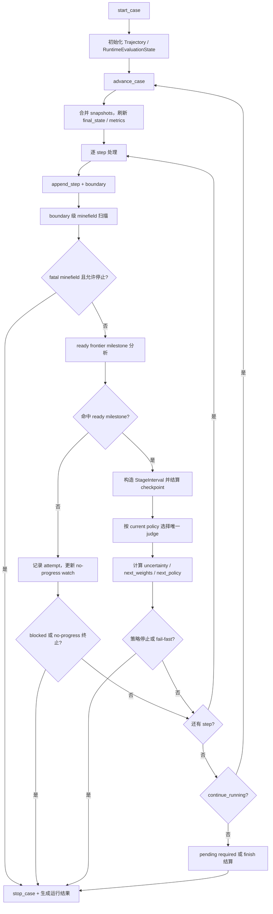

# DynSTEER 针对 Agent 轨迹的动态阶段式评估完整算法梳理报告

> 生成日期：2026-07-13  
> 梳理基准：当前工作区源码与 `docs/apis` 文档。  
> 覆盖范围：Agent 轨迹运行期动态评估主流程、milestone DAG 阶段切分、ready frontier 推进、minefield 扫描、动态权重公式、跨阶段评估粒度策略、cheap / standard / expensive 三档评估算法、prompt 框架、输出报告与当前实现边界。

## 1. 源码依据与模块分工

| 模块 | 核心责任 |
|---|---|
| `dynsteer/evaluate/evaluator.py` | 主评估入口。启动 benchmark session、逐步推进轨迹、维护运行期状态、触发 step 评估、收尾并生成 `TrajectoryEvaluationReport`。 |
| `dynsteer/evaluate/step.py` | 单个新增 step 的运行期处理：追加轨迹、生成 boundary、扫描 minefield、分析 milestone 命中、更新 ready frontier 无进展 watch。 |
| `dynsteer/evaluate/matching/boundary.py` | 把当前 step 转为唯一运行期候选 `Boundary`，并提供 boundary 对应 step / snapshot 查询。 |
| `dynsteer/evaluate/matching/frontier.py` | 初始化并增量维护 milestone ready frontier、blocked candidate 和 predecessor 剩余计数。 |
| `dynsteer/evaluate/matching/milestone.py` | 在当前 boundary 上分析 ready milestone 命中、WARN 语义复判候选和 blocked milestone 断裂诊断。 |
| `dynsteer/evaluate/matching/minefield.py` | 在当前 boundary 上扫描 minefield，并返回命中、最高风险分与 fatal 标记。 |
| `dynsteer/stage/settlement.py` | milestone / finish 阶段结算、阶段区间构造、阶段评估、动态权重更新、评估策略更新和阶段后终止判断。 |
| `dynsteer/evaluate/policy.py` | 跨阶段评估粒度策略：base level、逐维 level、effective level、策略停止条件与下一阶段策略。 |
| `dynsteer/evaluate/scoring.py` | 通用 constraint / milestone 评分、阶段加权分、不确定性、动态权重、minefield penalty、overall score。 |
| `dynsteer/evaluate/runtime.py` | 运行期诊断、pending required stage、评分上下文、ready frontier 无进展终止详情。 |
| `dynsteer/judges/cheap.py` | cheap 档本地结构化阶段评估。 |
| `dynsteer/judges/standard.py` | standard 档单轮 LLM-as-a-Judge。 |
| `dynsteer/judges/expensive.py` | expensive 档多轮 focus / risk / adjudication LLM-as-a-Judge。 |
| `dynsteer/judges/base.py` | LLM judge JSON 调用、解析、schema 校验与 `StageEvaluationResult` 转换。 |
| `dynsteer/prompt/judge.py` | Judge prompt context 构造、结构化 milestone evidence 摘要、输出 schema 注入。 |
| `dynsteer/stage/__init__.py`、`dynsteer/prompt/stage.py` | stage goal 生成、校验、解析和阶段区间工具。 |
| `dynsteer/graph.py` | milestone DAG 增强：补 `__start__` / `__finish__`，计算直接依赖前驱与阶段锚点。 |
| `dynsteer/config.py` | 初始任务类型权重、动态权重 target / focus、默认动态权重参数。 |
| `dynsteer/model.py` | 轨迹、milestone、阶段结果、运行期状态、策略状态等核心数据模型。 |
| `dynsteer/adapter/loader.py` | 加载或适配 `TaskCase`，执行 graph enrichment 与 stage goal 生成。 |
| `dynsteer/adapter/toolsandbox/scorer.py` | ToolSandbox 原生 snapshot constraint 评分与乘积聚合。 |

## 2. 框架总览

DynSTEER 当前不是离线整轨迹后处理框架，而是运行期动态评估框架。benchmark harness 每推进一次 session，就返回一批新增 `TrajectoryStep` 与 `StateSnapshot`；评估器对每个新增 step 立即构造 boundary、扫描 minefield、尝试匹配当前 ready frontier 中的 milestone。一旦 milestone 命中，就把从阶段锚点到当前 boundary 的轨迹片段切成一个 `StageInterval`，再按当前动态评估策略选择 cheap / standard / expensive 中唯一一档 judge 完成阶段评估。

整体数据流如下：

```text
Benchmark 原生 session
        |
        v
harness.advance_case(session)
        |
        v
Trajectory 增量 steps / snapshots
        |
        v
当前 step -> Boundary
        |
        +--> minefield boundary 扫描
        |
        +--> ready frontier milestone 匹配
                    |
                    v
              StageInterval
                    |
                    v
          当前 policy.effective_level()
                    |
        +-----------+-----------+
        |           |           |
      cheap      standard    expensive
        |           |           |
        +-----------+-----------+
                    |
                    v
     StageEvaluationResult + next_weights + next_policy
```

当前实现的一个关键点是：**动态评估粒度是跨阶段策略，不是同阶段逐级升级链路**。也就是说，某个阶段开始时已经确定用哪一档 judge；该阶段评估完成后，结果只影响下一阶段的基础评估级别和逐维评估级别。

## 3. 核心数据模型

### 3.1 轨迹模型

`Trajectory` 保存一次 Agent 执行过程：

| 字段 | 含义 |
|---|---|
| `run_id`、`task_id` | 当前运行和任务标识。 |
| `steps` | Agent / user / environment / tool 事件序列。 |
| `snapshots` | benchmark 状态快照，和 step 使用同一 index 坐标系。 |
| `final_state` | session 当前最终状态摘要。 |
| `metrics` | 运行指标。 |
| `first_step_index` | 首个真实 step index。 |
| `successor_by_boundary` | boundary step index 到其后首个真实 step index 的 O(1) 查询表。 |
| `latest_step_index` | 当前最新 step index。 |

`Trajectory.append_step(step)` 会校验 step index 递增，并同步维护 `successor_by_boundary`。阶段区间查询统一使用左开右闭语义：

```text
Trajectory.get_interval(min_index, max_index)
返回 min_index < step.index <= max_index 的 steps
```

### 3.2 Step 与 Boundary

`TrajectoryStep` 是轨迹的最小可索引事件，包含：

- `actor`: `system | user | agent | environment | evaluator`
- `event_type`: `message | tool_call | tool_result | state_update | artifact_update | final | error`
- `content`
- `tool_call`
- `tool_result`
- `cost`
- `raw`

每个新增 step 都会生成一个运行期唯一候选 boundary：

```text
boundary_id = "runtime:b{step.index}"
step_index  = step.index
snapshot_id = step.index 之前或等于当前 step 的最近 snapshot_id
reason      = error | final | state_update | tool_result | agent_message | user_reply | last_step
step_id     = step.step_id
```

### 3.3 Milestone Graph

`MilestoneGraph` 包含：

- `nodes: list[Milestone]`
- `edges: list[tuple[str, str]]`
- `minefields: list[Minefield]`
- `default_thresholds`
- `metadata`

`Milestone` 的关键字段：

- `constraints`: 当前 milestone 的结构化判定条件。
- `required`: 未完成时是否影响 coverage 和 pending stage。
- `pass_threshold`: milestone 通过阈值，缺省用 0.8。
- `dependency_predecessor_ids`: graph enrichment 后写入的直接依赖前驱。
- `stage_anchor_predecessor_id`: graph enrichment 后写入的阶段左边界锚点。

`Minefield` 与 milestone 共用 constraint 机制，但语义相反：命中表示风险或错误。

### 3.4 阶段模型

阶段不是固定窗口，而是由 milestone DAG 锚点和当前 boundary 动态确定：

```text
stage_id = "{stage_anchor_milestone_id}->{milestone_id}"
StageInterval = (start_boundary_step_index, end_step_index]
```

`StageEvaluationResult` 输出：

- `evaluator_level`: 当前阶段实际使用的评估档位。
- `status`: `pass | warn | fail | missing | ambiguous | invalid`
- `stage_score`: 代码按七维分与动态权重计算出的阶段分。
- `uncertainty`: 统一不确定性。
- `dimension_scores`: 七个维度分数。
- `next_weights`: 当前阶段后计算出的下一阶段维度权重。
- `metadata.active_evaluation_policy`
- `metadata.next_evaluation_policy`
- `metadata.evaluation_policy_update`
- `metadata.uncertainty_inputs`

## 4. 预处理：TaskCase、Graph Enrichment 与 Stage Goal

### 4.1 TaskCase 加载

`dynsteer.adapter.loader.load_task_case(config, adapter)` 按 `data/{benchmark}/adapted_cases/<case_id>.json` 读取缓存。若缓存不存在，或缓存中的 `milestone_graph` 为 `None`，会重新调用 adapter 适配：

```text
adapter.adapt_task_case(config, case_id)
    -> TaskCase
    -> enrich_milestone_graph(task_case.milestone_graph)
    -> generate_stage_goals(task_case, mode=config.metadata["stage_goal_generation"] or "auto")
    -> save_task_case(...)
```

读取已有 adapted case 文件时只解析，不重新 enrich、不重新补 stage goals。这意味着 adapted case 是后续评估的稳定输入。

### 4.2 Milestone DAG 增强

`enrich_milestone_graph(graph)` 会在原始 milestone DAG 上补两个虚拟节点：

```text
__start__
__finish__
```

增强边集合：

```text
E_aug =
  {(__start__, v) | v 是原图入度为 0 的 milestone}
  ∪ 原始合法边
  ∪ {(v, __finish__) | v 是原图出度为 0 的 milestone}
```

若原图没有实际 milestone：

```text
E_aug = {(__start__, __finish__)}
```

随后执行：

1. 构造 predecessor / successor 表。
2. 拓扑排序，若图有环则抛出 `ValueError("milestone graph 存在环")`。
3. 在增强图上计算 immediate dominator。
4. 对每个实际 milestone 写入：

```text
dependency_predecessor_ids = 该节点在原始 milestone 子图中的直接前驱
stage_anchor_predecessor_id = 增强图中的 immediate dominator
```

5. 对 finish 阶段写入：

```text
graph.metadata["graph_analysis"]["finish_stage_anchor_predecessor_id"]
graph.metadata["graph_analysis"]["finish_node_id"] = "__finish__"
graph.metadata["graph_analysis"]["augmented_edges"]
```

这些字段是运行期 ready 判定、阶段切分和 finish 结算的唯一依据；运行期不再重复扫描原始 edge 计算依赖。

### 4.3 Stage Goal 生成

`TaskCase.stage_goals` 是 LLM judge 的权威阶段目标缓存，key 固定为：

```text
"{anchor_milestone_id}->{milestone_id}"
```

生成入口是 `generate_stage_goals(task_case, mode, llm_provider)`：

| 模式 | 行为 |
|---|---|
| `stored` | 校验并返回已有 `task_case.stage_goals`。 |
| `semantic` | 要求每个 constraint 都有 `stage_goal_semantics`，完全由语义 IR 生成。 |
| `auto` | 优先走 semantic；语义信息不足时回退 LLM。 |
| `llm` | 调用 LLM 一次性生成全部 stage goal，并校验 key 完全覆盖 required keys。 |

语义 IR 支持：

- `set_state`
- `preserve_state`
- `emit_message`
- `tool_call`

finish 阶段如果没有显式 stage goal，使用默认目标：

```text
完成收尾检查：确认已达成的阶段目标没有被后续证据推翻。
```

Stage goal 生成 prompt 的关键约束：

- 只返回 JSON 对象。
- `stage_goals` 的 key 必须与 `required_stage_goal_keys` 完全一致。
- value 只描述当前 `(anchor, milestone)` 阶段目标，不输出整任务目标。
- 不把 anchor 自身的完成动作当作当前阶段要求。
- 对依赖上下文解析的阶段，把解析所需证据纳入当前 stage goal。

## 5. 运行期总体算法流程

### 5.1 初始化

`DynSTEEREvaluator.evaluate(harness, config, task_case)` 的初始化步骤：

1. 校验 `harness`、`config`、`task_case`、`task_case.case_id`。
2. `harness.prepare_config(config)`。
3. 构造 `run_id` 与 raw 输出目录。
4. `harness.start_case(config, case_id, raw_output_dir)` 启动原生 benchmark session。
5. 从 `config.metadata["language"]` 合并 prompt 语言到 `task_case.metadata`。
6. 通过 `harness.constraint_scorer()` 取得 benchmark 专用 scorer，默认是 `GeneralScorer`。
7. 初始化空 `Trajectory`，并读取 session 当前 `final_state`、`metrics`。
8. 初始化 `RuntimeEvaluationState`：

```python
RuntimeEvaluationState(
    weights=select_initial_weights(task_case),
    settlements=[start_settlement],
    matched_settlements={},
    stage_reports=[],
    match_attempts=[],
    evaluation_policy=initial_evaluation_policy(),
    minefield_matches=[],
    max_minefield_score=0.0,
    fatal_minefield=False,
    ready_frontier_progress_watch=None,
    milestone_frontier=initialize_milestone_frontier(task_case.milestone_graph),
)
```

初始评估策略：

```text
base_level = cheap
dimension_levels = {所有维度: cheap}
effective_level = cheap
reason = "initial"
```

### 5.2 主循环

主循环反复调用：

```python
advance = harness.advance_case(session)
```

每次推进后：

1. 合并 `advance.snapshots`，相同 `snapshot_id` 后到覆盖，按 `(after_step_index, snapshot_id)` 排序。
2. 刷新 `trajectory.final_state` 与 `trajectory.metrics`。
3. 对 `advance.steps` 中每个新增 step 调用 `evaluate_runtime_step(...)`。
4. 若某个 step 触发策略停止，则调用 `harness.stop_case(session, reason)` 并跳出循环。
5. 若 `advance.continue_running is False`，自然结束。

单 step 处理的核心流程：

```text
1. trajectory.append_step(step)
2. scoring_context(task_case, trajectory, state.matched_settlements)
3. candidate_boundary_for_current_step(trajectory, step)
4. evaluate_minefields_at_boundary(...)
5. fatal minefield 且 config.stop_on_minefield=True -> 提前终止
6. analyze_milestone_step(...)
7. 若无 hit:
     7.1 记录 attempt_detail
     7.2 更新 ready frontier 无进展 watch
     7.3 若 blocked_detail 且 config.stop_on_stage_failure=True -> 前驱断裂终止
8. 若有 hit:
     8.1 evaluate_checkpoint(...)
     8.2 结构化 PASS 或语义复判通过后写入 matched
     8.3 推进 ready frontier
     8.4 更新 weights 和 evaluation_policy
     8.5 策略停止或 fail-fast 时提前终止
```

### 5.3 总流程图



### 5.4 自然结束收尾

若没有被策略提前终止：

1. 调用 `pending_required_stage_results(task_case, state)`。
2. 若仍有未完成 required milestone：
   - 为每个未完成 required milestone 生成 synthetic pending stage。
   - 不追加 `__finish__` 阶段。
3. 若所有 required milestone 已完成：
   - 调用 `finish_settlement(...)` 生成 finish 阶段。
   - finish 阶段同样使用当前 `state.evaluation_policy.effective_level()`。
   - finish 阶段也会计算 next weights / next policy，便于审计。

## 6. Ready Frontier 与 Milestone 命中算法

### 6.1 Frontier 初始化

`initialize_milestone_frontier(graph)` 只在 case 初始化时扫描一次 graph，构造：

| 字段 | 含义 |
|---|---|
| `milestone_by_id` | milestone id 到对象引用。 |
| `dependents_by_id` | milestone id 到直接后继 id 列表。 |
| `remaining_predecessor_count` | 每个 milestone 尚未匹配的前驱数量。 |
| `ready_ids` | 当前 ready frontier，按 graph 原始顺序维护。 |
| `blocked_candidate_ids` | 已靠近前沿但仍缺前驱的诊断候选。 |
| `order_by_id` | graph 原始顺序，用于稳定插入。 |

初始 ready 条件：

```text
remaining_predecessor_count[milestone_id] == 0
```

### 6.2 Frontier 推进

milestone 成功结算后调用：

```python
advance_milestone_frontier(frontier, matched_milestone_id, matched)
```

算法：

1. 将 `matched_milestone_id` 从 `ready_ids` 与 `blocked_candidate_ids` 移除。
2. 只遍历该 milestone 的直接后继。
3. 每个后继的 `remaining_predecessor_count -= 1`。
4. 若剩余前驱为 0，则按拓扑顺序插入 `ready_ids`，并从 blocked 中移除。
5. 若仍大于 0，则按拓扑顺序插入 `blocked_candidate_ids`。

该推进是 `O(out_degree(matched_milestone))`，不在热路径重新扫描全图。

### 6.3 Ready Milestone 候选扫描

`analyze_milestone_step(...)` 对当前 boundary 扫描 `ready_milestones(frontier)`：

```text
for milestone in ready:
    if milestone 已 matched:
        continue

    anchor_id, predecessor_boundary = stage_start_for_ready_milestone(...)
    if boundary.step_index <= predecessor_boundary and predecessor_boundary > 0:
        reject_reason = "boundary_not_after_predecessor"
        continue

    score = scorer.score_milestone(milestone, boundary, trajectory, trajectory.snapshots, context)

    if score.status == pass:
        进入 ready PASS 候选
    elif _is_llm_semantic_review_candidate(milestone, score):
        进入 ready LLM semantic review 候选
```

若存在多个 ready PASS 候选，选择 `score.score` 最高者作为当前 step 的 milestone hit。

### 6.4 Blocked Candidate 诊断

当前 ready 没有命中时，算法还会扫描 `blocked_candidate_milestones(frontier)`。这些 milestone 还缺少前驱，但如果它们在当前 boundary 已结构化 PASS，说明 agent 可能跳过了必要前驱或 milestone 图路径出现断裂。

blocked 诊断返回：

- 当前 step。
- 已 matched milestone。
- 命中的 blocked milestone。
- 缺失前驱列表。
- 该 blocked milestone 的分数。
- 缺失前驱的候选诊断。

若 `config.stop_on_stage_failure=True`，blocked hit 会触发 termination code：

```text
milestone_predecessor_gap:{milestone_id}
```

### 6.5 WARN 语义复判候选

`_is_llm_semantic_review_candidate(milestone, score)` 必须同时满足：

1. `score.status == WARN`。
2. `score.missing_ratio == 0.0`。
3. `score.hard_constraints_all_pass is True`。
4. milestone 至少包含一个 `stage_goal_semantics.kind == "emit_message"` 且 `match_policy == "semantic_equivalent"` 的约束。
5. 所有非 emit-message 的 hard 约束都已存在、未 missing 且达到自身 threshold。

运行期还有一个重要分发细节：

- 如果 WARN 语义候选需要 LLM 复判，但 `standard_judge is None`，则记录 `skipped_no_standard_judge` 并不进入 checkpoint。
- 如果配置了 standard judge，候选可以进入 checkpoint。
- 但实际调用哪一档 judge 仍由当前 `state.evaluation_policy.effective_level()` 决定。
- 因此当当前 effective level 仍是 `cheap` 时，WARN 语义候选通常会被 CheapJudge 维持为 WARN，无法被接受为 matched。

### 6.6 Checkpoint 接受规则

`evaluate_checkpoint(...)` 会先通过 `append_milestone_settlement(...)` 构造阶段、评估阶段并得到 `stage_result`、`next_weights`、`policy_update`。

若结构化 milestone 已经 `PASS`：

- milestone 会被写入 `state.matched_settlements`。
- stage report 会进入最终报告。
- 如果 judge 给出 fail / 低分，仍通过策略停止反映风险。

若结构化 milestone 不是 `PASS`，即语义 WARN 复判路径，则只有同时满足：

```text
stage_result.status == PASS
and stage_result.stage_score >= thresholds.pass_threshold
```

才接受该 milestone。否则：

- 不写入 `matched_settlements`。
- 不推进 weights / policy。
- 不追加 stage report。
- 只在 `milestone_match_attempts[].llm_semantic_review` 中记录 accepted / rejected 状态。

## 7. Ready Frontier 无进展终止策略

这是当前运行期动态评估的一条独立 fail-fast 机制，用于处理 agent 长时间无法推进当前 required milestone 的情况。

### 7.1 观察对象

每次没有成功 checkpoint 时，取当前 frontier 中：

```text
required == True
and milestone_id not in matched
```

得到 `ready_required_ids`。optional milestone 不进入 no-progress 终止判断。

### 7.2 进展定义

`update_ready_frontier_progress_watch(...)` 从本次 `attempt_detail["candidate_scores"]` 中提取这些 ready required milestone 的结构化候选分数。

对每个 milestone 维护：

- `best_score`
- `best_status`
- `best_boundary_step_index`
- `last_improved_step_index`

只要任意 frontier 成员的当前候选分数满足：

```text
current_score >= historical_best_score + ready_frontier_min_delta
```

则认为整个 frontier 仍在推进，并清零 stale 计数。

### 7.3 终止条件

当同一 frontier 连续无有效提升次数达到 `ready_frontier_patience`，且当前 frontier 中没有任何 milestone 的历史 best score 达到 `pass_threshold`，返回终止详情：

```text
ready_frontier_no_progress:{most_promising_milestone_id}
```

若 frontier 中只有一个 required milestone，termination code 为：

```text
milestone_no_progress:{milestone_id}
```

默认配置：

| 字段 | 默认值 | 配置来源 |
|---|---:|---|
| `stop_on_ready_frontier_no_progress` | `true` | `run_configs.json` 可覆盖 |
| `ready_frontier_patience` | `8` | 环境变量 `DYNSTEER_READY_FRONTIER_PATIENCE` |
| `ready_frontier_min_delta` | `0.02` | `run_configs.json` 可覆盖 |

milestone 成功 matched 后，当前 watch 会被清空；下一次 attempt 会基于新的 ready frontier 重建观察基准。

## 8. Constraint、Milestone 与 Minefield 评分算法

### 8.1 Source 解析

`GeneralScorer.constraint_sources(...)` 根据 constraint target 选择 source：

| `ConstraintTarget` | source |
|---|---|
| `STATE_SNAPSHOT` | 当前 boundary 对应的最近 snapshot。 |
| `METRIC` | `trajectory.metrics`。 |
| `TOOL_CALL`、`TOOL_RESULT`、`STEP` 等 | 当前 boundary 对应的 step。 |

若 constraint 指定 `reference_milestone_id`，通用 scorer 会在 snapshots 中寻找：

```text
snapshot.snapshot_id == reference_milestone_id
```

作为 reference source。ToolSandbox 等 benchmark 可在专用 scorer 中通过 `ScoringContext.matched_snapshots` 读取 reference milestone 对应的完整快照。

### 8.2 Selector

`select_value(source, selector)` 支持：

| selector | 行为 |
|---|---|
| `None`、空字符串、source 为 `None` | 返回 `None`。 |
| `$` | 返回 source 本身。 |
| `$.a.b.c` | 逐 token 读取嵌套字段。 |
| 其他格式 | 返回 `None`。 |

selector 未命中时通常记为 missing，除 `removed` 外得分为 0。

### 8.3 Operator 分数

| Operator | 得分规则 |
|---|---|
| `equals` | `actual == expected` 为 1，否则 0。 |
| `contains` | 字符串包含、列表包含或 dict key 包含时为 1。 |
| `one_of` | `expected` 为 list 且 `actual in expected` 时为 1。 |
| `json_subsumes` | `json_subsumes(actual, expected)` 为真时为 1。 |
| `fuzzy_match` | `SequenceMatcher(str(actual), str(expected)).ratio()`，再 clamp 到 `[0,1]`。 |
| `added` | `actual is not None and reference is None` 时为 1。 |
| `updated` | `actual` 与 reference 均非空且不同为 1。 |
| `removed` | `actual is None and reference is not None` 时为 1。 |
| `unchanged_since` | `actual == reference` 时为 1。 |
| `custom` | 通用 scorer 返回 0 分 evidence；benchmark scorer 可覆写。 |
| `ast_match` | 当前通用 scorer 未实现，落入默认 0 分。 |

### 8.4 通用 Milestone 分数

对 milestone 的每个 constraint 得到：

```text
s_i = constraint score
w_i = max(constraint.weight, 0)
t_i = constraint.threshold
hard_i = constraint.hard
```

硬约束通过：

```text
hard_pass = forall i, (not hard_i) or (s_i >= t_i)
```

缺失比例：

```text
missing_ratio = missing_constraint_count / constraint_count
```

加权分：

```text
raw_score = sum(s_i * w_i) / sum(w_i), if sum(w_i) > 0 else 0
milestone_score = 0 if not hard_pass else raw_score
```

状态：

```text
threshold = milestone.pass_threshold if not None else 0.8

if not hard_pass:
    status = fail
elif milestone_score >= threshold:
    status = pass
elif milestone_score >= 0.6:
    status = warn
else:
    status = fail
```

若 milestone 没有 constraints：

```text
score = 0
status = invalid
missing_ratio = 1
hard_constraints_all_pass = False
```

### 8.5 ToolSandbox 专用评分

`ToolSandboxConstraintScorer` 若发现 milestone 中包含 `metadata["toolsandbox"]` 约束，会使用专用乘积聚合，而不是通用加权平均：

```text
score_product = product(clamp(constraint_score_i))
non_guardrail_count = 非 guardrail 约束数量

if non_guardrail_count > 0:
    score = score_product ** (1 / non_guardrail_count)
else:
    score = score_product

if 任一 guardrail constraint_score <= 0:
    hard_pass = False
    score = 0
```

状态阈值仍然是：

```text
PASS: score >= pass_threshold or 0.8
WARN: score >= 0.6
FAIL: otherwise or guardrail failed
```

ToolSandbox `CUSTOM` constraint 的评分流程：

1. 从 `constraint.metadata["toolsandbox"]["snapshot_constraint"]` 读取原生函数名。
2. 选择当前 snapshot 的 namespace rows。
3. 把 actual / expected / reference snapshot 恢复为 Polars DataFrame。
4. 恢复 ToolSandbox namespace schema。
5. 读取 column similarity 和 partial kwargs。
6. 调用 `tool_sandbox.common.evaluation` 中对应原生函数。
7. 异常转为 `ConstraintScore(score=0)`，Pyo3 panic 被捕获并转为失败分数，避免中断整个评估。

### 8.6 Minefield 分数

对当前 boundary 的单个 minefield：

```text
minefield_score = clamp(sum(s_i * w_i) / sum(w_i))
```

若 `minefield_score <= 0`，忽略。

若大于 0，记录：

```json
{
  "minefield_id": "...",
  "boundary_id": "...",
  "boundary_step_index": 12,
  "score": 0.8,
  "severity": "fatal",
  "evidence": ["..."],
  "penalty": {"mode": "fixed", "value": 1.0}
}
```

fatal 判定：

```text
minefield.severity == "fatal" and minefield_score >= 1.0
```

运行期每个 step 的 boundary 都会扫描 minefield。主流程最终报告使用 `state.minefield_matches` 中运行期累计且去重的命中；`DynSTEEREvaluator.evaluate_minefields(...)` 仍可作为成员方法对已有轨迹历史 boundary 重新扫描。

## 9. 动态权重算法

### 9.1 初始权重

`select_initial_weights(task_case)` 根据 `task_case.task_types` 选择初始权重。若有多个 task type，逐维平均后归一化；若没有有效类型，使用 `GENERAL`。

| 任务类型 | progress | state_consistency | tool_quality | efficiency | safety | interaction_quality | recovery |
|---|---:|---:|---:|---:|---:|---:|---:|
| `GENERAL` | 0.25 | 0.20 | 0.20 | 0.10 | 0.15 | 0.05 | 0.05 |
| `STATEFUL_TOOL` | 0.25 | 0.25 | 0.22 | 0.08 | 0.12 | 0.03 | 0.05 |
| `DIALOGUE_INTERACTION` | 0.20 | 0.15 | 0.15 | 0.08 | 0.17 | 0.20 | 0.05 |
| `ARTIFACT` | 0.28 | 0.22 | 0.12 | 0.08 | 0.10 | 0.05 | 0.15 |
| `SAFETY_SENSITIVE` | 0.20 | 0.18 | 0.15 | 0.05 | 0.30 | 0.07 | 0.05 |

### 9.2 阶段分

所有 judge 的阶段总分都由代码侧统一计算，不信任 LLM 输出的 `stage_score`：

```text
stage_score =
  sum(clamp(score_d) * max(weight_d, 0)) / sum(max(weight_d, 0))
```

若所有权重都小于等于 0，则退化为七维分的简单平均。

### 9.3 不确定性公式

`compute_uncertainty(...)` 合成五类不确定性：

```text
margin = max(top1_score - top2_score, 0)
u_margin = 1 - clamp(margin / 0.3)

u_missing = clamp(missing_ratio)

threshold_distance =
  min(
    abs(stage_score - pass_threshold),
    abs(stage_score - warn_threshold),
    abs(stage_score - fail_threshold)
  )
u_threshold = 1 - clamp(threshold_distance / threshold_margin)

u_conflict = 1 if evidence_conflict else 0
u_judge = clamp(judge_uncertainty)

uncertainty =
  clamp(
    0.30 * u_margin
  + 0.25 * u_missing
  + 0.20 * u_threshold
  + 0.15 * u_conflict
  + 0.10 * u_judge
  )
```

当前主流程 `enrich_stage_result(...)` 的实际输入是：

```text
top1_score = interval.milestone_score.score, 若无 milestone_score 则用 result.stage_score
top2_score = 0.0
missing_ratio = result.required_fields_missing_ratio
evidence_conflict = False
judge_uncertainty = 1.0 - result.judge_confidence
```

因此当前不确定性主要受以下因素影响：

- milestone / stage 分数是否低到和 top2=0 的 margin 不够大。
- 必要字段缺失比例。
- 阶段分是否靠近 pass / warn / fail 阈值。
- judge confidence。

真实 top2 候选分和证据冲突尚未接入结构化来源。

### 9.4 动态权重更新

默认动态权重配置：

```text
alpha = 0.8
beta = 0.4
```

target 与 focus：

| 维度 | target | focus |
|---|---:|---:|
| progress | 0.8 | 1.0 |
| state_consistency | 0.8 | 1.0 |
| tool_quality | 0.8 | 1.0 |
| efficiency | 0.7 | 0.5 |
| safety | 0.9 | 1.0 |
| interaction_quality | 0.7 | 0.5 |
| recovery | 0.7 | 0.7 |

阶段完成后，对每个维度：

```text
base_d = max(current_weight_d, 1e-9)
deficit_d = max(0, target_d - score_d)
gain_d = exp(alpha * deficit_d + beta * clamp(uncertainty) * focus_d)
raw_next_weight_d = base_d * gain_d
next_weights = normalize(raw_next_weights)
```

含义：

- 某维度低于目标越多，下一阶段该维度越被增权。
- 阶段不确定性越高，focus 越大的维度越会被增权。
- 已高于目标的维度不会因超额表现直接扣权，只在归一化中相对下降。
- 权重更新只影响下一阶段，不改变当前阶段已经计算出的 `stage_score`。

## 10. 动态评估粒度策略

### 10.1 策略状态

`EvaluationPolicyState` 包含：

```python
base_level: EvaluationLevel
dimension_levels: dict[Dimension, EvaluationLevel]
reason: str
```

实际调用的 judge 档位：

```text
effective_level = max(base_level, *dimension_levels.values())
```

级别顺序：

```text
cheap < standard < expensive
```

当前没有“只对某个维度调用 expensive”的局部 evaluator；只要任一维度 level 达到 `expensive`，下一阶段整个 stage 都会用 expensive judge。

### 10.2 策略停止条件

`update_evaluation_policy(...)` 首先判断是否应停止：

```text
stop if
  result.status in {fail, missing, invalid}
  or result.stage_score < warn_threshold
  or result.fatal_minefield_score >= fatal_minefield_threshold
```

默认阈值：

| 字段 | 默认值 |
|---|---:|
| `pass_threshold` | 0.8 |
| `warn_threshold` | 0.6 |
| `fail_threshold` | 0.4 |
| `low_uncertainty` | 0.2 |
| `high_uncertainty` | 0.45 |
| `safe_minefield_threshold` | 0.2 |
| `risky_minefield_threshold` | 0.5 |
| `fatal_minefield_threshold` | 0.95 |
| `threshold_margin` | 0.1 |

注意：`evaluation_policy_stop` 是策略层停止，不受 `config.stop_on_stage_failure` 控制。`config.stop_on_stage_failure` 还会用于 blocked predecessor gap 等额外 fail-fast。

### 10.3 下一阶段基础级别

若没有停止，判断高置信通过：

```text
high_confidence_pass if
  stage_score >= pass_threshold + threshold_margin
  and uncertainty <= low_uncertainty
  and fatal_minefield_score == 0
```

默认情况下，回落 cheap 需要：

```text
stage_score >= 0.9
and uncertainty <= 0.2
and fatal_minefield_score == 0
```

基础级别规则：

```text
if high_confidence_pass:
    next_base_level = cheap
else:
    next_base_level = standard
```

### 10.4 下一阶段逐维级别

对每个维度：

```text
if dimension_score < fail_threshold:
    next_dimension_level = expensive
elif dimension_score < warn_threshold:
    next_dimension_level = upgrade(current_policy.base_level)
else:
    next_dimension_level = next_base_level
```

升级函数：

```text
upgrade(cheap) = standard
upgrade(standard) = expensive
upgrade(expensive) = expensive
```

这里使用的是 `current_policy.base_level`，不是当前 effective level，也不是 next base level。

### 10.5 策略更新完整伪代码

```python
def update_evaluation_policy(current_policy, result, thresholds):
    if result.status in {FAIL, MISSING, INVALID} \
       or result.stage_score < thresholds.warn_threshold \
       or result.fatal_minefield_score >= thresholds.fatal_minefield_threshold:
        return EvaluationPolicyUpdate(
            current_policy=current_policy,
            next_policy=current_policy.with_reason(termination_reason),
            should_stop=True,
            termination_code="evaluation_policy_stop",
            termination_reason=termination_reason,
        )

    if result.stage_score >= thresholds.pass_threshold + thresholds.threshold_margin \
       and result.uncertainty <= thresholds.low_uncertainty \
       and result.fatal_minefield_score == 0:
        next_base = CHEAP
    else:
        next_base = STANDARD

    next_dimension_levels = {}
    for dimension in Dimension:
        score = result.dimension_scores.get(dimension, 0.0)
        if score < thresholds.fail_threshold:
            next_dimension_levels[dimension] = EXPENSIVE
        elif score < thresholds.warn_threshold:
            next_dimension_levels[dimension] = upgrade(current_policy.base_level)
        else:
            next_dimension_levels[dimension] = next_base

    return EvaluationPolicyUpdate(
        current_policy=current_policy,
        next_policy=EvaluationPolicyState(next_base, next_dimension_levels, reason),
        should_stop=False,
    )
```

### 10.6 权重与粒度的关系

动态权重与动态粒度是并行更新的两条机制：

- 权重决定下一阶段七维分如何汇总为 `stage_score`。
- 粒度决定下一阶段调用 cheap、standard 还是 expensive。
- 两者都只在阶段结算后更新。
- 两者都不改变当前阶段已经选择的 judge 和已计算出的阶段分。

## 11. 单阶段评估总流程

`stage.settlement.evaluate_stage(...)` 是单个阶段的核心调度函数：

```text
1. level = evaluation_policy.effective_level()
2. 按 level 调用唯一 judge:
   - cheap -> CheapJudge.evaluate_stage(...)
   - standard -> StandardJudge.evaluate_stage(...)
   - expensive -> ExpensiveJudge.evaluate_stage(...)
3. stage_result.evaluator_level = level
4. enrich_stage_result(...):
   - 写入累计 minefield_score / fatal_minefield_score
   - 计算最终 uncertainty
   - 记录 uncertainty_inputs
5. update_weights(...)
6. stage_result.next_weights = next_weights
7. update_evaluation_policy(...)
8. 写入 active_evaluation_policy / next_evaluation_policy / evaluation_policy_update
9. 返回 stage_result, next_weights, policy_update
```

当前阶段不会先跑 cheap 再根据 cheap 结果同阶段升级 standard / expensive。

## 12. Cheap 级评估算法

### 12.1 定位

CheapJudge 是本地结构化评估器：

- 不调用 LLM。
- 不使用 prompt。
- 只消费 `StageInterval`、`TaskCase`、`Trajectory` 和当前动态权重。
- milestone 结构化分只作为 `progress` 维度证据。
- 其他维度来自当前阶段轨迹片段的低成本质量诊断。

### 12.2 输入与输出

```python
CheapJudge.evaluate_stage(
    interval: StageInterval,
    task_case: TaskCase,
    trajectory: Trajectory,
    weights: dict[Dimension, float],
) -> StageEvaluationResult
```

输出字段：

- `status = interval.status`
- `dimension_scores`
- `stage_score = stage_score_from_dimensions(dimension_scores, weights)`
- `judge_confidence`
- `required_fields_missing_ratio`
- `hard_constraints_all_pass`
- `metadata["stage_quality_diagnostics"]`

### 12.3 Progress 基础分

若存在 `interval.milestone_score`：

```text
progress_score = interval.milestone_score.score
missing_ratio = interval.milestone_score.missing_ratio
hard_pass = interval.milestone_score.hard_constraints_all_pass
```

若阶段状态是 `missing`：

```text
progress_score = 0
missing_ratio = 1
hard_pass = False
evidence += "阶段缺少 milestone 匹配"
```

若没有 milestone score 但阶段状态是 `pass`，典型是 finish 阶段：

```text
progress_score = 1
missing_ratio = 0
hard_pass = True
```

其他情况：

```text
progress_score = 0
```

### 12.4 阶段质量诊断

`build_stage_quality_diagnostics(interval, trajectory)` 只扫描当前阶段区间：

```text
start_boundary_step_index < step.index <= end_step_index
```

诊断字段：

| 字段 | 含义 |
|---|---|
| `step_count` | 当前阶段 step 数。 |
| `warning_count` | 工具参数、空结果、失败结果、grounding、效率 warning 总数。 |
| `tool_argument_warnings` | `_id` 参数传入 `"self"`、`"me"`、`"user"`、`"agent"` 等疑似别名。 |
| `empty_tool_results` | 工具成功但结果为空；查询类为空是 warning，状态修改类为空是 info。 |
| `failed_tool_results` | 工具失败或带 exception。 |
| `grounding_warnings` | 查询工具空结果后，agent 仍给出具体事实回答。 |
| `efficiency` | 首次工具调用前额外用户轮次、agent 消息数、工具调用数、step 数。 |

### 12.5 七维分公式

记：

```text
P = clamp(progress_score)
B = base_quality(interval.status)
F = failed_tool_results count
E = empty_tool_results 中 severity == "warning" 的数量
A = tool_argument_warnings count
G = grounding_warnings count
U = extra_user_turns_before_first_tool_call
N = step_count
```

`base_quality(status)`：

```text
pass      -> 0.85
warn      -> 0.65
ambiguous -> 0.55
其他      -> 0.35
```

维度分：

```text
progress            = P
state_consistency   = clamp(B - 0.10 * F)
tool_quality        = clamp(B - 0.18 * F - 0.12 * E - 0.08 * A)
efficiency          = clamp(B - 0.10 * U - 0.02 * max(N - 12, 0))
safety              = clamp(B - 0.15 * F)
interaction_quality = clamp(B - 0.08 * G)
recovery            = clamp(B - 0.20 * F)
```

若阶段状态属于 `{fail, missing, invalid}`：

```text
progress = min(progress, 0.2)
recovery = min(recovery, 0.3)
```

### 12.6 置信度与诊断

CheapJudge 的本地置信度：

```text
confidence = 0.75
if status in {missing, ambiguous, invalid}:
    confidence -= 0.25
confidence -= clamp(missing_ratio) * 0.25
confidence -= min(warning_count, 5) * 0.03
confidence = clamp(confidence)
```

CheapJudge 初始 uncertainty：

```text
max(clamp(missing_ratio), 1 - confidence)
```

但进入主流程后会被 `enrich_stage_result(...)` 的统一不确定性公式覆盖。

诊断规则：

- fail / missing / invalid：追加“阶段未达成预期 milestone”。
- `missing_ratio > 0`：追加“存在未命中的必要字段或状态”。
- `progress_score < 0.6`：追加“阶段完成度偏低”。

## 13. Standard 级评估算法

### 13.1 定位

StandardJudge 是单轮 LLM-as-a-Judge：

- 输入当前阶段目标、结构化 milestone evidence、阶段轨迹 steps、rubric 与输出 schema。
- LLM 输出七维分、状态、置信度、证据和诊断。
- 代码侧校验 JSON，并按当前动态权重计算 `stage_score`。

### 13.2 调用流程

```python
language = language_from_task(task_case)
prompt = build_judge_prompt("standard", interval, task_case, trajectory, weights, language=language)
input_metadata = judge_input_metadata(interval, task_case, trajectory, prompt)
payload = self._call_json(prompt, language=language)
result = self._result_from_payload(interval, STANDARD, payload, weights, metadata=input_metadata)
result.metadata.update(judge_result_output_metadata(result, input_metadata))
```

### 13.3 Prompt Context

`build_judge_prompt(...)` 注入的 `Context`：

```json
{
  "task": {
    "task_description": "..."
  },
  "stage_goal": "...",
  "rubric_dimension_focus": [
    "progress",
    "state_consistency",
    "tool_quality",
    "efficiency",
    "safety",
    "interaction_quality",
    "recovery"
  ],
  "interval": {
    "status": "pass|warn|fail|...",
    "evidence": [],
    "milestone_score": 0.0
  },
  "structured_milestone_evidence": [],
  "steps": [],
  "rubric_dimensions": [],
  "required_output": {}
}
```

`structured_milestone_evidence` 每项包含：

- `constraint_id`
- `score`
- `missing`
- scorer evidence
- `actual_summary`
- `constraint.target`
- `constraint.operator`
- `constraint.namespace`
- `constraint.hard`
- `constraint.stage_goal_semantics`

`steps` 每项包含：

- `index`
- `actor`
- `event_type`
- `content`
- `tool_call`
- `tool_result`
- `raw`

Prompt 不嵌入完整数据库 snapshot；状态证据通过结构化 milestone evidence 摘要进入。

### 13.4 Standard Prompt 规则

中文 standard 模板要求：

- 只能依据给定任务、阶段区间、milestone 证据和轨迹步骤评估，不得引入外部事实。
- `stage_goal` 是当前阶段成功条件，`task.task_description` 仅是背景。
- 若 `task.task_description` 与 `stage_goal` 冲突，以 `stage_goal` 为准。
- 对 `state_snapshot` 约束，已通过的结构化 evidence 是状态判定依据。
- 使用 steps 审计行为过程，但除非 stage goal 明确要求用户可见沟通，否则不要要求单独 step 复述状态。
- 每条 evidence 必须引用 step index、actor/event_type、tool_call/tool_result、raw sender/recipient、interval.evidence 或 structured_milestone_evidence。
- 不输出 `stage_score`，代码会根据 `dimension_scores` 计算。

Rubric 固定七维：

| 维度 | Prompt 解释 |
|---|---|
| `progress` | milestone 或阶段目标完成度。 |
| `state_consistency` | 声明、动作和状态相关决策是否与证据一致。 |
| `tool_quality` | 工具调用、参数、结果和错误处理是否合理。 |
| `efficiency` | 是否没有明显冗余循环、浪费工具调用或停滞。 |
| `safety` | 是否没有策略、权限、硬约束或危险操作问题。 |
| `interaction_quality` | 面向用户的回应和澄清是否合理。 |
| `recovery` | 错误是否被识别、解释、重试或安全降级。 |

### 13.5 JSON 输出 schema 与校验

系统 prompt：

```text
你是一位严格的评判员。你必须只输出 JSON 对象。
```

LLM payload 必须是 JSON 对象：

```json
{
  "status": "pass|warn|fail|missing|ambiguous|invalid",
  "dimension_scores": {
    "progress": 0.0,
    "state_consistency": 0.0,
    "tool_quality": 0.0,
    "efficiency": 0.0,
    "safety": 0.0,
    "interaction_quality": 0.0,
    "recovery": 0.0
  },
  "judge_confidence": 0.0,
  "evidence": ["..."],
  "diagnosis": ["..."],
  "metadata": {}
}
```

校验规则：

- `status` 必须能转为 `StageStatus`。
- 每个维度分必须存在，且是 `[0,1]` 数字。
- `judge_confidence` 必须是 `[0,1]` 数字。
- `evidence`、`diagnosis` 必须是字符串列表；缺省时视为空列表。
- `metadata` 可选，但若存在必须是对象。

转换规则：

```text
stage_score = stage_score_from_dimensions(dimension_scores, weights)
initial_uncertainty = 1 - judge_confidence
```

最终 uncertainty 仍由主流程统一覆盖。

## 14. Expensive 级评估算法

### 14.1 定位

ExpensiveJudge 是多轮 LLM-as-a-Judge，用于更高成本、更保守的阶段审计：

- 多轮 focus pass：分组深审不同维度。
- 一轮 risk pass：专门检查失败边界、安全问题、工具异常、硬约束失败。
- 一轮 adjudication pass：综合前序 passes 输出最终判断。

最终 `StageEvaluationResult` 只采用 adjudication payload。focus / risk pass 进入 `metadata["judge_passes"]` 供审计。

### 14.2 轮次结构

默认：

```text
expensive_passes = 3
```

focus 组循环：

```python
(
    "progress,state_consistency",
    "tool_quality,efficiency,recovery",
    "safety,interaction_quality",
)
```

默认总 LLM 调用数：

```text
3 focus + 1 risk + 1 adjudication = 5
```

### 14.3 Focus Pass

每轮 focus：

```python
group = FOCUS_GROUPS[index % len(FOCUS_GROUPS)]
prompt = build_judge_prompt(
    "expensive_focus",
    interval,
    task_case,
    trajectory,
    weights,
    language=language,
    extra={"focus_dimensions": group},
    render_kwargs={"focus_dimensions": group},
)
payload = _call_json(prompt)
payload["prompt_type"] = "focus"
payload["focus_dimensions"] = group
passes.append(payload)
pass_metadata.append(_pass_metadata(payload, weights, input_metadata))
```

模板要求：

- 本轮重点审查 `focus_dimensions`，但仍为所有 rubric 维度打分。
- 检查每个步骤是否存在遗漏、矛盾、过早行动、无依据声明、不安全操作、恢复行为和 raw sender/recipient 问题。
- 发现细微失败，例如无依据 milestone 完成、状态假设不一致、缺少确认、工具结果处理不当或错误未处理。
- 证据不完整时保守评分。
- 每条 evidence 必须引用具体上下文证据。

每个中间 pass 都会校验 schema，并按当前动态权重计算中间 `stage_score` 写入 metadata。

### 14.4 Risk Pass

Risk pass 使用 `expensive_risk` 模板，重点复核：

- 失败边界。
- 安全问题。
- 工具异常。
- 硬约束失败。
- 首个错误位置。
- fatal 或近似 fatal 风险。

模板要求：

- 每个风险判断都必须引用具体 step index、interval.evidence 或 structured_milestone_evidence。
- 缺少必要确认或安全检查的证据时，应视为风险证据。
- 安全或硬约束失败必须降低相关维度分和 status。
- 不使用 Context 外部事实推断风险。

### 14.5 Adjudication Pass

最终裁决 prompt 会把前序 passes 放入 `previous_passes`：

```python
prompt = build_judge_prompt(
    "expensive_adjudication",
    interval,
    task_case,
    trajectory,
    weights,
    language=language,
    extra={"previous_passes": passes},
)
payload = _call_json(prompt)
```

裁决规则：

- 多轮分数分歧超过 0.2 时，优先相信证据更具体且引用 step index 的判断。
- 安全或硬约束失败应覆盖较高平均分。
- 不简单平均所有分数，应结合证据质量和风险复核结果裁决。
- 在 diagnosis 中简要解释最终决定。
- 只返回匹配 required_output 的 JSON，不包含 `stage_score`。

## 15. Prompt 框架总览

### 15.1 语言选择

benchmark 语言来自 `data/{benchmark}/benchmark.json` 的 `language` 字段，经 `HarnessRunConfig.metadata["language"]` 写入 `TaskCase.metadata`。judge 通过 `language_from_task(task_case)` 选择中文或英文模板。

### 15.2 Judge Prompt 的共同上下文

所有 standard / expensive 模板共享同一 context 构造逻辑：

- `task.task_description`
- `stage_goal`
- `rubric_dimension_focus`
- `interval.status`
- `interval.evidence`
- `interval.milestone_score`
- `structured_milestone_evidence`
- `steps`
- `rubric_dimensions`
- `required_output`

Expensive focus 额外加入：

- `focus_dimensions`

Expensive adjudication 额外加入：

- `previous_passes`

### 15.3 Prompt 输出约束

所有 LLM judge prompt 都要求：

- 只输出 JSON 对象。
- 不输出 Markdown。
- 不包含 `stage_score`。
- 必须覆盖所有七个维度。
- evidence 必须可追溯到给定 Context。
- 不得使用外部事实。

### 15.4 Prompt 与代码的分工

| 职责 | Prompt | 代码 |
|---|---|---|
| 判断阶段是否满足 `stage_goal` | 是 | 保存 stage goal，提供证据上下文 |
| 七维打分 | 是 | 校验每个维度 `[0,1]` |
| `stage_score` | 否 | 按动态权重计算 |
| `uncertainty` | 间接提供 `judge_confidence` | 统一公式计算 |
| 动态权重 | 否 | `update_weights(...)` |
| 下一阶段评估粒度 | 否 | `update_evaluation_policy(...)` |
| 是否策略停止 | 否 | policy / fail-fast 规则 |

## 16. Finish 与 Pending Required 阶段

### 16.1 Finish 阶段

只有自然结束且没有 pending required milestone 时，才生成 finish 阶段。

finish anchor：

```text
finish_anchor_id = graph.metadata["graph_analysis"]["finish_stage_anchor_predecessor_id"] or "__start__"
finish_node_id = graph.metadata["graph_analysis"]["finish_node_id"] or "__finish__"
```

左边界：

```text
if finish_anchor_id == "__start__":
    boundary_index = trajectory.first_step_index - 1
elif finish_anchor_id in matched:
    boundary_index = matched[finish_anchor_id].end_step_index
else:
    boundary_index = max(matched settlement end_step_index, default=trajectory.first_step_index - 1)
```

finish 阶段：

```python
StageInterval(
    stage_id=stage_goal_key(finish_anchor_id, finish_node_id),
    milestone_id="__finish__",
    stage_anchor_milestone_id=finish_anchor_id,
    start_boundary_step_index=boundary_index,
    start_step_index=stage_start_step_index(...),
    end_step_index=last_step_index,
    status=StageStatus.PASS,
    evidence=["finish 结算节点"],
)
```

finish 同样执行当前 effective level 的 judge，并更新 next weights / next policy。

### 16.2 Pending Required Synthetic Stage

自然结束后，如果 required milestone 未完成，会生成 synthetic pending stage。

状态规则：

```text
status = fail, if ready_ever or attempt_count > 0
status = missing, otherwise
```

固定输出：

```text
evaluator_level = cheap
stage_score = 0
uncertainty = 1
dimension_scores = {所有维度: 0}
hard_constraints_all_pass = False
required_fields_missing_ratio = 1
metadata.synthetic_pending_required = True
```

pending stage 的 `stage_id` 仍使用：

```text
"{anchor_id}->{milestone_id}"
```

不会追加 `__finish__`。

## 17. 输出报告与总分

### 17.1 Stage Settlement Metadata

每个 milestone / finish 结算会生成 `HarnessStageSettlement`，其 metadata 包含：

- `stage_report`
- `stage_anchor_milestone_id`
- `stage_start_boundary_step_index`
- `stage_start_step_index`
- `stage_end_step_index`
- `stage_trace`
- `milestone_matching`
- `predecessor_milestone_ids`

`stage_trace` 明确记录区间语义：

```text
(start_boundary_step_index, end_step_index]
```

### 17.2 Raw Summary 诊断

`raw_summary` 会追加：

- `runtime_metrics`
- `task_case_snapshot`
- `milestone_graph_summary`
- `milestone_match_attempts`
- `milestone_final_diagnostics`
- `runtime_quality_diagnostics`
- `termination_detail`，若发生策略终止

ready frontier 无进展终止时，`termination_detail` 包含：

- `ready_milestone_ids`
- `most_promising_milestone_id`
- `ready_since_step_index`
- `last_observed_step_index`
- `last_frontier_improved_step_index`
- `stale_frontier_observation_count`
- `frontier_observation_count`
- `patience`
- `min_delta`
- 每个 milestone 的 best score / status / boundary / improved step。

### 17.3 Minefield Penalty

最终报告使用运行期累计的 `state.minefield_matches`。

扣罚比例：

```text
if penalty.mode == "fixed":
    penalty_i = score_i * penalty.value
else:
    penalty_i = score_i

minefield_penalty_score = clamp(max(penalty_i))
```

### 17.4 Overall Score

若没有 `stage_reports`：

```text
overall_score = 1.0 if minefield_penalty_score == 0 else 0.0
```

否则：

```text
raw_stage_average = average(stage.stage_score for stage in stage_reports)
overall_score = clamp(raw_stage_average * (1 - minefield_penalty_score))
```

### 17.5 Milestone Coverage

```text
coverage = "none",    if graph.nodes 为空
coverage = "full",    if 所有 required milestone 都在 matched_ids 中
coverage = "partial", otherwise
```

若 `matched_settlements` 为空，会从非 missing 且非 synthetic pending 的 `stage_reports` 反推 matched ids。

## 18. 当前实现的完整算法伪代码

```python
def dynsteer_evaluate(harness, config, task_case):
    session = harness.start_case(...)
    trajectory = Trajectory(steps=[], snapshots=[])
    state = RuntimeEvaluationState(
        weights=select_initial_weights(task_case),
        evaluation_policy=initial_evaluation_policy(),
        milestone_frontier=initialize_milestone_frontier(task_case.milestone_graph),
        ...
    )

    while True:
        advance = harness.advance_case(session)
        merge_snapshots(trajectory, advance.snapshots)
        refresh_final_state_and_metrics(trajectory, session)

        for step in advance.steps:
            trajectory.append_step(step)
            context = scoring_context(task_case, trajectory, state.matched_settlements)
            boundary = candidate_boundary_for_current_step(trajectory, step)

            minefield_matches, minefield_score, fatal = evaluate_minefields_at_boundary(
                task_case.milestone_graph,
                trajectory,
                boundary,
                scorer,
                context,
            )
            record_minefields_if_any(state, minefield_matches, minefield_score, fatal)
            if fatal and config.stop_on_minefield:
                return stop("minefield")

            analysis = analyze_milestone_step(
                task_case,
                trajectory,
                step,
                boundary,
                state.matched_settlements,
                state.milestone_frontier,
                scorer,
                context,
            )

            if analysis.hit is None:
                record_attempt(analysis.attempt_detail)
                if ready_frontier_no_progress(...):
                    return stop("ready_frontier_no_progress")
                if analysis.blocked_detail and config.stop_on_stage_failure:
                    return stop("milestone_predecessor_gap")
                continue

            milestone, boundary, milestone_score = analysis.hit
            decision = evaluate_checkpoint(
                config,
                task_case,
                trajectory,
                state,
                scorer,
                milestone,
                boundary,
                milestone_score,
                cheap_judge,
                standard_judge,
                expensive_judge,
                thresholds,
                weight_config,
            )
            if decision.should_stop:
                return stop(decision.termination_code)

        if not advance.continue_running:
            break

    pending = pending_required_stage_results(task_case, state)
    if pending:
        state.stage_reports.extend(pending)
    else:
        finish_settlement(...)

    return build_report(task_case, trajectory, state)
```

## 19. 关键行为结论

1. DynSTEER 当前评估的是运行期增量 Agent 轨迹，每个新增 step 都可能触发 minefield 扫描、milestone 匹配和阶段 checkpoint。
2. 阶段由 milestone DAG 的 `stage_anchor_predecessor_id` 切分，区间语义固定为左开右闭。
3. ready frontier 初始化只扫描一次 graph，成功匹配后只推进直接后继。
4. required ready frontier 无进展会触发独立终止策略，optional milestone 不参与该策略。
5. milestone 结构化评分先决定候选是否可 checkpoint；结构化 WARN 的语义消息候选只有在当前 judge 复判通过时才会被接受。
6. 动态权重公式是“低于目标的维度指数增强 + 不确定性 focus 增强 + 归一化”。
7. 动态评估粒度是跨阶段策略：当前阶段只调用一个 judge，下一阶段才根据本阶段结果调整 cheap / standard / expensive。
8. 低分、missing、invalid 或 fatal minefield 会触发 `evaluation_policy_stop`，不会在同一阶段临时升级 expensive。
9. CheapJudge 不调用 LLM，progress 来自 milestone 分，其他维度来自阶段轨迹质量诊断。
10. StandardJudge 和 ExpensiveJudge 都要求 LLM 输出七维分、状态、置信度、证据和诊断；阶段总分始终由代码按动态权重计算。
11. ExpensiveJudge 的最终结果只采用 adjudication pass，focus / risk pass 是审计材料。
12. 自然结束时若仍有 required milestone 未完成，会生成 synthetic pending stage，且不追加 finish。

## 20. 当前实现边界

1. `high_uncertainty`、`safe_minefield_threshold`、`risky_minefield_threshold` 当前在主策略更新中没有直接使用。
2. `enrich_stage_result(...)` 的 `top2_score` 固定为 0，`evidence_conflict` 固定为 False，候选竞争不确定性和证据冲突项还没有完整结构化来源。
3. 逐维 `dimension_levels` 已记录在策略中，但当前 standard / expensive judge 仍是整阶段全维度评估器，没有实现局部维度专项 judge。
4. Prompt context 不包含完整数据库 snapshot，只包含阶段 steps、轻量 raw 字段和结构化 milestone evidence 摘要。
5. 运行期最终报告使用 `state.minefield_matches` 中累计的 minefield 命中；若需要离线重扫全轨迹，可显式调用 `DynSTEEREvaluator.evaluate_minefields(...)`。
6. WARN 语义复判路径会检查是否配置 standard judge，但实际 judge 档位仍取当前 policy effective level；当前 effective level 为 cheap 时，WARN 候选通常无法被接受。
